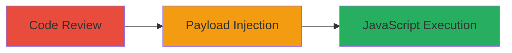

# Reflected XSS in Revive Adserver via Unencoded Query String

Multi-stage attack chain demonstrating the discovery and exploitation of a reflected XSS vulnerability in Revive Adserver's www/delivery/afr.php file. The attack begins with code review to identify the lack of encoding for the QUERY_STRING, followed by crafting a malicious payload to execute JavaScript in the victim's browser, enabling session theft or CSRF attacks.

## Chain Metrics Dashboard

| Metric | Value |
|--------|-------|
| Chain Status | Unverified |
| Total Steps | 2 |
| Execution Time | ~5 minutes |
| Skill Level | Intermediate |
| Complexity | Medium |
| Impact Level | High |

## Attack Flow Visualization



## Prerequisites & Requirements

### Required Tools

- [[tools/curl]]

### Target Environment

- Web application running Revive Adserver (PHP-based)
- Access to source code for review (e.g., via download or repository)
- Network access to the adserver instance

### Initial Access Requirements

- Publicly accessible Revive Adserver instance
- No authentication required for the delivery endpoint

## Detailed Attack Procedures

### Step 1: Code Review for Vulnerability Identification
procedure: [[procedures/Code-Review-to-Identify-XSS-in-Revive-Adserver]]

**Objective**: Analyze the source code of afr.php to locate the reflected XSS vulnerability caused by unencoded QUERY_STRING insertion.

**Instructions**: Download and examine the Revive Adserver source code, focusing on www/delivery/afr.php. Look for assignments involving $_SERVER['QUERY_STRING'] and check for encoding before HTML output.

**Expected Output**: Identification of vulnerable lines (e.g., line 4381 for concatenation, lines 4386-4387 for HTML insertion).

**Success Indicators**:
- Confirmed lack of URL encoding in $dest variable
- Noted similar issue in www/delivery_dev/afr.php

### Step 2: Exploit with Proof-of-Concept Request
procedure: [[procedures/Exploit-Reflected-XSS-with-Curl-POC]]

**Objective**: Send a malicious HTTP request to trigger the XSS payload, executing JavaScript in the browser context.

**Instructions**: Craft a URL with a JavaScript payload in the query string to break out of the existing setTimeout script. Use [[commands/curl-reflected-xss-poc-revive]] to send the request:

```bash
curl "domain.com/www/delivery/afr.php?refresh=10000&\")',10000000);alert(1);setTimeout('alert(\""")"
```

Observe the response HTML to confirm injection.

**Expected Output**: HTML response containing injected script like setTimeout('window.location.replace("http://domain.com/www/delivery/afr.php?refresh=10000&")',10000000);alert(1);setTimeout('alert("&loc=")', 10000000); which executes alert(1).

**Success Indicators**:
- JavaScript alert pops up in the browser
- Payload reflected without sanitization

## Attack Chain Summary

### Key Achievements

1. Identified unencoded QUERY_STRING usage in PHP code
2. Successfully injected and executed JavaScript payload
3. Demonstrated potential for session cookie theft or CSRF

## Technique & Tactic Coverage

### MITRE ATT&CK Techniques

- [[Exploit Public-Facing Application]]
- [[JavaScript]]

### MITRE ATT&CK Tactics

- [[Execution]]
- [[Collection]]

---

*Last updated: 2023-10-01T00:00:00Z*
