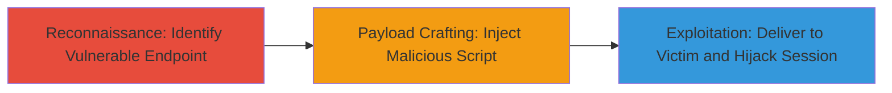

# Reflected XSS in Rocket.Chat Video Subdomain for Session Hijacking

Multi-stage attack chain demonstrating exploitation of CVE-2022-32770 in Rocket.Chat's video subdomain to inject and execute arbitrary JavaScript in victims' browsers, enabling session hijacking, data exfiltration, or phishing.

## Chain Metrics Dashboard

| Metric | Value |
|--------|-------|
| Chain Status | Unverified |
| Total Steps | 3 |
| Execution Time | ~5 minutes |
| Skill Level | Intermediate |
| Complexity | Medium |
| Impact Level | High |

## Attack Flow Visualization

## Prerequisites & Requirements

### Required Tools

- Web browser (e.g., Chrome Developer Tools for testing)
- Proxy tool like Burp Suite for payload manipulation

### Target Environment

- Web platform
- Accessible Rocket.Chat video subdomain at https://video.rocket.chat/
- No specific ports required beyond standard HTTPS (443)

### Initial Access Requirements

- Public access to the video subdomain
- Ability to craft and host malicious links (e.g., via email or social engineering)
- No prior credentials needed for reflected XSS

## Detailed Attack Procedures

### Step 1: Reconnaissance - Identify Vulnerable Endpoint

procedure: [[procedures/Exploit-Reflected-XSS-in-Rocket-Chat-Video]]

**Objective**: Locate the reflected XSS vulnerability in the Rocket.Chat video subdomain by testing for insufficient input sanitization.

**Instructions**: Navigate to https://video.rocket.chat/ and inspect parameters (e.g., query strings in URLs) for reflection without encoding. Use browser developer tools to test basic payloads like `` in URL parameters.

**Expected Output**: Payload reflected in the page source without sanitization, triggering an alert on load.

**Success Indicators**:
- Script executes in the browser console
- No server-side blocking of the payload

### Step 2: Payload Crafting - Inject Malicious Script

procedure: [[procedures/Exploit-Reflected-XSS-in-Rocket-Chat-Video]]

**Objective**: Develop a JavaScript payload to steal session cookies or exfiltrate data, exploiting the lack of output encoding.

**Instructions**: Craft a URL with the payload, e.g., https://video.rocket.chat/?param=. Test locally or with a proxy to ensure reflection.

**Expected Output**: When the URL is loaded, the script sends the victim's cookies to the attacker's server.

**Success Indicators**:
- Network request to attacker's domain with stolen data
- Confirmation via server logs on attacker.com

### Step 3: Exploitation - Deliver to Victim and Hijack Session

procedure: [[procedures/Exploit-Reflected-XSS-in-Rocket-Chat-Video]]

**Objective**: Trick a user into visiting the malicious URL to execute the payload in their browser context, leading to account compromise.

**Instructions**: Distribute the crafted URL via phishing email or malicious link. Monitor the attacker's server for incoming data exfiltration.

**Expected Output**: Victim's session cookies or sensitive data received on the attacker's endpoint, allowing session replay for hijacking.

**Success Indicators**:
- Successful data theft (e.g., cookies captured)
- Ability to access the victim's Rocket.Chat account using stolen session

## Attack Chain Summary

### Key Achievements

1. Identified and confirmed reflected XSS in video subdomain
2. Injected and executed arbitrary JavaScript for data theft
3. Achieved session hijacking without authentication

## Technique & Tactic Coverage

### MITRE ATT&CK Techniques

- [[JavaScript]]

### MITRE ATT&CK Tactics

- [[Execution]]
- [[Collection]]

---
*Last updated: 2023-10-01T00:00:00Z*
