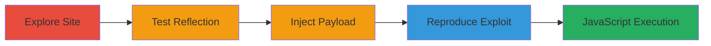

---
tags:
  - xss
  - reflected-xss
  - javascript
  - web-vulnerability
type: attack_chain
tools: []
tactics:
  - '[[Initial Access]]'
  - '[[Execution]]'
verified: false
platforms:
  - Web
submitted: true
complexity: medium
created_at: '2023-10-01T00:00:00Z'
procedures:
  - '[[procedures/Explore-and-Identify-Search-Endpoint]]'
  - '[[procedures/Test-Input-Reflection-in-Search]]'
  - '[[procedures/Inject-XSS-Payload-to-Confirm-Vulnerability]]'
  - '[[procedures/Reproduce-XSS-Exploit-via-Direct-URL]]'
step_count: 4
techniques:
  - '[[JavaScript]]'
  - '[[Exploit Public-Facing Application]]'
updated_at: '2025-12-14T03:16:20.128Z'
description: >-
  A multi-step attack exploiting a reflected XSS vulnerability in the
  /search/node endpoint of a web application, allowing arbitrary JavaScript
  execution in the victim's browser.
skill_level: intermediate
impact_level: high
id: 7938e9f9-9e36-4281-a264-4013f0663c52
validated: true
mitre_tactics:
  - '[[Initial Access]]'
  - '[[Execution]]'
mitre_techniques:
  - '[[JavaScript]]'
  - '[[Exploit Public-Facing Application]]'
---
# Reflected XSS in Search Endpoint Leading to Arbitrary JavaScript Execution

Multi-stage attack chain demonstrating the discovery and exploitation of a reflected Cross-Site Scripting (XSS) vulnerability in the search functionality of a web application, specifically the /search/node endpoint. This allows attackers to inject and execute arbitrary JavaScript in the victim's browser, potentially leading to session hijacking, data theft, or further malicious actions.

## Chain Metrics Dashboard

| Metric | Value |
|--------|-------|
| Chain Status | Unverified |
| Total Steps | 4 |
| Execution Time | ~5 minutes |
| Skill Level | Intermediate |
| Complexity | Medium |
| Impact Level | High |

## Attack Flow Visualization

## Prerequisites & Requirements

### Required Tools

- Web browser (e.g., Chrome Developer Tools for inspection)
- [[tools/curl]]

### Target Environment

- Web application with search functionality
- Accessible /search/node endpoint
- No authentication required for public search

### Initial Access Requirements

- Public network access to the target website
- No prior credentials needed
- Ability to manipulate URL parameters

## Detailed Attack Procedures

### Step 1: Explore and Identify Search Endpoint
procedure: [[procedures/Explore-and-Identify-Search-Endpoint]]

**Objective**: Discover the search functionality and identify endpoints where user input might be reflected.

**Instructions**: Navigate the website to locate search features. Inspect the page source or use developer tools to examine network requests for paths like /search/node.

**Expected Output**: Identification of the /search/node path handling search queries.

**Success Indicators**:
- Search endpoint located
- Basic search functionality confirmed

### Step 2: Test Input Reflection in Search
procedure: [[procedures/Test-Input-Reflection-in-Search]]

**Objective**: Verify if user input from the search parameter is reflected back in the page without sanitization.

**Instructions**: Perform a search with a benign term like 'chron0x' using the endpoint /search/node/chron0x. Inspect the page source to check for direct reflection in JavaScript code.

**Expected Output**: Reflection observed, e.g., var internalPath = 'search/node/chron0x';

**Success Indicators**:
- Input echoed in inline JavaScript
- No encoding or escaping applied

### Step 3: Inject XSS Payload to Confirm Vulnerability
procedure: [[procedures/Inject-XSS-Payload-to-Confirm-Vulnerability]]

**Objective**: Inject a JavaScript payload to break out of the JavaScript context and execute code.

**Instructions**: Enter the payload ';alert('chron0x');' into the search field. Observe the resulting JavaScript: var internalPath = 'search/node/';alert('chron0x');''; which executes the alert.

**Expected Output**: Alert box pops up displaying 'chron0x'.

**Success Indicators**:
- Arbitrary JavaScript executes
- Vulnerability confirmed

### Step 4: Reproduce XSS Exploit via Direct URL
procedure: [[procedures/Reproduce-XSS-Exploit-via-Direct-URL]]

**Objective**: Demonstrate the exploit through direct URL manipulation for reliable reproduction.

**Instructions**: Access the URL https://██████████/search/node/%27%3Balert%28%27chron0x%27%29%3B%27 directly in a browser. Use URL encoding for the payload.

**Expected Output**: Alert box triggers with 'chron0x' upon page load.

**Success Indicators**:
- Exploit reproduces without form submission
- JavaScript executes in browser context

## Attack Chain Summary

### Key Achievements

1. Identified unsanitized input reflection in JavaScript
2. Confirmed XSS via payload injection
3. Demonstrated arbitrary code execution
4. Highlighted potential for data theft (e.g., cookies)

## Technique & Tactic Coverage

### MITRE ATT&CK Techniques

- [[JavaScript]]
- [[Exploit Public-Facing Application]]

### MITRE ATT&CK Tactics

- [[Initial Access]]
- [[Execution]]

---
*Last updated: 2023-10-01T00:00:00Z*
