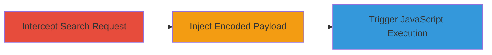

# Reflected XSS in Search Form via WAF-Bypassing Encoded JavaScript URI

Multi-stage attack chain demonstrating exploitation of a reflected XSS vulnerability in the search form of www.█████, where unsanitized POST keyword input is reflected back, allowing arbitrary JavaScript execution. The attack bypasses the WAF using URL-encoded line breaks to construct a malicious javascript: URI in an anchor tag, leading to client-side impacts like cookie theft or phishing.

## Chain Metrics Dashboard

| Metric | Value |
|--------|-------|
| Chain Status | Unverified |
| Total Steps | 3 |
| Execution Time | ~5 minutes |
| Skill Level | Intermediate |
| Complexity | Medium |
| Impact Level | High |

## Attack Flow Visualization

## Prerequisites & Requirements

### Required Tools

- [[tools/Burp-Suite]]

### Target Environment

- Web application with search form at www.█████
- Required services/ports: HTTP/HTTPS on port 80/443
- Network access requirements: Direct access to the target website

### Initial Access Requirements

- No credentials required
- Browser or proxy access to the site
- No prior access needed beyond public-facing web

## Detailed Attack Procedures

### Step 1: Intercept Search Request
procedure: [[procedures/Intercept-and-Modify-Search-Request-with-Burp-Suite]]

**Objective**: Capture the legitimate POST request from the search form to prepare for payload injection.

**Instructions**: Navigate to the search form on www.█████ and perform a standard search query. Use [[tools/Burp-Suite]] to intercept the outgoing POST request containing the keyword parameter.

**Expected Output**: Intercepted HTTP POST request visible in Burp Suite proxy, showing the keyword parameter with the original search term.

**Success Indicators**:
- Request successfully intercepted and paused in Burp Suite
- POST body includes 'keyword' parameter

### Step 2: Inject Encoded Payload
procedure: [[procedures/Intercept-and-Modify-Search-Request-with-Burp-Suite]]

**Objective**: Modify the keyword parameter with a WAF-bypassing XSS payload to reflect malicious JavaScript.

**Instructions**: In Burp Suite, edit the keyword value to the payload: `<a+href="ja%0A%0Dvascript:alert(document.domain)">Click</a>`. This uses %0A%0D (URL-encoded newlines) to break out and form a javascript: URI in the href attribute, evading WAF detection.

**Expected Output**: Modified request ready for forwarding, with the payload in the keyword field.

**Success Indicators**:
- Payload correctly encoded and inserted without syntax errors
- No immediate WAF block on inspection

### Step 3: Trigger JavaScript Execution
procedure: [[procedures/Intercept-and-Modify-Search-Request-with-Burp-Suite]]

**Objective**: Submit the tampered request and interact with the reflected content to execute the payload.

**Instructions**: Forward the modified request in Burp Suite. On the response page, locate and click the reflected 'Click' link, which executes `alert(document.domain)` in the victim's browser context.

**Expected Output**: Search results page with a clickable 'Click' anchor tag; clicking it triggers a JavaScript alert displaying the document domain.

**Success Indicators**:
- Alert popup appears confirming JavaScript execution
- No errors in browser console; payload reflected unsanitized

## Attack Chain Summary

### Key Achievements

1. Successful interception and modification of search POST request using Burp Suite
2. WAF bypass via URL-encoded line breaks in javascript: URI construction
3. Arbitrary JavaScript execution demonstrating potential for cookie theft or phishing

## Technique & Tactic Coverage

### MITRE ATT&CK Techniques

- [[Exploit Public-Facing Application]]
- [[JavaScript]]

### MITRE ATT&CK Tactics

- [[Initial Access]]
- [[Execution]]

---

*Last updated: 2023-10-01T00:00:00Z*
