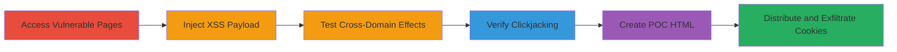

---
tags:
  - xss
  - reflected-xss
  - clickjacking
  - cookie-theft
  - javascript
type: attack_chain
tools: []
tactics:
  - '[[Initial Access]]'
  - '[[Execution]]'
  - '[[Collection]]'
verified: false
platforms:
  - Web
submitted: true
complexity: medium
created_at: '2023-10-01T00:00:00Z'
procedures:
  - '[[procedures/Access-Vulnerable-Shop-Pages]]'
  - '[[procedures/Inject-and-Confirm-Reflected-XSS-Payload]]'
  - '[[procedures/Test-Cross-Domain-XSS-Payloads]]'
  - '[[procedures/Verify-Clickjacking-Vulnerability]]'
  - '[[procedures/Create-Clickjacking-POC-with-XSS]]'
  - '[[procedures/Distribute-POC-and-Exfiltrate-Cookies]]'
step_count: 6
techniques:
  - '[[JavaScript]]'
  - '[[Steal Web Session Cookie]]'
  - '[[Drive-by Compromise]]'
updated_at: '2025-12-14T17:28:12.243Z'
description: >-
  A multi-stage attack exploiting reflected XSS in the search parameter on shop
  pages of marthastewart.com and bhg.com, combined with clickjacking due to
  missing frame protection headers, to steal user cookies.
skill_level: intermediate
impact_level: high
id: ff74c536-bb1b-4d18-84ad-90e12e9fd21c
validated: true
mitre_tactics:
  - '[[Initial Access]]'
  - '[[Execution]]'
  - '[[Collection]]'
mitre_techniques:
  - '[[JavaScript]]'
  - '[[Steal Web Session Cookie]]'
  - '[[Drive-by Compromise]]'
---
# Reflected XSS in Search Parameter Combined with Clickjacking for Cookie Theft

Multi-stage attack chain demonstrating a complete attack workflow exploiting vulnerabilities on marthastewart.com and bhg.com shop pages.

## Chain Metrics Dashboard

| Metric | Value |
|--------|-------|
| Chain Status | Unverified |
| Total Steps | 6 |
| Execution Time | ~10 minutes |
| Skill Level | Intermediate |
| Complexity | Medium |
| Impact Level | High |

## Attack Flow Visualization

## Prerequisites & Requirements

### Required Tools

- Web browser (e.g., Chrome Developer Tools for payload testing)
- Text editor for creating HTML POC files
- Local web server (optional, for hosting POC)

### Target Environment

- Web platform
- Access to public-facing shop pages on https://marthastewart.com and https://bhg.com
- No authentication required

### Initial Access Requirements

- Internet access
- No credentials needed
- Victim interaction required for POC execution

## Detailed Attack Procedures

### Step 1: Access Vulnerable Shop Pages
procedure: [[procedures/Access-Vulnerable-Shop-Pages]]

**Objective**: Navigate to the shop pages to identify the vulnerable search parameter.

**Instructions**: Open a web browser and directly access the shop URLs with the search parameter.

**Expected Output**: Page loads with search functionality visible.

**Success Indicators**:
- Shop page renders without errors
- ?s= parameter is present in the URL

### Step 2: Inject and Confirm Reflected XSS Payload
procedure: [[procedures/Inject-and-Confirm-Reflected-XSS-Payload]]

**Objective**: Inject a payload into the ?s= parameter to break out of script context and execute JavaScript.

**Instructions**: Append a payload to the URL, such as ?s=%E2%80%98);%3C/script%3E%3Cscript%3Ealert(document.cookie)%3C/script%3E, and load the page to observe execution.

**Expected Output**: Alert box displays document.cookie contents.

**Success Indicators**:
- JavaScript executes (alert pops up)
- No sanitization blocks the payload

### Step 3: Test Cross-Domain XSS Payloads
procedure: [[procedures/Test-Cross-Domain-XSS-Payloads]]

**Objective**: Modify payloads to explore cross-domain effects using document.domain.

**Instructions**: Experiment with payloads incorporating document.domain to access properties across domains.

**Expected Output**: Payload variations confirm broader exploit potential.

**Success Indicators**:
- Payloads execute without domain restrictions
- Cookie or domain properties accessible

### Step 4: Verify Clickjacking Vulnerability
procedure: [[procedures/Verify-Clickjacking-Vulnerability]]

**Objective**: Check for absence of frame protection headers.

**Instructions**: Use browser dev tools or curl to inspect response headers for X-Frame-Options or CSP frame-ancestors.

**Expected Output**: No restrictive headers present; page can be iframed.

**Success Indicators**:
- Headers missing
- Test iframe loads the page

### Step 5: Create Clickjacking POC with XSS
procedure: [[procedures/Create-Clickjacking-POC-with-XSS]]

**Objective**: Develop an HTML file that iframes the vulnerable page with XSS payload and overlays elements for user interaction.

**Instructions**: Create POC1.html and POC2.html files embedding the iframed URL with payload, using CSS for invisibility and click overlays.

**Expected Output**: Local HTML file that, when opened, loads the iframe and executes XSS on interaction.

**Success Indicators**:
- Iframe loads vulnerable page
- Click triggers XSS execution

### Step 6: Distribute POC and Exfiltrate Cookies
procedure: [[procedures/Distribute-POC-and-Exfiltrate-Cookies]]

**Objective**: Deliver the POC to victims to capture cookies via exfiltration.

**Instructions**: Host or email the POC.html; upon victim opening and interacting, script sends cookies to attacker's server.

**Expected Output**: Cookies received on attacker's endpoint.

**Success Indicators**:
- Victim interacts with POC
- Cookies exfiltrated successfully

## Attack Chain Summary

### Key Achievements

1. Confirmed reflected XSS in ?s= parameter allowing arbitrary JS execution.
2. Exploited missing X-Frame-Options for clickjacking.
3. Combined vulnerabilities to steal cookies across domains via POC.

## Technique & Tactic Coverage

### MITRE ATT&CK Techniques

- [[JavaScript]]
- [[Steal Web Session Cookie]]
- [[Drive-by Compromise]]

### MITRE ATT&CK Tactics

- [[Initial Access]]
- [[Execution]]
- [[Collection]]

---
*Last updated: 2023-10-01T00:00:00Z*
