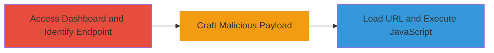

# Reflected XSS in Semrush my_reports Dashboard via Unsanitized Document ID

Multi-stage attack chain demonstrating a complete attack workflow exploiting a reflected Cross-Site Scripting (XSS) vulnerability in the Semrush my_reports dashboard. The attack targets the /api/v1/document endpoint where the document ID parameter is reflected without sanitization, enabling injection of arbitrary JavaScript. This leads to execution in the victim's browser context, potentially stealing session cookies for hijacking authenticated sessions.

## Chain Metrics Dashboard

| Metric | Value |
|--------|-------|
| Chain Status | Unverified |
| Total Steps | 3 |
| Execution Time | ~2 minutes |
| Skill Level | Intermediate |
| Complexity | Medium |
| Impact Level | High |

## Attack Flow Visualization

## Prerequisites & Requirements

### Required Tools

- Web browser (e.g., Chrome or Firefox with developer tools)

### Target Environment

- Web platform
- Access to Semrush my_reports dashboard (authenticated user session)
- No specific services/ports beyond standard HTTPS (443)

### Initial Access Requirements

- Valid authenticated session to Semrush my_reports
- Direct network access to https://www.semrush.com
- No prior elevated access needed

## Detailed Attack Procedures

### Step 1: Access Dashboard and Identify Vulnerable Endpoint
procedure: [[procedures/Exploit-Reflected-XSS-in-Semrush-Document-Endpoint]]

**Objective**: Gain access to the my_reports dashboard and locate the vulnerable /api/v1/document endpoint to confirm reflection of the document ID parameter.

**Instructions**: Navigate to the Semrush my_reports dashboard in a web browser. Inspect the network requests or page source to identify calls to https://www.semrush.com/my_reports/api/v1/document/{id}, where {id} is a document identifier. Verify that the {id} value is reflected unsanitized in the HTML response.

**Expected Output**: Page loads with the document ID visible in the HTML, confirming lack of sanitization.

**Success Indicators**:
- Dashboard accessible with authentication
- Endpoint identified via URL or developer tools
- Reflection of ID parameter observed in page source

### Step 2: Craft Malicious Payload
procedure: [[procedures/Exploit-Reflected-XSS-in-Semrush-Document-Endpoint]]

**Objective**: Create a URL-encoded payload that injects HTML and JavaScript into the document ID parameter to trigger XSS execution.

**Instructions**: Modify the base URL by replacing the document ID with a payload that closes the HTML attribute or tag and injects a script. Use the payload "> encoded as %22%3E%3Cimg%20src=x%20onerror=alert(document.cookie)%3E. Construct the full URL: https://www.semrush.com/my_reports/api/v1/document%22%3E%3Cimg%20src=x%20onerror=alert(document.cookie)%3E/4007861 (appending a valid ID segment to avoid errors).

**Expected Output**: A valid malicious URL ready for loading.

**Success Indicators**:
- Payload correctly URL-encoded
- URL parses without syntax errors
- Payload includes onerror handler for JavaScript execution

### Step 3: Load Manipulated URL and Observe Execution
procedure: [[procedures/Exploit-Reflected-XSS-in-Semrush-Document-Endpoint]]

**Objective**: Load the crafted URL to trigger the injected JavaScript, demonstrating cookie theft via an alert.

**Instructions**: Enter the malicious URL into the browser address bar while authenticated in the my_reports dashboard. Upon page load, the injected  tag will fail to load (src=x), triggering the onerror event that executes alert(document.cookie), displaying session cookies.

**Expected Output**: Browser alert box pops up showing document.cookie contents, including session tokens.

**Success Indicators**:
- JavaScript executes on page load
- Alert displays cookies (e.g., session IDs)
- Screenshots or console logs confirm execution (PoC via browser dev tools)

## Attack Chain Summary

### Key Achievements

1. Identified and confirmed reflected XSS in the document endpoint without input sanitization.
2. Successfully injected and executed arbitrary JavaScript to access sensitive browser data.
3. Demonstrated potential for session hijacking by exfiltrating cookies.

## Technique & Tactic Coverage

### MITRE ATT&CK Techniques

- [[JavaScript]]

### MITRE ATT&CK Tactics

- [[Execution]]
- [[Collection]]

---
*Last updated: 2023-10-01T00:00:00Z*
