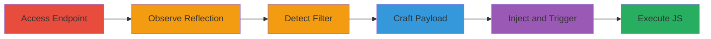

# Reflected XSS in Serial Verification via Uppercase Filter Bypass

Multi-stage attack chain demonstrating exploitation of a reflected XSS vulnerability in the product serial verification endpoint of an ASP-based web application, where user input in the 'serial' parameter is reflected without proper encoding, but an uppercase filter is bypassed using octal-encoded JavaScript to execute arbitrary code.

## Chain Metrics Dashboard

| Metric | Value |
|--------|-------|
| Chain Status | Unverified |
| Total Steps | 5 |
| Execution Time | ~5 minutes |
| Skill Level | Intermediate |
| Complexity | Medium |
| Impact Level | High |

## Attack Flow Visualization

## Prerequisites & Requirements

### Required Tools

- [[tools/Browser]]

### Target Environment

- Web platform with ASP technology
- Access to public-facing endpoint: http://www.grouplogic.com/files/glidownload/verify3.asp
- No authentication required

### Initial Access Requirements

- Direct network access to the target URL
- No prior credentials needed
- Victim browser context for execution

## Detailed Attack Procedures

### Step 1: Access and Test Serial Verification Endpoint
procedure: [[procedures/Access-and-Test-Serial-Verification-Endpoint]]

**Objective**: Gain initial access to the vulnerable endpoint and submit an invalid serial to begin testing for reflection.

**Instructions**: Use a web browser to navigate to the verification endpoint with an invalid serial parameter.

**Expected Output**: Response page displaying the invalid serial input.

**Success Indicators**:
- Endpoint loads successfully
- Invalid serial is accepted without errors

### Step 2: Observe Input Reflection in Response
procedure: [[procedures/Observe-Input-Reflection-in-Response]]

**Objective**: Confirm that user input from the serial parameter is directly reflected in the HTML response without encoding.

**Instructions**: Submit a test string like "test123" as the serial and inspect the response source to see it echoed back.

**Expected Output**: Reflected input visible in the page source, e.g., "Invalid serial: TEST123".

**Success Indicators**:
- Input appears unencoded in the response
- No HTML escaping observed

### Step 3: Detect Uppercase Conversion Filter
procedure: [[procedures/Detect-Uppercase-Conversion-Filter]]

**Objective**: Identify the uppercase filter that converts input, breaking standard JavaScript injections.

**Instructions**: Submit a lowercase JavaScript test like "" and observe the response where it becomes uppercase, preventing execution.

**Expected Output**: Reflected script as "", which does not execute.

**Success Indicators**:
- Input characters converted to uppercase
- Standard alert() fails to trigger

### Step 4: Craft Octal-Encoded JavaScript Payload
procedure: [[procedures/Craft-Octal-Encoded-JavaScript-Payload]]

**Objective**: Develop a bypass payload using octal encoding to avoid alphabetic characters affected by the uppercase filter.

**Instructions**: Reference ISO-8859-1 encoding to create octal sequences (e.g., \146 for 'f'), constructing a payload like []['\146\151\154\164\145\162']['\143\157\156\163\164\162\165\143\164\157\162']('\141\154\145\162\164\50\61\51')().

**Expected Output**: Encoded string that, when uppercased, still represents valid JS octal escapes.

**Success Indicators**:
- Payload avoids letters, using numbers and backslashes
- Test encoding in a local JS console confirms alert(1) execution

### Step 5: Inject and Trigger XSS Payload
procedure: [[procedures/Inject-and-Trigger-XSS-Payload]]

**Objective**: Deliver the encoded payload to the endpoint and trigger JavaScript execution in the victim's browser.

**Instructions**: URL-encode the payload and append to the serial parameter, then load the URL in a browser to trigger on events like onmouseover or onload.

**Expected Output**: JavaScript alert(1) or equivalent payload executes, confirming XSS.

**Success Indicators**:
- Arbitrary JS runs in browser context
- Potential for cookie theft or defacement observed

## Attack Chain Summary

### Key Achievements

1. Confirmed reflected XSS without encoding in serial parameter
2. Bypassed uppercase filter using octal encoding
3. Achieved arbitrary JavaScript execution for data exfiltration or manipulation

## Technique & Tactic Coverage

### MITRE ATT&CK Techniques

- [[JavaScript]]
- [[Exploit Public-Facing Application]]

### MITRE ATT&CK Tactics

- [[Initial Access]]
- [[Collection]]

---

*Last updated: 2023-10-01T00:00:00Z*
