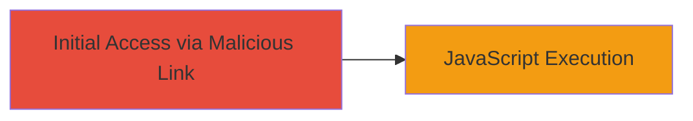

---
tags:
  - xss
  - reflected-xss
  - servicenow
  - javascript-injection
type: attack_chain
tools: []
tactics:
  - '[[Initial Access]]'
  - '[[Execution]]'
commands: []
platforms:
  - Web
complexity: low
procedures:
  - '[[procedures/Exploit-Reflected-XSS-in-ServiceNow-Logout-Redirect]]'
step_count: 1
techniques:
  - '[[JavaScript]]'
description: >-
  An attack chain exploiting a reflected XSS vulnerability in ServiceNow's
  logout redirect functionality to execute arbitrary JavaScript in the victim's
  browser.
skill_level: beginner
impact_level: medium
id: 26d66782-4229-4379-a870-ac8db0b3b4c4
created_at: '2025-12-14T03:15:53.467Z'
updated_at: '2025-12-14T03:15:53.467Z'
verified: false
validated: true
submitted: true
mitre_tactics:
  - '[[Initial Access]]'
  - '[[Execution]]'
mitre_techniques:
  - '[[JavaScript]]'
---
# Reflected XSS in ServiceNow Logout Redirect via Malicious URL

Multi-stage attack chain demonstrating a complete attack workflow.

## Chain Metrics Dashboard

| Metric | Value |
|--------|-------|
| Chain Status | Unverified |
| Total Steps | 1 |
| Execution Time | ~1 minute |
| Skill Level | Beginner |
| Complexity | Low |
| Impact Level | Medium |

## Attack Flow Visualization



## Prerequisites & Requirements

### Required Tools

- Web browser (e.g., Chrome, Firefox)

### Target Environment

- ServiceNow instance accessible over HTTPS on port 443
- Web platform with logout_redirect.do endpoint

### Initial Access Requirements

- No credentials required (unauthenticated)
- Victim must be tricked into clicking the malicious link (e.g., via phishing email or social engineering)
- Network access to the target ServiceNow instance

## Detailed Attack Procedures

### Step 1: Deliver and Execute Malicious URL
procedure: [[procedures/Exploit-Reflected-XSS-in-ServiceNow-Logout-Redirect]]

**Objective**: Craft and deliver a malicious URL that injects and executes JavaScript in the victim's browser context upon clicking, demonstrating arbitrary code execution.

**Instructions**: Construct the payload by URL-encoding a javascript: scheme in the sysparm_url parameter to bypass any basic filtering. The payload uses double slashes and encoding to evade sanitization. Share the link with the victim via email, chat, or other means. When clicked, it triggers the logout redirect, reflecting the payload and executing the JavaScript.

Example malicious URL:

```url
https://target:443/logout_redirect.do?sysparm_url=//j%5c%5cjavascript%3aalert(document.domain)
```

Breakdown:
- `//j\\javascript:alert(document.domain)` is URL-encoded as `//j%5c%5cjavascript%3aalert(document.domain)`
- `%5c` is the encoding for backslash (`\`)
- This crafts a scheme like `javascript:alert(document.domain)` after decoding and processing

**Expected Output**: Upon clicking, the browser executes the JavaScript, popping an alert box displaying the document domain (e.g., the ServiceNow instance's domain), confirming XSS execution.

**Success Indicators**:
- Alert box appears in the browser
- JavaScript console logs the execution (if inspected)
- No server-side errors; redirect attempts to process the invalid URL but reflects the payload client-side

## Attack Chain Summary

### Key Achievements

1. Successful injection of arbitrary JavaScript via unauthenticated URL parameter
2. Execution of code in the victim's browser without authentication
3. Potential for further attacks like session theft or data exfiltration if payload is escalated

## Technique & Tactic Coverage

### MITRE ATT&CK Techniques

- [[JavaScript]]

### MITRE ATT&CK Tactics

- [[Initial Access]]
- [[Execution]]

---
*Last updated: 2023-10-01*
