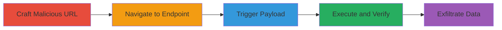

---
tags:
  - xss
  - reflected-xss
  - shopify
  - authentication
  - javascript-uri
type: attack_chain
tools: []
tactics:
  - '[[Execution]]'
verified: false
platforms:
  - Web
submitted: true
complexity: medium
procedures:
  - '[[procedures/Craft-Malicious-XSS-URL-for-Shopify-Auth]]'
  - '[[procedures/Trigger-XSS-Payload-via-Page-Reload]]'
  - '[[procedures/Verify-XSS-Execution-in-Admin-Context]]'
  - '[[procedures/Exfiltrate-Cookies-via-Advanced-XSS-Payload]]'
step_count: 4
techniques:
  - '[[JavaScript]]'
description: >-
  A multi-stage attack exploiting a reflected XSS vulnerability in the Shopify
  admin authentication endpoint through the return_url parameter, allowing
  arbitrary JavaScript execution in the admin context.
skill_level: intermediate
impact_level: high
id: e0c9b5c8-c110-43cf-8555-087625a0b813
created_at: '2025-12-13T23:52:49.667Z'
updated_at: '2025-12-13T23:52:49.668Z'
validated: true
mitre_tactics:
  - '[[Execution]]'
mitre_techniques:
  - '[[JavaScript]]'
---
# Reflected XSS in Shopify Admin Authentication via return_url Parameter

Multi-stage attack chain demonstrating a complete attack workflow exploiting reflected XSS in Shopify's admin authentication.

## Chain Metrics Dashboard

| Metric | Value |
|--------|-------|
| Chain Status | Unverified |
| Total Steps | 4 |
| Execution Time | ~2 minutes |
| Skill Level | Intermediate |
| Complexity | Medium |
| Impact Level | High |

## Attack Flow Visualization

## Prerequisites & Requirements

### Required Tools

- Web browser (e.g., Chrome or Firefox with developer tools)

### Target Environment

- Shopify admin panel (e.g., https://<store>.myshopify.com/admin)
- Access to the internet and ability to navigate to the target URL
- No special privileges required for initial access

### Initial Access Requirements

- Public access to the Shopify store's admin endpoint
- No credentials needed for the vulnerability trigger, but admin context execution requires the page to be in an authenticated session
- Network position: Direct internet access

## Detailed Attack Procedures

### Step 1: Craft and Navigate to Malicious URL
procedure: [[procedures/Craft-Malicious-XSS-URL-for-Shopify-Auth]]

**Objective**: Construct a URL that injects a javascript: URI into the return_url parameter to set up the XSS payload.

**Instructions**: Manually construct the URL in the browser address bar or via developer tools. Replace <Any> with the target store name.

**Expected Output**: The authentication page loads with the malicious return_url reflected but not yet executed.

**Success Indicators**:
- URL successfully navigated without errors
- Page displays the admin authentication interface

### Step 2: Trigger XSS Payload via Page Reload
procedure: [[procedures/Trigger-XSS-Payload-via-Page-Reload]]

**Objective**: Force the browser to re-evaluate the reflected javascript: URI by reloading the page.

**Instructions**: After navigating to the crafted URL, use the browser's reload function to trigger the payload execution.

**Expected Output**: The javascript:alert(100) executes, displaying an alert box.

**Success Indicators**:
- Alert dialog appears on screen
- No browser errors in console

### Step 3: Verify XSS Execution in Admin Context
procedure: [[procedures/Verify-XSS-Execution-in-Admin-Context]]

**Objective**: Confirm that the injected JavaScript runs in the context of the authenticated admin session.

**Instructions**: Observe the alert popup and check browser console for execution details. Ensure the page is in an admin-authenticated state.

**Expected Output**: Alert message '100' displayed, indicating successful JS execution.

**Success Indicators**:
- JavaScript alert triggers
- Execution occurs within the admin panel's DOM context

### Step 4: Exfiltrate Cookies via Advanced XSS Payload
procedure: [[procedures/Exfiltrate-Cookies-via-Advanced-XSS-Payload]]

**Objective**: Modify the payload to steal session cookies or perform other unauthorized actions.

**Instructions**: Update the return_url to include document.cookie in the alert and repeat the navigation and reload process.

**Expected Output**: Alert displays the admin's session cookies, which can be used for hijacking.

**Success Indicators**:
- Cookie data visible in alert
- Potential for further actions like session replay

## Attack Chain Summary

### Key Achievements

1. Successful injection and reflection of javascript: URI in return_url parameter
2. Arbitrary JavaScript execution in the Shopify admin context
3. Demonstration of session cookie theft for potential account takeover
4. Highlighting lack of URI validation in authentication flow

## Technique & Tactic Coverage

### MITRE ATT&CK Techniques

- [[JavaScript]]

### MITRE ATT&CK Tactics

- [[Execution]]

---
*Last updated: 2023-10-01T00:00:00Z*
