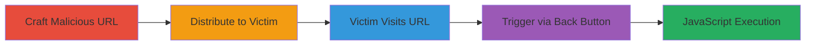

# Reflected XSS in Shopify Admin Marketing Reports via return_page_pathname Parameter

Multi-stage attack chain demonstrating a complete reflected XSS workflow in Shopify's admin interface, allowing arbitrary JavaScript execution to steal sensitive data or perform unauthorized actions.

## Chain Metrics Dashboard

| Metric | Value |
|--------|-------|
| Chain Status | Unverified |
| Total Steps | 4 |
| Execution Time | ~5 minutes |
| Skill Level | Intermediate |
| Complexity | Medium |
| Impact Level | High |

## Attack Flow Visualization

## Prerequisites & Requirements

### Required Tools

- None (manual URL crafting and social engineering)

### Target Environment

- Shopify admin platform
- Authenticated staff access to marketing reports
- Web browser (e.g., Chrome, Firefox)

### Initial Access Requirements

- Knowledge of victim's shop domain and a valid marketing campaign ID
- Ability to communicate with the target staff member (e.g., via email or chat)
- No prior credentials needed for attacker

## Detailed Attack Procedures

### Step 1: Craft Malicious URL
procedure: [[procedures/Craft-Malicious-URL-for-Shopify-XSS-Injection]]

**Objective**: Create a URL that injects a JavaScript payload into the return_page_pathname parameter, targeting the marketing reports endpoint.

**Instructions**: Identify a valid marketing campaign ID from the target's shop. Construct the URL by appending the vulnerable parameter with a javascript: protocol payload, such as `javascript:alert('XSS')` for testing or a more malicious script for exploitation.

**Expected Output**: A fully formed malicious URL like `https://[YOUR-SHOP].myshopify.com/admin/marketing/reports/[CAMPAIGN-ID]?return_page_pathname=javascript:alert('XSS')&return_page_title=Back`.

**Success Indicators**:
- URL is syntactically correct and includes the payload
- Parameter injection is unescaped

### Step 2: Distribute Malicious URL to Target
procedure: [[procedures/Distribute-Malicious-URL-to-Authenticated-Staff]]

**Objective**: Deliver the crafted URL to an authenticated Shopify staff member via a trusted channel to entice visitation.

**Instructions**: Send the URL through email, chat, or a phishing pretext, framing it as a legitimate link to the shop's marketing reports (e.g., "Check this report: [URL]").

**Expected Output**: Victim receives and potentially clicks the link while authenticated in the Shopify admin.

**Success Indicators**:
- Confirmation of delivery (e.g., email read receipt)
- Victim acknowledgment or visit logs if monitorable

### Step 3: Induce Victim to Visit Malicious URL
procedure: [[procedures/Induce-Victim-to-Visit-Malicious-URL]]

**Objective**: Ensure the victim navigates to the malicious URL in an authenticated session.

**Instructions**: If social engineering is used, follow up to encourage clicking. The victim must be logged into the Shopify admin and access the provided link.

**Expected Output**: Page loads partially, reflecting the parameter in an anchor element.

**Success Indicators**:
- Victim reports accessing the page or attacker observes indirect signs (e.g., via payload callback)
- No immediate error on page load

### Step 4: Trigger XSS Execution via Back Button
procedure: [[procedures/Trigger-XSS-Execution-via-Back-Button]]

**Objective**: Execute the injected JavaScript by manipulating browser navigation before full page load.

**Instructions**: Instruct or trick the victim to click the browser's back button immediately after the page starts loading. This executes the javascript: protocol in the reflected href attribute.

**Expected Output**: Alert or malicious script runs in the victim's browser context, potentially exfiltrating data or performing actions.

**Success Indicators**:
- JavaScript payload executes (e.g., alert pops or data sent to attacker server)
- Access to admin functions or data theft confirmed

## Attack Chain Summary

### Key Achievements

1. Successful injection of javascript: protocol without validation
2. Execution of arbitrary code in authenticated admin session
3. Potential for data exfiltration or session hijacking

## Technique & Tactic Coverage

### MITRE ATT&CK Techniques

- [[Exploit Public-Facing Application]]
- [[JavaScript]]

### MITRE ATT&CK Tactics

- [[Initial Access]]
- [[Execution]]

---
*Last updated: 2023-10-01T00:00:00Z*
