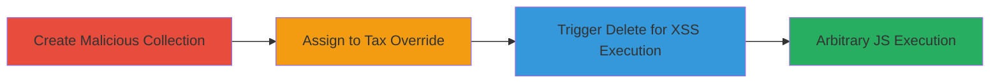

---
tags:
  - xss
  - reflected-xss
  - shopify
  - admin
  - javascript
type: attack_chain
tools: []
tactics:
  - '[[Execution]]'
commands: []
platforms:
  - Web
complexity: medium
procedures:
  - '[[procedures/Create-Malicious-Product-Collection-for-XSS]]'
  - '[[procedures/Add-Tax-Override-with-Malicious-Collection]]'
  - '[[procedures/Trigger-XSS-via-Delete-Override]]'
step_count: 3
techniques:
  - '[[JavaScript]]'
description: >-
  A multi-stage attack exploiting a reflected XSS vulnerability in Shopify's
  myshopify.com admin site via the TAX Overrides feature, allowing arbitrary
  JavaScript execution in an authenticated admin user's context.
skill_level: intermediate
impact_level: high
id: 7ca5a5e3-cc61-4993-b6fd-b2d6234ab764
created_at: '2025-12-14T17:28:45.062Z'
updated_at: '2025-12-14T17:28:45.062Z'
verified: false
validated: true
submitted: true
mitre_tactics:
  - '[[Execution]]'
mitre_techniques:
  - '[[JavaScript]]'
---
# Reflected XSS in Shopify Admin TAX Overrides for Arbitrary JavaScript Execution

## Overview

This attack chain demonstrates a reflected Cross-Site Scripting (XSS) vulnerability in Shopify's myshopify.com admin interface, specifically within the TAX Overrides feature. An attacker with authenticated access creates a product collection with a malicious payload in its name, assigns it to a tax override for 'Rest of World', and triggers the payload by deleting the override. The unsanitized reflection of the collection name in the delete confirmation UI executes arbitrary JavaScript, potentially leading to session hijacking, data theft, or unauthorized shop modifications in the admin's browser context.

## Chain Metrics Dashboard

| Metric | Value |
|--------|-------|
| Chain Status | Unverified |
| Total Steps | 3 |
| Execution Time | ~5 minutes |
| Skill Level | Intermediate |
| Complexity | Medium |
| Impact Level | High |

## Attack Flow Visualization

## Prerequisites & Requirements

### Required Tools

- Web browser with developer tools (e.g., Chrome DevTools for payload testing)

### Target Environment

- Shopify myshopify.com admin site
- Authenticated admin access to the shop
- No specific ports or services beyond standard HTTPS web access

### Initial Access Requirements

- Valid admin credentials for the target Shopify shop
- Direct network access to myshopify.com (no VPN or proxy restrictions)
- No prior access needed beyond authentication

## Detailed Attack Procedures

### Step 1: Create Malicious Product Collection
procedure: [[procedures/Create-Malicious-Product-Collection-for-XSS]]

**Objective**: Prepare a product collection with an XSS payload in its name to serve as the vector for reflection.

**Instructions**: Log in to the Shopify admin dashboard, navigate to Products > Collections, and create a new collection. In the name field, enter a payload that breaks out of HTML context, such as `'>`. Save the collection. This payload will be reflected later without sanitization.

**Expected Output**: A new collection listed in the admin with the malicious name visible but not yet executing.

**Success Indicators**:
- Collection created successfully
- Payload string appears intact in the collection list

### Step 2: Add Tax Override with Malicious Collection
procedure: [[procedures/Add-Tax-Override-with-Malicious-Collection]]

**Objective**: Assign the malicious collection to a tax override, embedding the payload in the tax settings UI.

**Instructions**: Navigate to Settings > Taxes in the admin dashboard. Under 'Rest of World', select 'Add a tax override'. Choose the malicious collection created in Step 1 as the applicable collection. The payload will appear in the UI selection but will not execute at this stage. Save the override.

**Expected Output**: Tax override added, with the collection name (including payload) displayed in the taxes settings list.

**Success Indicators**:
- Override configured without errors
- Malicious collection name visible in the tax overrides section

### Step 3: Trigger XSS via Delete Override
procedure: [[procedures/Trigger-XSS-via-Delete-Override]]

**Objective**: Force reflection of the unsanitized collection name in the delete UI to execute the JavaScript payload.

**Instructions**: In Settings > Taxes, locate the 'Rest of World' override with the malicious collection. Click the recycle bin icon to initiate 'Delete Entire Override'. The confirmation or error dialog will reflect the collection name without proper escaping, breaking out of HTML attributes and triggering the onerror handler to execute the prompt(7) or any arbitrary JS.

**Expected Output**: JavaScript alert or payload execution (e.g., prompt box appears) in the admin's browser.

**Success Indicators**:
- Payload executes, confirming XSS
- No server-side errors; execution occurs client-side

## Attack Chain Summary

### Key Achievements

1. Successful creation and assignment of a malicious collection to bypass input validation.
2. Triggering of reflected XSS via UI interaction, achieving arbitrary JS execution.
3. Potential for admin session compromise, enabling data exfiltration or unauthorized actions.

## Technique & Tactic Coverage

### MITRE ATT&CK Techniques

- [[JavaScript]]

### MITRE ATT&CK Tactics

- [[Execution]]

---
*Last updated: 2023-10-01*
