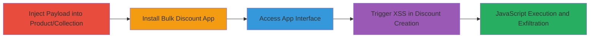

# Reflected XSS in Shopify Bulk Discount App via Unsanitized Product Names

Multi-stage attack chain demonstrating a complete reflected XSS workflow in the Shopify Bulk Discount App, where unsanitized user inputs from product or collection names are reflected without escaping, allowing arbitrary JavaScript execution in the context of the shopifyapps.com domain. This can lead to session hijacking, cookie theft, or phishing against authenticated store owners.

## Chain Metrics Dashboard

| Metric | Value |
|--------|-------|
| Chain Status | Unverified |
| Total Steps | 4 |
| Execution Time | ~5 minutes |
| Skill Level | Intermediate |
| Complexity | Medium |
| Impact Level | High |

## Attack Flow Visualization

## Prerequisites & Requirements

### Required Tools

- Web browser (e.g., Chrome with developer tools for payload testing)
- Access to a Shopify store admin panel

### Target Environment

- Shopify platform (myshopify.com store)
- Bulk Discount App installed on a store with a paid basic plan
- No specific ports or services beyond standard HTTPS (443)

### Initial Access Requirements

- Valid Shopify store owner credentials
- Administrative access to create products/collections
- Network access to install apps from Shopify App Store

## Detailed Attack Procedures

### Step 1: Inject Payload into Product or Collection
procedure: [[procedures/Create-Malicious-Product-or-Collection-for-XSS]]

**Objective**: Introduce a malicious JavaScript payload into a user-controlled field that will be reflected in the app interface.

**Instructions**: Log in to the Shopify admin dashboard, navigate to Products or Collections, and create a new entry. Enter the payload `'>` as the name or title, then save the changes. This payload uses an HTML injection to break out of any context and execute JavaScript via an onerror event on a broken image tag.

**Expected Output**: The product or collection is saved successfully, with the payload embedded in the name/title field.

**Success Indicators**:
- Product/collection appears in the list with the injected payload visible in the admin.
- No sanitization errors during save.

### Step 2: Install the Bulk Discount App
procedure: [[procedures/Install-Shopify-Bulk-Discount-App]]

**Objective**: Deploy the vulnerable app on the target store to enable reflection of the injected payload.

**Instructions**: From the Shopify admin, go to the Apps section, search for "Bulk Discount App", and install it. Ensure the store is on a paid basic plan, as required for app installation. Complete any onboarding prompts during installation.

**Expected Output**: The app is listed under installed apps, and its interface is accessible.

**Success Indicators**:
- App installation completes without errors.
- Dashboard shows "Shopify BulkDiscounts" as an active app.

### Step 3: Access the App Interface
procedure: [[procedures/Access-Bulk-Discount-App-Interface]]

**Objective**: Navigate to the app's dashboard where the reflected content will be displayed.

**Instructions**: In the Shopify admin dashboard, click on "Apps" and select "Shopify BulkDiscounts" to load the app interface at bulkdiscounts.shopifyapps.com.

**Expected Output**: The app's main page loads, potentially showing lists of products or collections that include the injected payload.

**Success Indicators**:
- App interface loads successfully in the browser.
- Authenticated session is maintained on the shopifyapps.com domain.

### Step 4: Trigger the XSS Payload
procedure: [[procedures/Trigger-Reflected-XSS-in-Discount-Creation]]

**Objective**: Cause the app to reflect the unsanitized input, executing the JavaScript payload.

**Instructions**: Within the app interface, click "Create One now" or "New Discount Set". This action queries and displays product/collection data, reflecting the payload without escaping, which triggers the JavaScript execution (e.g., a prompt showing the domain).

**Expected Output**: A JavaScript alert or prompt executes, confirming XSS (e.g., "bulkdiscounts.shopifyapps.com" displayed in a prompt box).

**Success Indicators**:
- Arbitrary JavaScript runs in the context of bulkdiscounts.shopifyapps.com.
- Browser developer tools show the payload injection and execution.

## Attack Chain Summary

### Key Achievements

1. Successful injection of XSS payload into Shopify store data.
2. Reflection and execution of JavaScript on a third-party app domain.
3. Potential for session theft or further client-side attacks on authenticated users.

## Technique & Tactic Coverage

### MITRE ATT&CK Techniques

- [[JavaScript]]

### MITRE ATT&CK Tactics

- [[Execution]]
- [[Collection]]

---
*Last updated: 2023-10-01T00:00:00Z*
