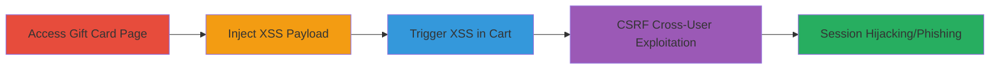

---
tags:
  - xss
  - reflected-xss
  - csrf
  - shopify
  - javascript
  - session-hijacking
type: attack_chain
tools:
  - '[[tools/XMLHttpRequest]]'
tactics:
  - '[[Initial Access]]'
  - '[[Execution]]'
verified: false
platforms:
  - Web
submitted: true
complexity: medium
created_at: '2023-10-01T00:00:00Z'
procedures:
  - '[[procedures/Access-Custom-Gift-Card-Page]]'
  - '[[procedures/Inject-XSS-Payload-in-Add-to-Cart-Request]]'
  - '[[procedures/Trigger-XSS-in-Cart-View]]'
  - '[[procedures/Exploit-CSRF-for-Cross-User-Attack]]'
step_count: 4
techniques:
  - '[[Drive-by Compromise]]'
  - '[[JavaScript]]'
  - '[[Exploit Public-Facing Application]]'
updated_at: '2025-12-14T03:46:37.135Z'
description: >-
  A multi-stage attack exploiting reflected XSS in Shopify's custom gift card
  cart addition combined with CSRF to inject and trigger malicious JavaScript
  across users, potentially leading to session hijacking.
skill_level: intermediate
impact_level: high
id: 33910325-68e0-43cb-ba57-d64160c1279c
validated: true
mitre_tactics:
  - '[[Initial Access]]'
  - '[[Execution]]'
mitre_techniques:
  - '[[Drive-by Compromise]]'
  - '[[JavaScript]]'
  - '[[Exploit Public-Facing Application]]'
---
---

# Reflected XSS in Shopify Cart via Unsanitized Gift Card Properties Enabling CSRF Cross-User Attacks

Multi-stage attack chain demonstrating a complete attack workflow exploiting vulnerabilities in Shopify's hardware store cart functionality.

## Chain Metrics Dashboard

| Metric | Value |
|--------|-------|
| Chain Status | Unverified |
| Total Steps | 4 |
| Execution Time | ~5 minutes |
| Skill Level | Intermediate |
| Complexity | Medium |
| Impact Level | High |

## Attack Flow Visualization

## Prerequisites & Requirements

### Required Tools

- [[tools/XMLHttpRequest]]
- Web proxy tool like Burp Suite (for request interception)

### Target Environment

- Web platform
- Shopify-hosted site (e.g., hardware.shopify.com)
- No specific ports; standard HTTPS (443)
- Network access to public-facing Shopify store

### Initial Access Requirements

- No credentials needed for unauthenticated attack
- Victim must be authenticated user (e.g., admin on related domain)
- Attacker needs ability to host CSRF PoC page

## Detailed Attack Procedures

### Step 1: Access Custom Gift Card Product Page
procedure: [[procedures/Access-Custom-Gift-Card-Page]]

**Objective**: Navigate to the vulnerable custom gift card product to prepare for cart addition.

**Instructions**: Open a browser and visit the custom gift card product page on the target Shopify store.

**Expected Output**: Product page loads, allowing selection of options like artwork upload.

**Success Indicators**:
- Page accessible without errors
- Form fields for gift card customization visible

### Step 2: Inject XSS Payload in Add to Cart Request
procedure: [[procedures/Inject-XSS-Payload-in-Add-to-Cart-Request]]

**Objective**: Modify the multipart form data in the add-to-cart request to inject an XSS payload into the properties[Artwork file] parameter.

**Instructions**: Select an image, click 'Add to Cart', intercept the POST request using a proxy, and alter the Content-Disposition header for properties[Artwork file] to include the payload ``. Forward the request with a valid PNG file.

**Expected Output**: Request completes successfully; item added to cart with injected property.

**Success Indicators**:
- No server errors on request forward
- Cart item added (verifiable in session)

### Step 3: Trigger XSS in Cart View
procedure: [[procedures/Trigger-XSS-in-Cart-View]]

**Objective**: View the cart to reflect the unsanitized property name, executing the injected JavaScript on interaction.

**Instructions**: Navigate to the cart page and hover over the artwork image in the custom gift card item.

**Expected Output**: JavaScript alert (e.g., alert(2)) pops up on mouseover.

**Success Indicators**:
- HTML payload reflected unescaped in cart view
- JS execution confirmed via alert or console

### Step 4: Exploit CSRF for Cross-User Attack
procedure: [[procedures/Exploit-CSRF-for-Cross-User-Attack]]

**Objective**: Use a CSRF PoC to force a victim's browser to add the malicious item to their cart, enabling cross-user XSS without direct interaction.

**Instructions**: Host an HTML page with JavaScript using XMLHttpRequest to send the crafted POST to /cart/add, including the XSS payload in the multipart body. Lure the victim to the page while authenticated on the target site.

**Expected Output**: Victim's cart populated with malicious item; XSS triggers on their cart view.

**Success Indicators**:
- Malicious request sent from victim's browser
- Victim's cart reflects the injected payload
- Potential for session theft if payload escalated

## Attack Chain Summary

### Key Achievements

1. Successful injection of reflected XSS via unsanitized form properties in Shopify cart.
2. Demonstration of JS execution in victim context without CSRF token validation.
3. Enablement of cross-user attacks targeting authenticated admins for phishing or hijacking.

## Technique & Tactic Coverage

### MITRE ATT&CK Techniques

- [[Drive-by Compromise]]
- [[JavaScript]]
- [[Exploit Public-Facing Application]]

### MITRE ATT&CK Tactics

- [[Initial Access]]
- [[Execution]]

---

*Last updated: 2023-10-01T00:00:00Z*
