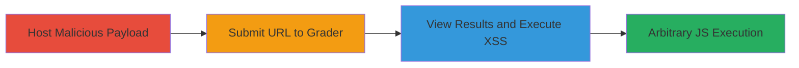

---
tags:
  - xss
  - reflected-xss
  - shopify
  - web-vulnerability
type: attack_chain
tools: []
tactics:
  - '[[Initial Access]]'
  - '[[Execution]]'
  - '[[Collection]]'
verified: false
platforms:
  - Web
submitted: true
complexity: medium
created_at: '2023-10-01T00:00:00Z'
procedures:
  - '[[procedures/Create-Malicious-Image-Tag-for-XSS]]'
  - '[[procedures/Submit-URL-to-Shopify-Grader-Tool]]'
  - '[[procedures/View-Grader-Results-to-Trigger-XSS]]'
step_count: 3
techniques:
  - '[[Exploit Public-Facing Application]]'
  - '[[JavaScript]]'
updated_at: '2025-12-14T03:15:31.838Z'
description: >-
  A multi-step attack exploiting a reflected XSS vulnerability in the Shopify
  Ecommerce Store Grader Tool by injecting a malicious image tag on a controlled
  site and triggering execution through unsanitized output.
skill_level: intermediate
impact_level: high
id: eb998aba-1c50-4e52-b8ef-6b7ae4fe482f
validated: true
mitre_tactics:
  - '[[Initial Access]]'
  - '[[Execution]]'
  - '[[Collection]]'
mitre_techniques:
  - '[[Exploit Public-Facing Application]]'
  - '[[JavaScript]]'
---
# Reflected XSS in Shopify Ecommerce Store Grader via Unsanitized Image Src

Multi-stage attack chain demonstrating exploitation of a reflected Cross-Site Scripting (XSS) vulnerability in the Shopify Ecommerce Store Grader Tool at ecommerce.shopify.com. The attack involves hosting a malicious image tag on a controlled website, submitting its URL to the grader, and triggering JavaScript execution when viewing the results, leading to arbitrary code execution in the victim's browser.

## Chain Metrics Dashboard

| Metric | Value |
|--------|-------|
| Chain Status | Unverified |
| Total Steps | 3 |
| Execution Time | ~5 minutes |
| Skill Level | Intermediate |
| Complexity | Medium |
| Impact Level | High |

## Attack Flow Visualization

## Prerequisites & Requirements

### Required Tools

- Web browser (e.g., Chrome, Firefox)
- Controlled website hosting capability (e.g., personal domain like imdb.jurgens.lv)

### Target Environment

- Web platform
- Access to https://ecommerce.shopify.com/grader
- No specific ports or services required beyond HTTP/HTTPS

### Initial Access Requirements

- No credentials needed
- Public internet access
- Control over a website to host the malicious payload

## Detailed Attack Procedures

### Step 1: Host Malicious Payload
procedure: [[procedures/Create-Malicious-Image-Tag-for-XSS]]

**Objective**: Prepare a controlled website with an image tag containing an XSS payload in the src attribute to be echoed unsanitized by the grader tool.

**Instructions**: Edit the HTML of your controlled website (e.g., imdb.jurgens.lv) to include a malicious  tag. Set the src to a non-existent resource followed by the payload, such as '111'. Save and ensure the page is publicly accessible.

**Expected Output**: The website displays the image tag, but the onerror event is primed for execution if the src is mishandled.

**Success Indicators**:
- Malicious tag visible in page source
- Page loads without errors on the controlled site

### Step 2: Submit URL to Grader Tool
procedure: [[procedures/Submit-URL-to-Shopify-Grader-Tool]]

**Objective**: Feed the controlled website's URL into the Shopify Ecommerce Store Grader Tool via the 'url' parameter to prompt the tool to fetch and analyze the page.

**Instructions**: Open a web browser and navigate to https://ecommerce.shopify.com/grader?url=imdb.jurgens.lv (replace with your controlled URL). The tool will process the input and generate a report.

**Expected Output**: The grader tool fetches the page and prepares results, including error messages about missing ALT tags.

**Success Indicators**:
- Grader tool accepts the URL without errors
- Report generation begins

### Step 3: Trigger XSS Execution
procedure: [[procedures/View-Grader-Results-to-Trigger-XSS]]

**Objective**: View the generated grader results, causing the tool to echo the unsanitized src attribute in an error message and execute the JavaScript payload.

**Instructions**: After submission, view the full grader results page. Look for the error block stating 'Some of the images on your homepage are missing ALT tags.' The embedded payload in the src will trigger the onerror event, executing alert(123).

**Expected Output**: A JavaScript alert box pops up displaying '123', confirming XSS execution.

**Success Indicators**:
- Alert dialog appears in the browser
- JavaScript console shows execution errors or alerts

## Attack Chain Summary

### Key Achievements

1. Successful injection of XSS payload via controlled website
2. Reflection of unsanitized user input in grader output
3. Arbitrary JavaScript execution, enabling potential session hijacking or data theft

## Technique & Tactic Coverage

### MITRE ATT&CK Techniques

- [[Exploit Public-Facing Application]] Exploit Public-Facing Application
- [[JavaScript]] JavaScript

### MITRE ATT&CK Tactics

- [[Initial Access]] Initial Access
- [[Execution]] Execution
- [[Collection]] Collection

---
*Last updated: 2023-10-01T00:00:00Z*
