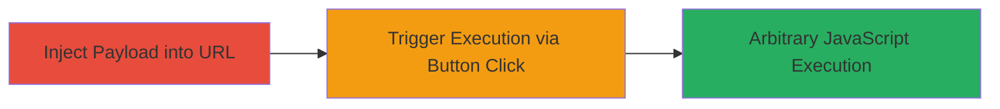

---
tags:
  - xss
  - reflected-xss
  - shopify
  - live-chat
  - javascript-injection
type: attack_chain
tools: []
tactics:
  - '[[Execution]]'
  - '[[Collection]]'
verified: false
platforms:
  - Web
submitted: true
complexity: medium
created_at: '2023-10-01T00:00:00Z'
procedures:
  - '[[procedures/Inject-Malicious-Payload-into-Chat-Tags-Parameter]]'
  - '[[procedures/Trigger-XSS-Execution-in-Shopify-Live-Chat]]'
step_count: 2
techniques:
  - '[[Exploit Public-Facing Application]]'
  - '[[JavaScript]]'
updated_at: '2025-12-14T03:15:31.961Z'
description: >-
  A reflected XSS attack exploiting insufficient sanitization in the chat[tags]
  parameter of Shopify's live chat initiation URL, leading to arbitrary
  JavaScript execution in the victim's browser.
skill_level: intermediate
impact_level: high
id: b11e1a5a-4ae3-442d-963e-2bddfc775f6d
validated: true
mitre_tactics:
  - '[[Execution]]'
  - '[[Collection]]'
mitre_techniques:
  - '[[Exploit Public-Facing Application]]'
  - '[[JavaScript]]'
---
# Reflected XSS in Shopify Live Chat via chat[tags] Parameter

Multi-stage attack chain demonstrating a complete attack workflow.

## Chain Metrics Dashboard

| Metric | Value |
|--------|-------|
| Chain Status | Unverified |
| Total Steps | 2 |
| Execution Time | ~1 minute |
| Skill Level | Intermediate |
| Complexity | Medium |
| Impact Level | High |

## Attack Flow Visualization



## Prerequisites & Requirements

### Required Tools

- Web browser with JavaScript enabled (e.g., Chrome, Firefox)

### Target Environment

- Web platform
- Shopify Live Chat service accessible via https://livechat.shopify.com/customer/chats/new
- No specific ports required; standard HTTPS (443)

### Initial Access Requirements

- Public access to the Shopify live chat initiation URL
- No credentials needed; exploitable by any user visiting a malicious link
- Victim must interact with the page (click 'Start chat')

## Detailed Attack Procedures

### Step 1: Inject Malicious Payload
procedure: [[procedures/Inject-Malicious-Payload-into-Chat-Tags-Parameter]]

**Objective**: Construct and load a chat initiation URL with a malicious JavaScript payload in the chat[tags] parameter to prepare for reflection.

**Instructions**: Manually construct the URL in the browser address bar or share it as a phishing link. The payload "123'"]);alert(1);//" breaks out of the expected string or array context in the chat[tags] parameter.

Example URL:

```url
https://livechat.shopify.com/customer/chats/new?chat%5Bemail%5D=mymail%40mail.com&chat%5Bname%5D=My+Name&utm_source=partner&chat%5Btags%5D=123%27%5D%29;alert%281%29;//&chat%5Bmetadata%5D%5Bshop_id%5D=90909090
```

Load this URL in a web browser to display the chat initiation page with the unsanitized parameter.

**Expected Output**: The chat initiation page loads, showing the 'Start chat' button. The payload is embedded in the page source but not yet executed.

**Success Indicators**:
- Page loads without errors
- Inspect page source to confirm payload presence in chat[tags] (e.g., via browser dev tools)

### Step 2: Trigger XSS Execution
procedure: [[procedures/Trigger-XSS-Execution-in-Shopify-Live-Chat]]

**Objective**: Interact with the page to cause the reflected payload to execute arbitrary JavaScript in the browser context.

**Instructions**: With the malicious URL loaded, locate and click the 'Start chat' button on the page. This action processes the parameters and reflects the payload, executing the JavaScript.

In a real attack, replace alert(1) with malicious code, such as document.cookie to steal session data or form hijacking for phishing.

**Expected Output**: JavaScript alert box pops up (for test payload), confirming execution. In production, arbitrary code runs, potentially logging keystrokes or exfiltrating data.

**Success Indicators**:
- Alert(1) executes or console logs payload
- Browser dev tools show JS execution in the page context
- No CSP or sanitization blocks the payload

## Attack Chain Summary

### Key Achievements

1. Successful injection of unsanitized payload into chat[tags] parameter
2. Triggered reflection leading to JavaScript execution upon user interaction
3. Demonstrated potential for session hijacking, phishing, or page defacement via arbitrary code

## Technique & Tactic Coverage

### MITRE ATT&CK Techniques

- [[Exploit Public-Facing Application]] Exploit Public-Facing Application
- [[JavaScript]] JavaScript

### MITRE ATT&CK Tactics

- [[Execution]] Execution
- [[Collection]] Collection

---
*Last updated: 2023-10-01T00:00:00Z*
