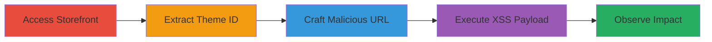

---
tags:
  - xss
  - reflected-xss
  - shopify
  - javascript
  - theme-preview
type: attack_chain
tools: []
tactics:
  - '[[Execution]]'
  - '[[Collection]]'
verified: false
platforms:
  - Web
submitted: true
complexity: medium
created_at: '2023-10-01T00:00:00Z'
procedures:
  - '[[procedures/Navigate-to-Shopify-Storefront]]'
  - '[[procedures/Extract-Shopify-Theme-ID-from-Page-Source]]'
  - '[[procedures/Construct-Malicious-Theme-Preview-URL]]'
  - '[[procedures/Trigger-and-Observe-XSS-Execution]]'
step_count: 4
techniques:
  - '[[JavaScript]]'
updated_at: '2025-12-13T23:52:55.667Z'
description: >-
  Unauthenticated reflected XSS vulnerability in Shopify's theme preview
  feature, exploiting improper escaping of the theme_handle parameter to execute
  JavaScript on the storefront and potentially compromise admin sessions.
skill_level: intermediate
impact_level: high
id: 6f1689ea-fa2b-476d-bdae-d87f0eaff3c8
validated: true
mitre_tactics:
  - '[[Execution]]'
  - '[[Collection]]'
mitre_techniques:
  - '[[JavaScript]]'
---
# Reflected XSS in Shopify Theme Preview via Unescaped Theme Handle

Multi-stage attack chain demonstrating a complete attack workflow for exploiting a reflected XSS vulnerability in Shopify's theme preview feature. The attack leverages improper escaping of the 'theme_handle' parameter, allowing unauthenticated attackers to inject and execute JavaScript on the storefront. Since the storefront shares the same origin as the admin area, this can lead to severe impacts like stealing admin cookies or performing authenticated actions without interaction.

## Chain Metrics Dashboard

| Metric | Value |
|--------|-------|
| Chain Status | Unverified |
| Total Steps | 4 |
| Execution Time | ~5 minutes |
| Skill Level | Intermediate |
| Complexity | Medium |
| Impact Level | High |

## Attack Flow Visualization

## Prerequisites & Requirements

### Required Tools

- Web browser (e.g., Chrome, Firefox) with developer tools enabled

### Target Environment

- Shopify-hosted storefront (e.g., <store>.myshopify.com)
- No authentication required
- Public internet access to the target store

### Initial Access Requirements

- No credentials needed
- Direct network access to the public-facing Shopify store
- No prior access required

## Detailed Attack Procedures

### Step 1: Access the Target Storefront
procedure: [[procedures/Navigate-to-Shopify-Storefront]]

**Objective**: Gain initial access to the Shopify storefront to prepare for vulnerability reconnaissance.

**Instructions**: Open a web browser and navigate to the target store's URL in the format https://<store-name>.myshopify.com, where <store-name> is the identifier for the Shopify account (e.g., echo for echo.myshopify.com).

**Expected Output**: The storefront homepage loads successfully, displaying the shop's content.

**Success Indicators**:
- Storefront page renders without errors
- URL confirms the myshopify.com domain

### Step 2: Extract Theme ID from Page Source
procedure: [[procedures/Extract-Shopify-Theme-ID-from-Page-Source]]

**Objective**: Identify the active theme ID by inspecting the client-side JavaScript variables in the page source.

**Instructions**: Right-click on the page and select 'View Page Source' or press Ctrl+U (Cmd+U on macOS). Search for 'Shopify.theme' in the source code. Locate the line defining the theme object and copy the numeric ID value associated with the current theme.

**Expected Output**: A numeric theme ID, such as 123456789, extracted from the JavaScript variable.

**Success Indicators**:
- Theme ID found in the source (e.g., Shopify.theme.id = 123456789)
- No errors in page loading that might indicate theme issues

### Step 3: Construct Malicious Theme Preview URL
procedure: [[procedures/Construct-Malicious-Theme-Preview-URL]]

**Objective**: Build a URL that injects a malicious payload into the theme_handle parameter to bypass escaping and trigger XSS.

**Instructions**: Using the extracted theme ID, construct the URL in the format: https://<store-name>.myshopify.com/?theme_handle=xx%27-alert(document.cookie)-%27&style_id=1&style_handle=1&preview_theme_id=<theme_id>. Replace <store-name> with the store identifier and <theme_id> with the copied ID. The payload 'xx'-alert(document.cookie)-'' exploits the failure to escape single quotes in theme_handle.

**Expected Output**: A fully formed URL ready for navigation, e.g., https://echo.myshopify.com/?theme_handle=xx%27-alert(document.cookie)-%27&style_id=1&style_handle=1&preview_theme_id=123456789.

**Success Indicators**:
- URL is syntactically correct and includes the payload
- No immediate encoding errors visible in the string

### Step 4: Trigger and Observe XSS Execution
procedure: [[procedures/Trigger-and-Observe-XSS-Execution]]

**Objective**: Load the malicious URL to execute the injected JavaScript and verify the XSS vulnerability.

**Instructions**: Paste the constructed URL into the browser's address bar and press Enter to navigate. The page should load the theme preview, triggering the alert with document cookies. The payload persists across all storefront pages until the preview is canceled.

**Expected Output**: A JavaScript alert dialog pops up displaying the site's cookies, confirming execution.

**Success Indicators**:
- Alert box appears with cookie data
- JavaScript executes without errors on page load
- Preview mode active, indicated by theme preview UI elements

## Attack Chain Summary

### Key Achievements

1. Unauthenticated access to execute arbitrary JavaScript on the Shopify storefront
2. Extraction of sensitive data like cookies due to same-origin policy with admin area
3. Potential for session hijacking or unauthorized admin actions without interaction

## Technique & Tactic Coverage

### MITRE ATT&CK Techniques

- [[JavaScript]]

### MITRE ATT&CK Tactics

- [[Execution]]
- [[Collection]]

---
*Last updated: 2023-10-01T00:00:00Z*
