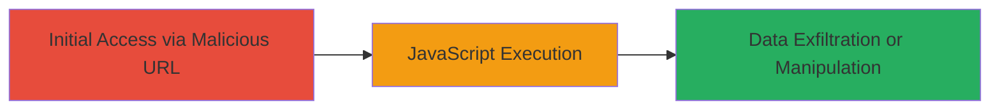

---
tags:
  - xss
  - reflected-xss
  - shopify
  - javascript-injection
type: attack_chain
tools: []
tactics:
  - '[[Execution]]'
commands: []
platforms:
  - Web
complexity: low
procedures:
  - '[[procedures/Exploit-Reflected-XSS-via-Animation-Event-Handler]]'
step_count: 1
techniques:
  - '[[JavaScript]]'
description: >-
  A reflected XSS vulnerability in the utm_source parameter on Shopify's markets
  page allows arbitrary JavaScript execution by injecting an animation event
  handler payload.
skill_level: beginner
impact_level: high
id: 2b26a66a-3596-4147-a0aa-fb8333441734
created_at: '2025-12-13T23:56:19.749Z'
updated_at: '2025-12-13T23:56:19.749Z'
verified: false
validated: true
submitted: true
mitre_tactics:
  - '[[Execution]]'
mitre_techniques:
  - '[[JavaScript]]'
---
# Reflected XSS in Shopify utm_source Parameter via Animation Event Handler

## Overview

This attack chain demonstrates a reflected cross-site scripting (XSS) vulnerability in the 'utm_source' parameter on the Shopify page at https://www.shopify.com/markets. By appending a malicious payload to the URL, an attacker can inject arbitrary JavaScript that executes in the victim's browser upon page load. The payload uses an inline style attribute to trigger an animation event handler, which executes an alert to prove concept. Successful exploitation can lead to session hijacking via cookie theft, phishing attacks, CSRF token bypass, and manipulation of browser autofill to capture credentials.

## Chain Metrics Dashboard

| Metric | Value |
|--------|-------|
| Chain Status | Unverified |
| Total Steps | 1 |
| Execution Time | ~1 minute |
| Skill Level | Beginner |
| Complexity | Low |
| Impact Level | High |

## Attack Flow Visualization



## Prerequisites & Requirements

### Required Tools

- Web browser (e.g., Chrome, Firefox)

### Target Environment

- Web platform
- Access to Shopify's public-facing website (https://www.shopify.com/markets)
- No authentication required

### Initial Access Requirements

- Ability to distribute the malicious URL (e.g., via email, social engineering)
- Victim must visit the crafted URL in their browser
- No prior access or credentials needed

## Detailed Attack Procedures

### Step 1: Craft and Deliver Malicious URL
procedure: [[procedures/Exploit-Reflected-XSS-via-Animation-Event-Handler]]

**Objective**: Inject and execute arbitrary JavaScript in the victim's browser by exploiting the unescaped reflection of the utm_source parameter.

**Instructions**: Construct the malicious URL by appending the payload to the utm_source parameter. The payload closes the attribute and injects a style tag with an animation that triggers an onanimationstart event to execute JavaScript. Share the URL with the victim via phishing or other means, prompting them to visit it.

Example crafted URL:

```url
https://www.shopify.com/markets?utm_source=INJECTION%22%20style=%22animation-name:swoop-up%22%20onanimationstart=%22alert(document.domain)%22
```

When the victim loads the page, the injected JavaScript executes, displaying an alert with the domain name to confirm exploitation.

**Expected Output**: Upon page load, a browser alert pops up showing "www.shopify.com", indicating successful JavaScript execution.

**Success Indicators**:
- Alert dialog appears in the victim's browser
- JavaScript console logs the executed code without errors
- No CSP or other protections block the payload

## Attack Chain Summary

### Key Achievements

1. Arbitrary JavaScript execution in the context of the Shopify domain
2. Potential for session cookie theft and account compromise
3. Bypass of CSRF protections through injected scripts
4. Creation of fake forms to exploit browser autofill for credential harvesting

## Technique & Tactic Coverage

### MITRE ATT&CK Techniques

- [[JavaScript]]

### MITRE ATT&CK Tactics

- [[Execution]]

---
*Last updated: 2023-10-01T00:00:00Z*
