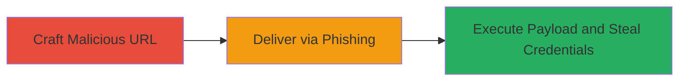

---
tags:
  - xss
  - reflected-xss
  - slack
  - phishing
  - credential-theft
  - javascript
type: attack_chain
tools:
  - '[[tools/Firefox-Browser]]'
tactics:
  - '[[Initial Access]]'
  - '[[Execution]]'
  - '[[Collection]]'
commands: []
platforms:
  - Web
complexity: medium
procedures:
  - '[[procedures/Craft-Malicious-URL-for-Slack-Emoji-XSS]]'
  - '[[procedures/Deliver-Phishing-URL-for-Slack-XSS]]'
  - '[[procedures/Execute-JavaScript-Payload-for-Credential-Theft]]'
step_count: 3
techniques:
  - '[[Drive-by Compromise]]'
  - '[[JavaScript]]'
  - '[[Credentials from Password Stores]]'
description: >-
  A multi-stage attack exploiting a reflected XSS vulnerability in Slack's
  custom emoji page to execute arbitrary JavaScript, steal credentials via fake
  login forms, and target multiple teams using guessable names.
skill_level: intermediate
impact_level: high
id: 8303d2b6-2b63-482a-807b-3c94e34811c4
created_at: '2025-12-13T23:52:49.410Z'
updated_at: '2025-12-13T23:52:49.410Z'
verified: false
validated: true
submitted: true
mitre_tactics:
  - '[[Initial Access]]'
  - '[[Execution]]'
  - '[[Collection]]'
mitre_techniques:
  - '[[Drive-by Compromise]]'
  - '[[JavaScript]]'
  - '[[Credentials from Password Stores]]'
---
# Reflected XSS in Slack Custom Emoji Page for Cross-Team Credential Theft

## Overview

This attack chain exploits a reflected cross-site scripting (XSS) vulnerability in Slack's custom emoji management page. The 'name' parameter in the URL is unsafely reflected into a flash message without proper sanitization, particularly in teams with a large number of emojis (e.g., over 1600), where performance optimizations skip existence checks. By crafting a malicious URL with a JavaScript payload, an attacker can trick victims into visiting it via phishing, leading to arbitrary code execution in the victim's browser. This enables the creation of fake login forms to steal credentials. The attack is amplified by the ease of guessing Slack team names, allowing cross-team exploitation without prior knowledge of specific workspaces.

## Chain Metrics Dashboard

| Metric | Value |
|--------|-------|
| Chain Status | Unverified |
| Total Steps | 3 |
| Execution Time | ~5 minutes |
| Skill Level | Intermediate |
| Complexity | Medium |
| Impact Level | High |

## Attack Flow Visualization

## Prerequisites & Requirements

### Required Tools

- [[tools/Firefox-Browser]]

### Target Environment

- Web platform (Slack web application)
- Required services/ports: HTTPS (443)
- Network access requirements: Internet access to Slack workspaces

### Initial Access Requirements

- No prior credentials needed for URL crafting
- Guessable team names (e.g., companyname.slack.com)
- Victim must be a Slack user without browser XSS protections

## Detailed Attack Procedures

### Step 1: Craft Malicious URL
procedure: [[procedures/Craft-Malicious-URL-for-Slack-Emoji-XSS]]

**Objective**: Create a URL that injects a JavaScript payload into the reflected 'name' parameter, breaking out of the emoji syntax in the flash message.

**Instructions**: Construct the URL using the format `https://{team}.slack.com/customize/emoji?added=1&name=<payload>`. For testing, use a simple alert payload like `vuln">`. Replace `{team}` with a guessable workspace name. Verify the payload in a browser without XSS filters.

**Expected Output**: Upon visiting, the flash message renders as 'Here's what it looks like :vuln">: in a sentence.', triggering the alert.

**Success Indicators**:
- Payload executes without errors
- Alert box appears in the browser

### Step 2: Deliver URL to Victim
procedure: [[procedures/Deliver-Phishing-URL-for-Slack-XSS]]

**Objective**: Socially engineer the victim to visit the malicious URL, exploiting the reflected XSS in the custom emoji page.

**Instructions**: Send the crafted URL via email, chat, or other phishing vectors, disguising it as a legitimate Slack invitation or emoji share. Target users in guessable teams by enumerating common workspace names (e.g., based on company domains).

**Expected Output**: Victim clicks the link and lands on the Slack custom emoji page, where the payload reflects in the flash message.

**Success Indicators**:
- Victim accesses the URL
- No immediate browser blocks (e.g., in Firefox)

### Step 3: Execute Payload for Credential Theft
procedure: [[procedures/Execute-JavaScript-Payload-for-Credential-Theft]]

**Objective**: Run arbitrary JavaScript to create a fake login form and exfiltrate credentials from the victim's session.

**Instructions**: Once the initial payload executes, chain it to inject a more sophisticated script that overlays a phishing form mimicking Slack's login. Use the payload to capture form inputs and send them to an attacker-controlled server via XMLHttpRequest or fetch.

**Expected Output**: Fake form appears over the page; submitted credentials are sent to attacker's endpoint.

**Success Indicators**:
- JavaScript executes (e.g., form appears)
- Credentials received on attacker's server

## Attack Chain Summary

### Key Achievements

1. Successful payload injection via reflected parameter
2. Cross-team targeting using guessable workspace names
3. Credential theft without direct access to the victim's account

## Technique & Tactic Coverage

### MITRE ATT&CK Techniques

- [[Drive-by Compromise]]
- [[JavaScript]]
- [[Credentials from Password Stores]]

### MITRE ATT&CK Tactics

- [[Initial Access]]
- [[Execution]]
- [[Collection]]

---
*Last updated: 2023-10-01*
