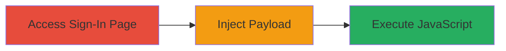

---
tags:
  - xss
  - reflected-xss
  - slack
  - web-vulnerability
type: attack_chain
tools: []
tactics:
  - '[[Execution]]'
  - '[[Collection]]'
verified: false
platforms:
  - Web
submitted: true
complexity: low
created_at: '2023-10-01T00:00:00Z'
procedures:
  - '[[procedures/Exploit-Reflected-XSS-in-Slack-Sign-In]]'
step_count: 1
techniques:
  - '[[JavaScript]]'
updated_at: '2025-12-14T17:27:15.703Z'
description: >-
  Demonstrates a reflected XSS vulnerability in the Slack sign-in page title,
  allowing JavaScript execution via unsanitized input reflection.
skill_level: beginner
impact_level: high
id: 9fb7e0e0-de6c-43cc-b07c-5c3f6fd93261
validated: true
mitre_tactics:
  - '[[Execution]]'
  - '[[Collection]]'
mitre_techniques:
  - '[[JavaScript]]'
---
# Reflected XSS in Slack Sign-In Page Title

Multi-stage attack chain demonstrating a complete attack workflow exploiting a reflected XSS vulnerability on the Slack sign-in page.

## Chain Metrics Dashboard

| Metric | Value |
|--------|-------|
| Chain Status | Unverified |
| Total Steps | 1 |
| Execution Time | ~1 minute |
| Skill Level | Beginner |
| Complexity | Low |
| Impact Level | High |

## Attack Flow Visualization

## Prerequisites & Requirements

### Required Tools

- Web browser (e.g., Chrome, Firefox)

### Target Environment

- Web platform
- Access to Slack workspace sign-in URL (e.g., https://sehacure.slack.com)
- No special services or ports required beyond standard HTTPS (443)

### Initial Access Requirements

- Public internet access
- No credentials needed for initial access to the sign-in page
- Ability to craft and navigate to modified URLs

## Detailed Attack Procedures

### Step 1: Inject Malicious Payload into Sign-In Page
procedure: [[procedures/Exploit-Reflected-XSS-in-Slack-Sign-In]]

**Objective**: Identify and exploit the reflected XSS vulnerability in the page title by injecting a payload that breaks out of the HTML attribute context, enabling JavaScript execution.

**Instructions**: Navigate to the Slack account settings or sign-in endpoint with a crafted URL containing a malicious payload in a reflected parameter, such as the workspace identifier or redirect query. For example, append a payload like "> to the URL parameter that gets reflected in the title. Observe the page title rendering as 'Sign in to ">' , confirming the breakout and potential for JS execution.

**Expected Output**: The browser executes the injected JavaScript, such as displaying an alert box, and the page title shows the unescaped payload.

**Success Indicators**:
- Payload reflected without sanitization in the HTML title attribute
- JavaScript code executes in the victim's browser context
- Potential for further actions like session cookie theft via document.cookie

## Attack Chain Summary

### Key Achievements

1. Successful reflection of user input in the page title without proper HTML encoding
2. Breakout from HTML attribute context to inject and execute arbitrary JavaScript
3. Demonstration of impact including session hijacking or phishing via stolen credentials

## Technique & Tactic Coverage

### MITRE ATT&CK Techniques

- [[JavaScript]]

### MITRE ATT&CK Tactics

- [[Execution]]
- [[Collection]]

---
*Last updated: 2023-10-01T00:00:00Z*
