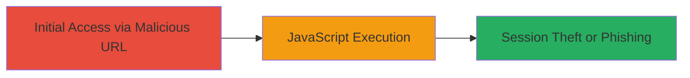

# Reflected XSS in Slack Sign-In Page via Subdomain Injection

Multi-stage attack chain demonstrating a complete attack workflow.

## Chain Metrics Dashboard

| Metric | Value |
|--------|-------|
| Chain Status | Unverified |
| Total Steps | 1 |
| Execution Time | ~1 minute |
| Skill Level | Beginner |
| Complexity | Low |
| Impact Level | High |

## Attack Flow Visualization

## Prerequisites & Requirements

### Required Tools

- Web browser (e.g., Chrome, Firefox)

### Target Environment

- Web platform
- Access to Slack's sign-in page at https://*.slack.com/services/import
- Ability to control a subdomain (e.g., via DNS or a test domain)

### Initial Access Requirements

- No credentials required
- Victim must visit the malicious URL during authentication flow
- Network access to Slack's domain

## Detailed Attack Procedures

### Step 1: Craft and Deliver Malicious URL
procedure: [[procedures/Exploit-Reflected-XSS-in-Slack-Sign-In-via-Subdomain]]

**Objective**: Inject malicious JavaScript into the Slack sign-in page title tag by leveraging unsanitized subdomain reflection, achieving arbitrary code execution in the victim's browser.

**Instructions**: Construct a URL with a subdomain containing a payload that breaks out of the HTML title attribute. For example, use a subdomain like "onerror" appended with the payload ">". The full URL would be https://onerror%22%3E%3Cimg%20src%3Dx%20onerror%3Dalert(1)%3E.slack.com/services/import. Visit this URL in a browser to trigger the XSS. In a real attack, deliver this URL via phishing email or social engineering to entice the victim to click during sign-in.

**Expected Output**: The page loads with the title reflecting the injected payload, executing the onerror handler to display an alert box with "1". In a production exploit, this could be replaced with code to steal session cookies or redirect to a phishing site.

**Success Indicators**:
- Alert box pops up confirming JavaScript execution
- Browser console shows no errors, and the payload is reflected in the page source within the <title> tag
- Potential for further actions like document.cookie access if escalated

## Attack Chain Summary

### Key Achievements

1. Successful breakout from the <title> attribute using subdomain input
2. Arbitrary JavaScript execution without authentication
3. Potential for session hijacking or phishing during Slack's authentication flow

## Technique & Tactic Coverage

### MITRE ATT&CK Techniques

- [[Drive-by Compromise]]
- [[JavaScript]]

### MITRE ATT&CK Tactics

- [[Initial Access]]

---
*Last updated: 2023-10-01T00:00:00Z*
