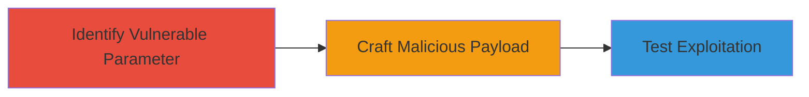

---
tags:
  - xss
  - reflected-xss
  - javascript-injection
  - cookie-theft
type: attack_chain
tools: []
tactics:
  - '[[Initial Access]]'
  - '[[Execution]]'
  - '[[Collection]]'
commands: []
platforms:
  - Web
complexity: medium
procedures:
  - '[[procedures/Identify-Vulnerable-URL-Hash-Parameter]]'
  - '[[procedures/Craft-Malicious-XSS-Payload]]'
  - '[[procedures/Test-XSS-Exploitation-via-Crafted-URL]]'
step_count: 3
techniques:
  - '[[JavaScript]]'
description: >-
  Exploitation of a reflected XSS vulnerability in Slack's web pages through
  unsanitized URL hash parameters, enabling arbitrary JavaScript execution for
  potential cookie theft or account takeover.
skill_level: intermediate
impact_level: high
id: 66166bcd-2d5e-4d3d-a2ae-5859fae87a14
created_at: '2025-12-14T00:11:25.355Z'
updated_at: '2025-12-14T00:11:25.355Z'
verified: false
validated: true
submitted: true
mitre_tactics:
  - '[[Initial Access]]'
  - '[[Execution]]'
  - '[[Collection]]'
mitre_techniques:
  - '[[JavaScript]]'
---
# Reflected XSS in Slack via URL Hash Parameter for Cookie Theft

Multi-stage attack chain demonstrating the exploitation of a reflected XSS vulnerability in Slack's web application, allowing injection of malicious JavaScript through the URL hash to execute arbitrary code and potentially steal cookies or take over accounts.

## Chain Metrics Dashboard

| Metric | Value |
|--------|-------|
| Chain Status | Unverified |
| Total Steps | 3 |
| Execution Time | ~5 minutes |
| Skill Level | Intermediate |
| Complexity | Medium |
| Impact Level | High |

## Attack Flow Visualization

## Prerequisites & Requirements

### Required Tools

- None (browser-based exploitation)

### Target Environment

- Web platform
- Target URL: https://slack.com/is
- JavaScript-enabled browser

### Initial Access Requirements

- Ability to craft and share malicious URLs
- Victim must visit the crafted link

## Detailed Attack Procedures

### Step 1: Identify Vulnerable Parameter
procedure: [[procedures/Identify-Vulnerable-URL-Hash-Parameter]]

**Objective**: Discover the unsanitized cvo_sid1 parameter in the URL hash that allows injection of malicious parameters.

**Instructions**: Analyze the target URL https://slack.com/is and inspect the live.js script to identify that the cvo_sid1 parameter is used without sanitization to call third-party convertro code, enabling injection of an additional 'typ' parameter for XSS.

**Expected Output**: Confirmation of the vulnerable parameter and its usage in the script.

**Success Indicators**:
- Vulnerable parameter identified
- Understanding of injection point achieved

### Step 2: Craft Malicious Payload
procedure: [[procedures/Craft-Malicious-XSS-Payload]]

**Objective**: Create a payload that bypasses restrictions by encoding special characters to inject arbitrary JavaScript.

**Instructions**: Encode the semicolon as %3b and use unicode escape \u0026 for the ampersand to inject JavaScript code, such as alert(document.cookie), via the typ parameter. Example payload: cvo_sid1=111\u0026;typ=55577]")%3balert(document.cookie)%3b//

**Expected Output**: A crafted payload string ready for insertion into the URL hash.

**Success Indicators**:
- Payload successfully bypasses encoding restrictions
- JavaScript injection validated in a test environment

### Step 3: Test Exploitation with Crafted URL
procedure: [[procedures/Test-XSS-Exploitation-via-Crafted-URL]]

**Objective**: Verify the XSS vulnerability by visiting the malicious URL and executing the injected code.

**Instructions**: Construct the full URL with the payload in the hash, such as https://slack.com/is#?cvo_sid1=111\u0026;typ=55577]")%3balert(document.cookie)%3b//, and visit it in a browser to trigger the alert showing document cookies.

**Expected Output**: Execution of the alert(document.cookie) function, displaying the cookies.

**Success Indicators**:
- Alert box appears with cookie data
- Arbitrary code execution confirmed

## Attack Chain Summary

### Key Achievements

1. Identification of unsanitized input in URL hash
2. Successful bypass of character restrictions for payload injection
3. Demonstration of cookie theft potential through XSS

## Technique & Tactic Coverage

### MITRE ATT&CK Techniques

- [[JavaScript]]

### MITRE ATT&CK Tactics

- [[Initial Access]]
- [[Execution]]
- [[Collection]]

*Last updated: 2023-10-01*
