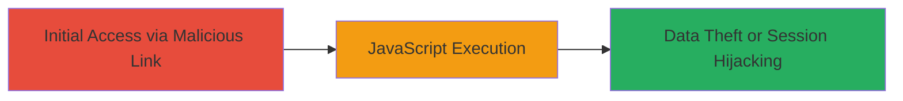

---
tags:
  - xss
  - reflected-xss
  - javascript
  - web-vulnerability
type: attack_chain
tools: []
tactics:
  - '[[Execution]]'
commands: []
platforms:
  - Web
complexity: medium
procedures:
  - '[[procedures/Exploit-Reflected-XSS-via-Unsanitized-Parameter]]'
step_count: 1
techniques:
  - '[[JavaScript]]'
description: >-
  A single-stage attack exploiting a reflected XSS vulnerability in the
  Starbucks Singapore card unsubscribe endpoint to execute arbitrary JavaScript
  in a victim's browser.
skill_level: intermediate
impact_level: medium
id: 6b4d2023-48e1-42c8-9c4c-11cdf66f53f5
created_at: '2025-12-14T03:16:20.267Z'
updated_at: '2025-12-14T03:16:20.267Z'
verified: false
validated: true
submitted: true
mitre_tactics:
  - '[[Execution]]'
mitre_techniques:
  - '[[JavaScript]]'
---
# Reflected XSS in Starbucks Unsubscribe Endpoint Leading to JavaScript Execution

Multi-stage attack chain demonstrating a complete attack workflow.

## Chain Metrics Dashboard

| Metric | Value |
|--------|-------|
| Chain Status | Unverified |
| Total Steps | 1 |
| Execution Time | ~1 minutes |
| Skill Level | Intermediate |
| Complexity | Medium |
| Impact Level | Medium |

## Attack Flow Visualization

## Prerequisites & Requirements

### Required Tools

- Browser developer tools for payload testing

### Target Environment

- Web platform
- Access to the Starbucks Singapore card website (https://card.starbucks.com.sg)
- No specific ports or services beyond standard HTTPS (443)

### Initial Access Requirements

- Ability to send a malicious link to a victim (e.g., via phishing email or social engineering)
- Victim must be authenticated or visit the unsubscribe page
- No prior credentials needed for discovery, but victim session for impact

## Detailed Attack Procedures

### Step 1: Exploit Reflected XSS
procedure: [[procedures/Exploit-Reflected-XSS-via-Unsanitized-Parameter]]

**Objective**: Inject and execute arbitrary JavaScript code in the victim's browser by crafting a malicious URL targeting the 'ct' parameter in the unsubscribe endpoint.

**Instructions**: Construct a URL with a JavaScript payload in the 'ct' parameter, such as https://card.starbucks.com.sg/unsub.php?ct=%3Cscript%3Ealert%28%27XSS%27%29%3C%2Fscript%3E. Send this link to the victim via email or messaging. When the victim clicks it, the payload is reflected unsanitized, executing the script in their browser context.

For testing, use a browser to visit the URL and observe the alert popup or inspect the page source to confirm reflection.

**Expected Output**: JavaScript alert or console log executes, confirming control over the victim's browser session.

**Success Indicators**:
- JavaScript payload executes (e.g., alert box appears)
- Page source shows unsanitized reflection of the 'ct' parameter
- Potential for further actions like stealing cookies via document.cookie

## Attack Chain Summary

### Key Achievements

1. Discovery of unsanitized 'ct' parameter in unsub.php
2. Successful execution of arbitrary JavaScript in victim browser
3. Potential for session hijacking or phishing attacks

## Technique & Tactic Coverage

### MITRE ATT&CK Techniques

- [[JavaScript]]

### MITRE ATT&CK Tactics

- [[Execution]]

---
*Last updated: 2023-10-01*
