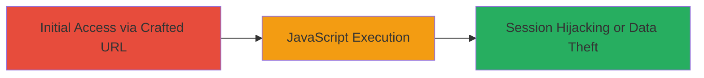

# Reflected XSS in Steam Help Wizard via Unescaped Option Parameter

Multi-stage attack chain demonstrating a complete attack workflow.

The vulnerability allows attackers to inject arbitrary JavaScript into the page title by manipulating the 'option' parameter in the Steam help wizard endpoint. When no matching translation token exists for the input, it is rendered unescaped in a 
 element, executing the payload in the context of the victim's browser session. This can result in session hijacking, cookie theft, or phishing attacks when the victim clicks a crafted link.

## Chain Metrics Dashboard

| Metric | Value |
|--------|-------|
| Chain Status | Unverified |
| Total Steps | 1 |
| Execution Time | ~1 minute |
| Skill Level | Beginner |
| Complexity | Low |
| Impact Level | High |

## Attack Flow Visualization

## Prerequisites & Requirements

### Required Tools

- Web browser (e.g., Chrome, Firefox)

### Target Environment

- Web platform
- Access to public internet
- No authentication required

### Initial Access Requirements

- No credentials needed
- Victim must visit the crafted URL (e.g., via phishing email or direct link)
- Network access to https://help.steampowered.com

## Detailed Attack Procedures

### Step 1: Craft and Deliver Malicious URL
procedure: [[procedures/Exploit-Reflected-XSS-in-Steam-Help-Wizard]]

**Objective**: Inject and execute arbitrary JavaScript by crafting a URL with an XSS payload in the 'option' parameter, triggering reflected execution on the target endpoint.

**Instructions**: Construct the malicious URL using the Steam help wizard endpoint with a payload in the 'option' parameter. For example, use a simple alert payload to test execution:

Encode the payload '' as '%3Cscript%3Ealert(1)%3C%2Fscript%3E' and append it to the URL.

Full example URL:

https://help.steampowered.com/en/wizard/HelpWithGameIssue/?appid=704740&issueid=125&option=%3Cscript%3Ealert(1)%3C%2Fscript%3E

Access the URL in a browser or send it to a victim. The payload will be inserted unescaped into the page title div if no translation matches.

**Expected Output**: An alert box pops up in the browser, confirming JavaScript execution. In a real attack, replace with payload to steal cookies (e.g., document.cookie).

**Success Indicators**:
- JavaScript alert or other payload executes
- Page title reflects the injected HTML without escaping
- Victim's session data can be exfiltrated (e.g., via network request to attacker-controlled server)

## Attack Chain Summary

### Key Achievements

1. Successful injection of unescaped user input into the DOM
2. Arbitrary JavaScript execution in the browser context
3. Potential for session hijacking or phishing via social engineering

## Technique & Tactic Coverage

### MITRE ATT&CK Techniques

- [[JavaScript]]

### MITRE ATT&CK Tactics

- [[Execution]]
- [[Collection]]

---

*Last updated: 2023-10-01T00:00:00Z*
