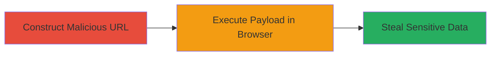

---
tags:
  - xss
  - reflected-xss
  - javascript-injection
  - cookie-theft
  - browser-exploitation
type: attack_chain
tools: []
tactics:
  - '[[Execution]]'
  - '[[Collection]]'
commands: []
platforms:
  - Web
complexity: low
procedures:
  - '[[procedures/Exploit-Reflected-XSS-via-Malicious-URL]]'
step_count: 2
techniques:
  - '[[JavaScript]]'
description: >-
  A simple reflected XSS attack exploiting unsanitized query parameters on
  www.stopthehacker.com to inject and execute JavaScript, stealing browser
  cookies in vulnerable browsers like Internet Explorer.
skill_level: beginner
impact_level: medium
id: da9e9649-a002-4987-aca4-07dcb349dbc6
created_at: '2025-12-14T03:15:36.002Z'
updated_at: '2025-12-14T03:15:36.002Z'
verified: false
validated: true
submitted: true
mitre_tactics:
  - '[[Execution]]'
  - '[[Collection]]'
mitre_techniques:
  - '[[JavaScript]]'
---
# Reflected XSS in StopTheHacker Query Parameter for Cookie Theft

Multi-stage attack chain demonstrating a complete attack workflow.

## Chain Metrics Dashboard

| Metric | Value |
|--------|-------|
| Chain Status | Unverified |
| Total Steps | 2 |
| Execution Time | ~1 minute |
| Skill Level | Beginner |
| Complexity | Low |
| Impact Level | Medium |

## Attack Flow Visualization

## Prerequisites & Requirements

### Required Tools

- A web browser (Internet Explorer for confirmed execution; other browsers may vary in vulnerability)

### Target Environment

- Web platform
- Accessible URL: http://www.stopthehacker.com/
- No specific services or ports required beyond standard HTTP/80

### Initial Access Requirements

- No credentials needed
- Direct network access to the target website
- No prior access required; attack relies on social engineering to trick victims into visiting the malicious URL

## Detailed Attack Procedures

### Step 1: Construct Malicious URL
procedure: [[procedures/Exploit-Reflected-XSS-via-Malicious-URL]]

**Objective**: Create a URL with an injected XSS payload that reflects user input without sanitization, setting up JavaScript execution.

**Instructions**: Manually construct the URL by appending the payload to the query parameter. Use the payload `?">` to break out of any HTML context and inject the script tag.

Full URL example: `http://www.stopthehacker.com/?">`

**Expected Output**: A valid URL string ready for delivery to the victim (e.g., via phishing email or link sharing).

**Success Indicators**:
- URL is formed without syntax errors
- Payload is embedded in the query string

### Step 2: Execute Payload in Browser
procedure: [[procedures/Exploit-Reflected-XSS-via-Malicious-URL]]

**Objective**: Load the malicious URL in a vulnerable browser to trigger the reflected XSS, executing the JavaScript and displaying stolen data.

**Instructions**: Open the constructed URL in Internet Explorer (or another vulnerable browser). The server reflects the payload back in the page response, causing the browser to parse and execute the `` tag.

**Expected Output**: An alert dialog pops up displaying the victim's `document.cookie` value, which includes session tokens and other browser-stored sensitive data.

**Success Indicators**:
- JavaScript alert executes
- Cookie contents are revealed in the alert
- No errors in browser console related to script blocking

## Attack Chain Summary

### Key Achievements

1. Successful injection of JavaScript via unsanitized query parameter
2. Execution of arbitrary code in the victim's browser context
3. Theft of sensitive browser data like cookies and session tokens

## Technique & Tactic Coverage

### MITRE ATT&CK Techniques

- [[JavaScript]]

### MITRE ATT&CK Tactics

- [[Execution]]
- [[Collection]]

---
*Last updated: 2023-10-01*
