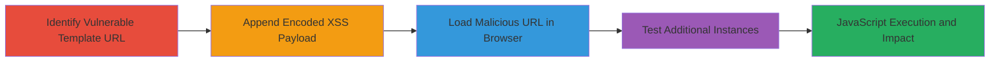

---
tags:
  - xss
  - reflected-xss
  - javascript
  - web-vulnerability
type: attack_chain
tools:
  - '[[tools/Firefox]]'
tactics:
  - '[[Initial Access]]'
  - '[[Execution]]'
  - '[[Collection]]'
verified: false
platforms:
  - Web
submitted: true
complexity: medium
created_at: '2023-10-01T00:00:00Z'
procedures:
  - '[[procedures/Exploit-Reflected-XSS-in-URL-Path]]'
step_count: 4
techniques:
  - '[[Exploit Public-Facing Application]]'
  - '[[JavaScript]]'
updated_at: '2025-12-13T23:55:06.114Z'
description: >-
  A multi-step attack exploiting reflected XSS in the URL path of Stripo Email's
  template pages to inject and execute arbitrary JavaScript in the victim's
  browser.
skill_level: intermediate
impact_level: high
id: 77434c9a-45e3-4c26-a124-b414a3655daa
validated: true
mitre_tactics:
  - '[[Initial Access]]'
  - '[[Execution]]'
  - '[[Collection]]'
mitre_techniques:
  - '[[Exploit Public-Facing Application]]'
  - '[[JavaScript]]'
---
---
id: 123e4567-e89b-12d3-a456-426614174000
name: Reflected XSS in Stripo Email Template URLs Leading to JavaScript Execution
type: attack_chain
description: "A multi-step attack exploiting reflected XSS in the URL path of Stripo Email's template pages to inject and execute arbitrary JavaScript in the victim's browser."
verified: false
submitted: false
step_count: 4
created_at: 2023-10-01T00:00:00Z
updated_at: 2023-10-01T00:00:00Z
procedures: [[procedures/Exploit-Reflected-XSS-in-URL-Path]]
techniques: [[Exploit Public-Facing Application]], [[JavaScript]]
tactics: [[Initial Access]], [[Execution]], [[Collection]]
tags: xss, reflected-xss, javascript, web-vulnerability
platforms: Web
tools: [[tools/Firefox]]
---

# Reflected XSS in Stripo Email Template URLs Leading to JavaScript Execution

Multi-stage attack chain demonstrating a complete attack workflow exploiting a reflected Cross-Site Scripting (XSS) vulnerability in the URL path of template pages on stripo.email. User-controlled input from the URL is not properly sanitized or encoded, allowing injection of malicious JavaScript that executes in the victim's browser. This can lead to session cookie theft, phishing, or other client-side attacks as per OWASP guidelines.

## Chain Metrics Dashboard

| Metric | Value |
|--------|-------|
| Chain Status | Unverified |
| Total Steps | 4 |
| Execution Time | ~2 minutes |
| Skill Level | Intermediate |
| Complexity | Medium |
| Impact Level | High |

## Attack Flow Visualization

## Prerequisites & Requirements

### Required Tools

- [[tools/Firefox]]

### Target Environment

- Web platform
- Access to public-facing Stripo Email template endpoints (e.g., https://stripo.email/templates/[template-name])
- No authentication required

### Initial Access Requirements

- Internet access to load URLs in a browser
- No prior credentials or network position needed; targets public URLs

## Detailed Attack Procedures

### Step 1: Identify Vulnerable Template URL

procedure: [[procedures/Exploit-Reflected-XSS-in-URL-Path]]

**Objective**: Locate a template URL where the path is reflected unsanitized in the HTML page.

**Instructions**: Navigate to the base URL of a Stripo Email template, such as https://stripo.email/templates/merry-christmas-email-template-winter-inspiration-gifts-flowers-industry. Inspect the page source to confirm the URL path is directly reflected without encoding.

**Expected Output**: Page loads with the template name visible in the HTML, indicating potential for injection.

**Success Indicators**:
- URL path appears in page HTML without sanitization
- No immediate errors or blocks on access

### Step 2: Append Encoded XSS Payload to the URL

procedure: [[procedures/Exploit-Reflected-XSS-in-URL-Path]]

**Objective**: Craft a malicious URL by appending a URL-encoded payload that breaks out of the string context to inject a script tag.

**Instructions**: Modify the URL by appending the encoded payload %3E%22%27%3E%3Cscript%3Ealert%281578%29%3C%2Fscript%3E (decoded: >"'>). The full URL becomes https://stripo.email/templates/merry-christmas-email-template-winter-inspiration-gifts-flowers-industry%3E%22%27%3E%3Cscript%3Ealert%281578%29%3C%2Fscript%3E.

**Expected Output**: A valid URL ready for loading that contains the injectable payload.

**Success Indicators**:
- Payload decodes correctly without URL breakage
- URL is accessible without 404 errors

### Step 3: Load Malicious URL in Browser to Verify Execution

procedure: [[procedures/Exploit-Reflected-XSS-in-URL-Path]]

**Objective**: Execute the injected JavaScript by loading the malicious URL, confirming XSS vulnerability.

**Instructions**: Open the crafted URL in [[tools/Firefox]] (version 69.0.3 or similar). Observe the execution of the payload.

**Expected Output**: An alert popup displaying "1578" confirms JavaScript execution in the browser context.

**Success Indicators**:
- Alert box appears immediately upon page load
- Browser console shows no blocking errors; script runs as expected

### Step 4: Test Additional Instances in the /templates/ Directory

procedure: [[procedures/Exploit-Reflected-XSS-in-URL-Path]]

**Objective**: Verify the vulnerability affects multiple templates to assess broader impact.

**Instructions**: Append similar payloads to other template URLs, e.g., https://stripo.email/ru/templates/%22%3E%3Cscript%3Ealert(838)%3C/script%3E/ (decoded: ">/). Load in browser and check for execution.

**Expected Output**: Multiple alerts or script executions across different templates.

**Success Indicators**:
- Consistent payload execution on varied templates
- No template-specific sanitization observed

## Attack Chain Summary

### Key Achievements

1. Successful identification of unsanitized URL path reflection in template pages
2. Injection and execution of arbitrary JavaScript via encoded payloads
3. Confirmation of vulnerability across multiple /templates/ endpoints
4. Demonstration of potential for session hijacking or phishing attacks

## Technique & Tactic Coverage

### MITRE ATT&CK Techniques

- [[Exploit Public-Facing Application]]
- [[JavaScript]]

### MITRE ATT&CK Tactics

- [[Initial Access]]
- [[Execution]]
- [[Collection]]

---
*Last updated: 2023-10-01T00:00:00Z*
