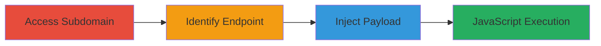

# Reflected XSS in Tableau Authentication Redirect for Arbitrary JavaScript Execution

Multi-stage attack chain demonstrating exploitation of a reflected XSS vulnerability in a Tableau software deployment on a U.S. Department of Defense subdomain. The attack involves navigating to the target, identifying the vulnerable authentication endpoint, and injecting a JavaScript payload to execute arbitrary code in the victim's browser, potentially leading to session hijacking or data theft.

## Chain Metrics Dashboard

| Metric | Value |
|--------|-------|
| Chain Status | Unverified |
| Total Steps | 3 |
| Execution Time | ~2 minutes |
| Skill Level | Beginner |
| Complexity | Low |
| Impact Level | Medium |

## Attack Flow Visualization

## Prerequisites & Requirements

### Required Tools

- Web browser (e.g., Chrome or Firefox with developer tools)

### Target Environment

- Web platform with Tableau software deployed
- Accessible subdomain (e.g., https://subdomain.dod.mil/)
- No authentication required for initial access

### Initial Access Requirements

- Public network access to the target subdomain
- No prior credentials needed
- Victim must visit the crafted malicious URL for exploitation

## Detailed Attack Procedures

### Step 1: Access Target Subdomain
procedure: [[procedures/Access-Target-Subdomain]]

**Objective**: Gain initial visibility into the target environment by navigating to the vulnerable subdomain.

**Instructions**: Open a web browser and directly navigate to the target U.S. Department of Defense subdomain hosting Tableau software. Observe the page load to confirm Tableau functionality is present.

**Expected Output**: The subdomain loads, displaying Tableau-related interfaces or dashboards.

**Success Indicators**:
- Subdomain is accessible without errors
- Tableau elements (e.g., login or dashboard views) are visible

### Step 2: Identify Tableau Authentication Endpoint
procedure: [[procedures/Identify-Tableau-Authentication-Endpoint]]

**Objective**: Locate the vulnerable authentication redirect URL used by Tableau for embedded authentication.

**Instructions**: Examine the subdomain's URLs and resources. Look for paths related to Tableau's authentication, specifically the /en/embeddedAuthRedirect.html endpoint, which handles redirects with an 'auth' parameter.

**Expected Output**: Identification of the full endpoint URL, such as https://subdomain.dod.mil/en/embeddedAuthRedirect.html.

**Success Indicators**:
- Endpoint URL is found through manual inspection or browser navigation
- Parameter 'auth' is present in the URL structure

### Step 3: Inject JavaScript Payload into Auth Parameter
procedure: [[procedures/Inject-JavaScript-Payload-into-Auth-Parameter]]

**Objective**: Exploit the lack of sanitization in the 'auth' parameter to inject and execute arbitrary JavaScript in the victim's browser.

**Instructions**: Append a javascript: scheme payload to the 'auth' parameter in the identified endpoint. For example, construct the URL as https://subdomain.dod.mil/en/embeddedAuthRedirect.html?auth=javascript:alert(%22xElkomy%22). Share this URL with the victim or test it in your browser to trigger the alert.

**Expected Output**: Upon visiting the URL, a JavaScript alert box pops up displaying "xElkomy", confirming arbitrary code execution.

**Success Indicators**:
- Alert or injected script executes in the browser
- No server-side blocking or sanitization occurs

## Attack Chain Summary

### Key Achievements

1. Successful access to a sensitive DoD subdomain running vulnerable Tableau software
2. Identification of the reflected XSS entry point in the authentication redirect
3. Demonstration of arbitrary JavaScript execution, enabling potential session theft or phishing

## Technique & Tactic Coverage

### MITRE ATT&CK Techniques

- [[JavaScript]]

### MITRE ATT&CK Tactics

- [[Execution]]
- [[Collection]]

---
*Last updated: 2023-10-01T00:00:00Z*
