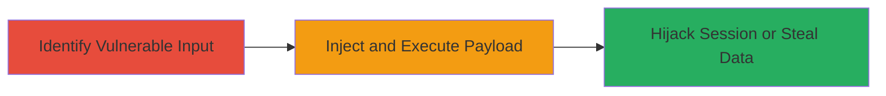

# Reflected XSS in Third-Party Service for Session Hijacking

Multi-stage attack chain demonstrating exploitation of a reflected XSS vulnerability in a third-party service used by Informatica to execute arbitrary JavaScript and hijack user sessions.

## Chain Metrics Dashboard

| Metric | Value |
|--------|-------|
| Chain Status | Unverified |
| Total Steps | 2 |
| Execution Time | ~5 minutes |
| Skill Level | Intermediate |
| Complexity | Medium |
| Impact Level | High |

## Attack Flow Visualization

## Prerequisites & Requirements

### Required Tools

- Browser developer tools for payload testing
- Proxy tool like Burp Suite for intercepting requests (optional)

### Target Environment

- Web platform with Informatica services integrating third-party components
- Access to a user-facing endpoint in the third-party service
- No specific ports required beyond standard HTTPS (443)

### Initial Access Requirements

- Ability to interact with the web application as a legitimate user
- Network access to the Informatica-hosted service
- No prior credentials needed beyond basic user access

## Detailed Attack Procedures

### Step 1: Identify Vulnerable Input
procedure: [[procedures/Identify-Reflected-XSS-Input-Point]]

**Objective**: Locate unsanitized user inputs in the third-party service that reflect back into the HTML response without proper encoding.

**Instructions**: Review the web application's input fields, such as search parameters or error messages in the third-party service integrated with Informatica. Use browser developer tools to inspect network requests and responses. Test inputs with simple payloads like `` in URL parameters or form fields to check for reflection.

**Expected Output**: Confirmation of reflected input in the page source without escaping, e.g., the payload appears as raw HTML.

**Success Indicators**:
- Payload reflected unescaped in browser
- Alert or error triggered by basic script

### Step 2: Exploit Reflected XSS for JavaScript Execution
procedure: [[procedures/Exploit-Reflected-XSS-for-JavaScript-Execution]]

**Objective**: Craft and deliver a malicious payload to execute arbitrary JavaScript in the victim's browser, enabling session theft or data exfiltration.

**Instructions**: Once the vulnerable parameter is identified (e.g., a search query in the third-party service), encode a payload to steal cookies or redirect to a phishing site. Deliver via a crafted link sent to the target user. For example, use a payload like `` reflected through the vulnerable endpoint.

**Expected Output**: JavaScript execution in the victim's browser, with data sent to attacker's server or session hijacked.

**Success Indicators**:
- Malicious script executes (e.g., alert or network request to attacker)
- Cookies or session data captured

## Attack Chain Summary

### Key Achievements

1. Identified reflected XSS in third-party service used by Informatica
2. Executed arbitrary JavaScript leading to potential session hijacking
3. Demonstrated high-impact risks like data theft, responsibly reported and patched

## Technique & Tactic Coverage

### MITRE ATT&CK Techniques

- [[JavaScript]]

### MITRE ATT&CK Tactics

- [[Execution]]

---
*Last updated: 2023-10-01T12:00:00Z*
