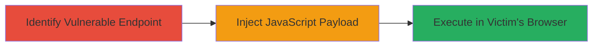

---
tags:
  - xss
  - reflected-xss
  - tiktok
  - javascript-injection
  - session-hijacking
type: attack_chain
tools: []
tactics:
  - '[[Initial Access]]'
  - '[[Execution]]'
verified: false
platforms:
  - Web
submitted: true
complexity: low
created_at: '2023-10-01T00:00:00Z'
procedures:
  - '[[procedures/Exploit-Reflected-XSS-in-TikTok-Share-Endpoint]]'
step_count: 2
techniques:
  - '[[Exploit Public-Facing Application]]'
  - '[[JavaScript]]'
updated_at: '2025-12-13T23:55:06.573Z'
description: >-
  A multi-stage attack chain exploiting a reflected XSS vulnerability in the
  TikTok incentive sharing endpoint to inject and execute JavaScript in the
  victim's browser, potentially leading to session hijacking.
skill_level: intermediate
impact_level: high
id: 8dfcd4f9-08f7-4f50-8790-eb811ef2272d
validated: true
mitre_tactics:
  - '[[Initial Access]]'
  - '[[Execution]]'
mitre_techniques:
  - '[[Exploit Public-Facing Application]]'
  - '[[JavaScript]]'
---
# Reflected XSS in TikTok Incentive Sharing Endpoint via 'x' Parameter

Multi-stage attack chain demonstrating a complete attack workflow exploiting a reflected Cross-Site Scripting (XSS) vulnerability in the TikTok incentive sharing endpoint.

## Chain Metrics Dashboard

| Metric | Value |
|--------|-------|
| Chain Status | Unverified |
| Total Steps | 2 |
| Execution Time | ~5 minutes |
| Skill Level | Intermediate |
| Complexity | Low |
| Impact Level | High |

## Attack Flow Visualization



## Prerequisites & Requirements

### Required Tools

- Web browser or proxy tool like Burp Suite for payload testing

### Target Environment

- Web platform
- TikTok incentive share endpoint at https://www-useast1a.tiktok.com/ug/incentive/share/hd
- No specific ports required; standard HTTPS (443)
- Network access to the public internet

### Initial Access Requirements

- No credentials required; public-facing endpoint
- Ability to craft and send HTTP requests
- Victim interaction needed (e.g., clicking a malicious link)

## Detailed Attack Procedures

### Step 1: Identify Vulnerable Endpoint

procedure: [[procedures/Exploit-Reflected-XSS-in-TikTok-Share-Endpoint]]

**Objective**: Locate the reflected XSS vulnerability in the 'x' parameter of the TikTok share endpoint.

**Instructions**: Access the endpoint https://www-useast1a.tiktok.com/ug/incentive/share/hd and inspect how the 'x' parameter is reflected in the response without HTML escaping. Test with a benign payload like 'test' to confirm reflection.

Use a browser or [[commands/curl-fetch-with-payload]] to send a request:

```bash
curl "https://www-useast1a.tiktok.com/ug/incentive/share/hd?x=test" -v
```

**Expected Output**: The response HTML contains the unescaped 'test' value, confirming reflection.

**Success Indicators**:
- Parameter value appears directly in HTML without encoding
- No sanitization errors or blocks

### Step 2: Inject and Execute JavaScript Payload

procedure: [[procedures/Exploit-Reflected-XSS-in-TikTok-Share-Endpoint]]

**Objective**: Inject a JavaScript payload via the 'x' parameter to execute arbitrary code in the victim's browser context.

**Instructions**: Craft a malicious URL with a JavaScript payload, such as an alert or data exfiltration script. For example, use `<script>alert('XSS')</script>` encoded if necessary, but since it's reflected without escaping, direct injection works.

Deliver the link to the victim (e.g., via phishing). Test locally with [[commands/curl-fetch-with-payload]]:

```bash
curl "https://www-useast1a.tiktok.com/ug/incentive/share/hd?x=%3Cscript%3Ealert%28%27XSS%27%29%3C%2Fscript%3E" -v
```

When the victim visits, the payload executes in their session.

**Expected Output**: In a browser, an alert box pops up or script runs; response shows injected script in HTML.

**Success Indicators**:
- JavaScript executes (e.g., alert triggers)
- Potential for session cookie theft or further actions

## Attack Chain Summary

### Key Achievements

1. Identified reflection point in 'x' parameter without escaping
2. Injected and executed JavaScript payload
3. Enabled potential session hijacking or client-side attacks

## Technique & Tactic Coverage

### MITRE ATT&CK Techniques

- [[Exploit Public-Facing Application]]
- [[JavaScript]]

### MITRE ATT&CK Tactics

- [[Initial Access]]
- [[Execution]]

---
*Last updated: 2023-10-01T00:00:00Z*
