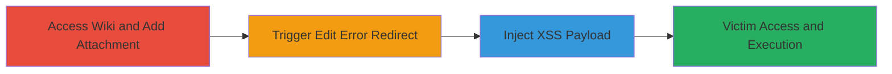

---
tags:
  - xss
  - reflected-xss
  - web-vulnerability
  - javascript-injection
  - topcoder-wiki
type: attack_chain
tools: []
tactics:
  - '[[Initial Access]]'
  - '[[Execution]]'
  - '[[Collection]]'
verified: false
platforms:
  - Web
submitted: true
complexity: medium
created_at: '2024-10-01T00:00:00Z'
procedures:
  - '[[procedures/Access-Wiki-Page-to-Add-Attachment]]'
  - '[[procedures/Trigger-Attachment-Edit-Error-Redirect]]'
  - '[[procedures/Inject-XSS-Payload-into-fileName-Parameter]]'
  - '[[procedures/Deliver-Malicious-URL-for-XSS-Execution]]'
step_count: 4
techniques:
  - '[[JavaScript]]'
  - '[[Drive-by Compromise]]'
updated_at: '2025-12-14T00:11:15.857Z'
description: >-
  A multi-stage attack exploiting a reflected XSS vulnerability in the TopCoder
  wiki's attachment editing feature, where an unsanitized fileName parameter is
  reflected in an error message, allowing JavaScript injection and execution in
  victims' browsers to steal cookies or perform other malicious actions.
skill_level: intermediate
impact_level: high
id: 6d1b6971-a382-4444-b96f-9990e9e5eeb2
validated: true
mitre_tactics:
  - '[[Initial Access]]'
  - '[[Execution]]'
  - '[[Collection]]'
mitre_techniques:
  - '[[JavaScript]]'
  - '[[Drive-by Compromise]]'
---
---
id: 123e4567-e89b-12d3-a456-426614174000
name: Reflected XSS in TopCoder Wiki Attachment Editing via fileName Parameter
type: attack_chain
description: A multi-stage attack exploiting a reflected XSS vulnerability in the TopCoder wiki's attachment editing feature, where an unsanitized fileName parameter is reflected in an error message, allowing JavaScript injection and execution in victims' browsers to steal cookies or perform other malicious actions.
verified: false
submitted: false
step_count: 4
created_at: 2024-10-01T00:00:00Z
updated_at: 2024-10-01T00:00:00Z
procedures: [[procedures/Access-Wiki-Page-to-Add-Attachment]], [[procedures/Trigger-Attachment-Edit-Error-Redirect]], [[procedures/Inject-XSS-Payload-into-fileName-Parameter]], [[procedures/Deliver-Malicious-URL-for-XSS-Execution]]
techniques: [[JavaScript]], [[Drive-by Compromise]]
tactics: [[Initial Access]], [[Execution]], [[Collection]]
tags: xss, reflected-xss, web-vulnerability, javascript-injection, topcoder-wiki
platforms: Web
tools: []
---

# Reflected XSS in TopCoder Wiki Attachment Editing via fileName Parameter

Multi-stage attack chain demonstrating a complete attack workflow exploiting a reflected XSS vulnerability in the TopCoder wiki application.

## Chain Metrics Dashboard

| Metric | Value |
|--------|-------|
| Chain Status | Unverified |
| Total Steps | 4 |
| Execution Time | ~5 minutes |
| Skill Level | Intermediate |
| Complexity | Medium |
| Impact Level | High |

## Attack Flow Visualization

## Prerequisites & Requirements

### Required Tools

- Web browser (e.g., Chrome, Firefox)

### Target Environment

- TopCoder wiki application
- Web platform
- Access to https://apps.topcoder.com/wiki/

### Initial Access Requirements

- Valid user account on TopCoder wiki (for adding attachments)
- Network access to the target wiki
- No special privileges required beyond basic user access

## Detailed Attack Procedures

### Step 1: Access Wiki Page to Add Attachment
procedure: [[procedures/Access-Wiki-Page-to-Add-Attachment]]

**Objective**: Gain access to the target wiki page and add a benign attachment to set up the exploit scenario.

**Instructions**: Open a web browser and navigate to the wiki page attachments section. Upload a simple file, such as an SVG image named "sss.svg", to create the attachment that will be used in subsequent steps.

**Expected Output**: Attachment successfully added to the page with ID 165871793.

**Success Indicators**:
- Attachment list shows "sss.svg"
- No errors during upload

### Step 2: Trigger Attachment Edit Error Redirect
procedure: [[procedures/Trigger-Attachment-Edit-Error-Redirect]]

**Objective**: Attempt to edit the attachment to force an error condition that redirects to the vulnerable endpoint.

**Instructions**: In the browser, navigate to the edit attachment URL for the added file. This action simulates an edit attempt that fails and redirects to doeditattachment.action, reflecting parameters.

**Expected Output**: Redirect to https://apps.topcoder.com/wiki/pages/doeditattachment.action with fileName parameter.

**Success Indicators**:
- Error page loads with reflected fileName
- URL includes doeditattachment.action endpoint

### Step 3: Inject XSS Payload into fileName Parameter
procedure: [[procedures/Inject-XSS-Payload-into-fileName-Parameter]]

**Objective**: Modify the fileName parameter in the URL to include a JavaScript payload that breaks out of the error message context.

**Instructions**: Intercept or manually alter the redirect URL's fileName parameter to inject the payload. Use URL encoding for special characters. Example payload: s">::ss.svg

**Expected Output**: Crafted URL ready for delivery: https://apps.topcoder.com/wiki/pages/doeditattachment.action?pageId=165871793&fileName=s%22%3E%3Cimg%20src=X%20onerror=alert(document.domain)%3E%3Ass.svg

**Success Indicators**:
- Payload properly URL-encoded
- No syntax errors in the injected script

### Step 4: Deliver Malicious URL for XSS Execution
procedure: [[procedures/Deliver-Malicious-URL-for-XSS-Execution]]

**Objective**: Trick the victim into accessing the malicious URL, triggering the XSS payload execution in their browser.

**Instructions**: Share the crafted URL with the victim via email, link, or social engineering. When accessed, the reflected payload executes.

**Expected Output**: JavaScript alert box displaying the document domain in the victim's browser.

**Success Indicators**:
- Alert pops up confirming execution
- Potential for cookie theft or further JS actions

## Attack Chain Summary

### Key Achievements

1. Successfully added and set up attachment on target wiki page
2. Triggered vulnerable redirect with reflected parameter
3. Injected and encoded XSS payload without detection
4. Demonstrated arbitrary JavaScript execution, enabling session hijacking or data exfiltration

## Technique & Tactic Coverage

### MITRE ATT&CK Techniques

- [[JavaScript]]
- [[Drive-by Compromise]]

### MITRE ATT&CK Tactics

- [[Initial Access]]
- [[Execution]]
- [[Collection]]

---
*Last updated: 2024-10-01T00:00:00Z*
