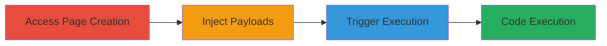

---
tags:
  - xss
  - reflected-xss
  - confluence
  - javascript-injection
type: attack_chain
tools: []
tactics:
  - '[[Execution]]'
  - '[[Collection]]'
verified: false
platforms:
  - Web
submitted: true
complexity: medium
created_at: '2023-10-01T00:00:00Z'
procedures:
  - '[[procedures/Access-Wiki-Page-Creation-Endpoint]]'
  - '[[procedures/Inject-XSS-Payloads-into-Parameters]]'
  - '[[procedures/Trigger-Reflected-XSS-via-URL-Visit]]'
step_count: 3
techniques:
  - '[[JavaScript]]'
  - '[[Drive-by Compromise]]'
updated_at: '2025-12-14T03:16:02.593Z'
description: >-
  A multi-step attack exploiting a reflected XSS vulnerability in the TopCoder
  wiki's page creation feature by injecting JavaScript payloads into unsanitized
  parameters, leading to arbitrary code execution in the victim's browser.
skill_level: intermediate
impact_level: high
id: b01203f6-a577-4cad-9c16-37a71e537826
validated: true
mitre_tactics:
  - '[[Execution]]'
  - '[[Collection]]'
mitre_techniques:
  - '[[JavaScript]]'
  - '[[Drive-by Compromise]]'
---
# Reflected XSS in TopCoder Wiki Page Creation via Unsanitized Parameters

Multi-stage attack chain demonstrating exploitation of a reflected Cross-Site Scripting (XSS) vulnerability in the TopCoder wiki's page creation feature at https://apps.topcoder.com/wiki/pages/createpage.action. The attack targets the parentPageString and labelsString parameters, which reflect user input without sanitization, allowing JavaScript injection. This requires the victim to be signed in to access the functionality, enabling cookie theft or other client-side attacks upon visiting the malicious URL.

## Chain Metrics Dashboard

| Metric | Value |
|--------|-------|
| Chain Status | Unverified |
| Total Steps | 3 |
| Execution Time | ~2 minutes |
| Skill Level | Intermediate |
| Complexity | Medium |
| Impact Level | High |

## Attack Flow Visualization

## Prerequisites & Requirements

### Required Tools

- Web browser (e.g., Chrome, Firefox)

### Target Environment

- Web platform
- Atlassian Confluence-based wiki (inferred from .action endpoints)
- Access to https://apps.topcoder.com/wiki/

### Initial Access Requirements

- Valid user credentials for TopCoder to sign in
- Network access to the target URL
- No prior access needed beyond authentication

## Detailed Attack Procedures

### Step 1: Access Wiki Page Creation Endpoint
procedure: [[procedures/Access-Wiki-Page-Creation-Endpoint]]

**Objective**: Navigate to the vulnerable page creation interface to prepare for payload injection.

**Instructions**: Open a web browser and sign in to the TopCoder platform if not already authenticated. Then, directly access the wiki page creation URL with the spaceKey parameter set to 'tcwiki'.

**Expected Output**: The page creation form loads, displaying input fields for parent page and labels.

**Success Indicators**:
- Page creation interface is accessible
- User is authenticated and no access denied errors

### Step 2: Inject XSS Payloads into Parameters
procedure: [[procedures/Inject-XSS-Payloads-into-Parameters]]

**Objective**: Craft a malicious URL by appending URL-encoded JavaScript payloads to the vulnerable parentPageString and labelsString parameters.

**Instructions**: Manually construct the URL in the browser's address bar or use URL encoding tools. For parentPageString, use a payload like ">, encoded as %22%3E%3Cimg%20src=X%20onerror=alert(document.cookie)%3E. For labelsString, use ">, encoded as %22%3E%3Cimg+src%3DX+onerror%3Dalert(document.domain)%3E. Combine with the base URL and spaceKey.

**Expected Output**: A fully formed PoC URL ready for execution.

**Success Indicators**:
- URL is correctly encoded without syntax errors
- Payloads are appended to the parameters

### Step 3: Trigger Reflected XSS via URL Visit
procedure: [[procedures/Trigger-Reflected-XSS-via-URL-Visit]]

**Objective**: Load the malicious URL in the browser to reflect and execute the injected JavaScript payloads.

**Instructions**: Paste the crafted PoC URL into the browser address bar while signed in and press enter to load the page. The payloads will reflect in the response and execute automatically.

**Expected Output**: Browser alerts pop up displaying document.cookie (session data) and document.domain (topcoder.com).

**Success Indicators**:
- JavaScript alerts execute
- Sensitive data like cookies is accessible via the payload

## Attack Chain Summary

### Key Achievements

1. Successful access to the vulnerable endpoint
2. Injection of functional XSS payloads into unsanitized parameters
3. Execution of arbitrary JavaScript, demonstrating potential for session hijacking

## Technique & Tactic Coverage

### MITRE ATT&CK Techniques

- [[JavaScript]]
- [[Drive-by Compromise]]

### MITRE ATT&CK Tactics

- [[Execution]]
- [[Collection]]

---
*Last updated: 2023-10-01T00:00:00Z*
