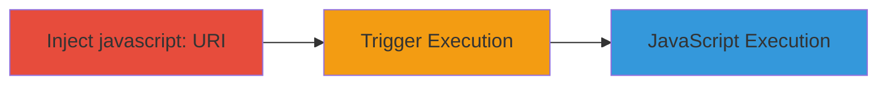

---
tags:
  - xss
  - reflected-xss
  - javascript-uri
  - tor-browser
type: attack_chain
tools: []
tactics:
  - '[[Execution]]'
verified: false
platforms:
  - Browser
  - Tor Browser
submitted: true
complexity: medium
created_at: '[TIMESTAMP]'
procedures:
  - '[[procedures/Inject-javascript-URI-into-about-tbupdate-Query-String]]'
  - '[[procedures/Trigger-XSS-via-Visit-Website-Link]]'
step_count: 2
techniques:
  - '[[JavaScript]]'
updated_at: '2025-12-13T23:52:39.406Z'
description: >-
  A reflected XSS vulnerability in the Tor Browser's about:tbupdate page allows
  injection of javascript: URIs into the query string, leading to arbitrary
  JavaScript execution upon clicking the 'visit our website' link, potentially
  enabling tracking or fingerprinting on a NoScript-whitelisted page.
skill_level: intermediate
impact_level: medium
id: 34cd363a-eb6e-4ebd-9604-0dc218d03201
validated: true
mitre_tactics:
  - '[[Execution]]'
mitre_techniques:
  - '[[JavaScript]]'
---
# Reflected XSS in Tor Browser about:tbupdate via javascript: URI Injection

Multi-stage attack chain demonstrating a complete attack workflow exploiting a reflected XSS vulnerability in the Tor Browser's about:tbupdate page.

## Chain Metrics Dashboard

| Metric | Value |
|--------|-------|
| Chain Status | Unverified |
| Total Steps | 2 |
| Execution Time | ~1 minute |
| Skill Level | Intermediate |
| Complexity | Medium |
| Impact Level | Medium |

## Attack Flow Visualization

## Prerequisites & Requirements

### Required Tools

- None (manual browser navigation)

### Target Environment

- Tor Browser (Mozilla Firefox-based)
- Access to about:tbupdate page
- No specific services/ports required

### Initial Access Requirements

- Local access to Tor Browser instance
- No credentials or prior network access needed

## Detailed Attack Procedures

### Step 1: Inject javascript: URI
procedure: [[procedures/Inject-javascript-URI-into-about-tbupdate-Query-String]]

**Objective**: Inject a malicious javascript: URI into the query string of the about:tbupdate page to set up the XSS payload.

**Instructions**: Manually navigate to the vulnerable URL in the Tor Browser address bar.

**Expected Output**: The about:tbupdate page loads with the injected query string parameter present but not yet executed.

**Success Indicators**:
- Page loads without errors
- Query string appears in the URL bar

### Step 2: Trigger XSS Execution
procedure: [[procedures/Trigger-XSS-via-Visit-Website-Link]]

**Objective**: Execute the injected JavaScript by interacting with the page element that processes the query string.

**Instructions**: Click the 'visit our website' link on the loaded page to trigger the payload.

**Expected Output**: The injected JavaScript (e.g., alert(1)) executes, displaying an alert dialog.

**Success Indicators**:
- JavaScript alert or other payload effect is observed
- No chrome privileges escalation due to URI_SAFE_FOR_UNTRUSTED_CONTENT flag

## Attack Chain Summary

### Key Achievements

1. Successful injection of javascript: URI into a trusted about: page
2. Arbitrary JavaScript execution on a NoScript-whitelisted context
3. Potential for tracking or fingerprinting without privilege escalation

## Technique & Tactic Coverage

### MITRE ATT&CK Techniques

- [[JavaScript]]

### MITRE ATT&CK Tactics

- [[Execution]]

---

*Last updated: [TIMESTAMP]*
