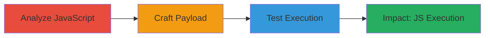

# Reflected XSS in Twitter Amplify Web Player via Unsanitized image_src Parameter

Multi-stage attack chain demonstrating a complete reflected XSS workflow targeting the Twitter Amplify web player.

## Chain Metrics Dashboard

| Metric | Value |
|--------|-------|
| Chain Status | Unverified |
| Total Steps | 3 |
| Execution Time | ~5 minutes |
| Skill Level | Intermediate |
| Complexity | Medium |
| Impact Level | High |

## Attack Flow Visualization

## Prerequisites & Requirements

### Required Tools

- Web browser developer tools (e.g., Chrome DevTools)
- Vulnerable browser (e.g., older Android browser without full CSP support)

### Target Environment

- Web platform
- Access to Twitter Amplify web player endpoint: https://amp.twimg.com/amplify-web-player/prod/source.html
- No authentication required; public-facing

### Initial Access Requirements

- Internet access
- No credentials needed
- Direct URL access to the player

## Detailed Attack Procedures

### Step 1: Analyze JavaScript for XSS Vulnerabilities
procedure: [[procedures/Analyze-JavaScript-for-XSS-Vulnerabilities]]

**Objective**: Identify unsanitized parameter handling in the web player's JavaScript to find injection points.

**Instructions**: Load the target endpoint in a browser and inspect the amplify-web-player.min.js file. Search for parameter assignments like 'image_src' and check for direct concatenation into HTML attributes without escaping.

**Expected Output**: Confirmation that 'image_src' is assigned to a variable and inserted into an img src attribute unsafely.

**Success Indicators**:
- Located vulnerable code in JS file
- Identified lack of sanitization for data URIs

### Step 2: Craft XSS Payload for image_src
procedure: [[procedures/Craft-XSS-Payload-for-image_src]]

**Objective**: Create a malicious URL injecting JavaScript via a data URI in the image_src parameter to trigger onload execution.

**Instructions**: Construct the URL with the payload: https://amp.twimg.com/amplify-web-player/prod/source.html?url=...&image_src=data:image/gif;base64,R0lGODlhAQABAIAAAAAAAAAAACH5BAAAAAAALAAAAAABAAEAAAICTAEAOw%27onload%3D%27alert(1000). URL-decode the payload to ensure proper injection of 'onload=alert(1000)'.

**Expected Output**: A valid URL ready for testing that embeds the XSS payload.

**Success Indicators**:
- Payload URL formed without syntax errors
- Data URI correctly encodes the JavaScript

### Step 3: Test XSS in Vulnerable Browsers
procedure: [[procedures/Test-XSS-in-Vulnerable-Browsers]]

**Objective**: Execute the payload in browsers lacking CSP support to confirm arbitrary JavaScript execution.

**Instructions**: Open the crafted URL in an older Android browser or similar environment without strict CSP. Observe the alert popup confirming execution.

**Expected Output**: Alert box displaying '1000' or equivalent JS output.

**Success Indicators**:
- JavaScript alert triggers
- No CSP blocks the execution

## Attack Chain Summary

### Key Achievements

1. Discovered reflected XSS via code review
2. Injected JS payload using data URI
3. Achieved code execution in legacy browsers, enabling potential session hijacking

## Technique & Tactic Coverage

### MITRE ATT&CK Techniques

- [[Exploit Public-Facing Application]]
- [[JavaScript]]

### MITRE ATT&CK Tactics

- [[Execution]]
- [[Collection]]

---
*Last updated: 2023-10-01T00:00:00Z*
