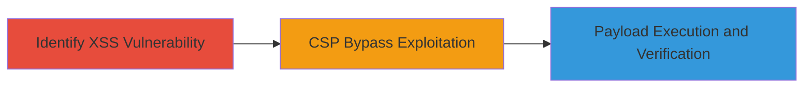

---
tags:
  - xss
  - csp-bypass
  - reflected-xss
  - javascript-injection
type: attack_chain
tools: []
tactics:
  - '[[Execution]]'
  - '[[Collection]]'
verified: false
platforms:
  - Web
submitted: true
complexity: medium
created_at: '2023-10-01T00:00:00Z'
procedures:
  - '[[procedures/Identify-Reflected-XSS-in-Location-Parameter]]'
  - '[[procedures/Bypass-CSP-via-Analytics-Endpoint]]'
  - '[[procedures/Trigger-and-Verify-XSS-Execution]]'
step_count: 3
techniques:
  - '[[JavaScript]]'
updated_at: '2025-12-13T23:52:44.112Z'
description: >-
  A multi-stage attack exploiting a reflected XSS vulnerability in the Twitter
  careers page location parameter, combined with a known CSP bypass on the
  analytics endpoint to execute arbitrary JavaScript.
skill_level: intermediate
impact_level: high
id: 3bcf9e15-725f-4f02-b75a-9a7f01cf0a68
validated: true
mitre_tactics:
  - '[[Execution]]'
  - '[[Collection]]'
mitre_techniques:
  - '[[JavaScript]]'
---
# Reflected XSS in Twitter Careers Location Parameter Chained with CSP Bypass

Multi-stage attack chain demonstrating a complete attack workflow exploiting a reflected XSS in the Twitter careers search page combined with a CSP bypass to execute JavaScript payloads.

## Chain Metrics Dashboard

| Metric | Value |
|--------|-------|
| Chain Status | Unverified |
| Total Steps | 3 |
| Execution Time | ~5 minutes |
| Skill Level | Intermediate |
| Complexity | Medium |
| Impact Level | High |

## Attack Flow Visualization

## Prerequisites & Requirements

### Required Tools

- Web browser for testing (e.g., Chrome with developer tools)
- URL encoder/decoder for payload crafting

### Target Environment

- Web platform
- Access to https://careers.twitter.com
- Knowledge of prior CSP bypass (report #126464)

### Initial Access Requirements

- Public access to the careers page
- No authentication required
- Network access to analytics.twitter.com

## Detailed Attack Procedures

### Step 1: Identify Reflected XSS in Location Parameter
procedure: [[procedures/Identify-Reflected-XSS-in-Location-Parameter]]

**Objective**: Detect the reflected XSS vulnerability in the 'location' parameter by testing for unsanitized input reflection in HTML attributes.

**Instructions**: Navigate to https://careers.twitter.com/en/jobs-search.html and append a test payload to the location parameter, such as ?location=. Observe if the input is reflected without escaping in the HTML source, allowing attribute breakout.

**Expected Output**: The payload appears in the page source as part of an HTML attribute, e.g., value="", confirming potential for injection.

**Success Indicators**:
- Input reflected without HTML entity encoding
- Ability to break out of the attribute with quotes and inject tags

### Step 2: Exploit CSP Bypass via Analytics Endpoint
procedure: [[procedures/Bypass-CSP-via-Analytics-Endpoint]]

**Objective**: Leverage the known CSP bypass on analytics.twitter.com to load external scripts that would otherwise be blocked.

**Instructions**: Craft a script tag sourcing from //analytics.twitter.com/tpm?tpm_cb=alert(document.domain), which exploits the analytics endpoint's vulnerability to execute JavaScript despite CSP restrictions. Test by injecting this in a controlled environment.

**Expected Output**: The script loads and executes, popping an alert with the document domain, confirming CSP evasion.

**Success Indicators**:
- Script from analytics.twitter.com executes without CSP violation
- Alert or console log confirms payload run

### Step 3: Trigger and Verify XSS Execution
procedure: [[procedures/Trigger-and-Verify-XSS-Execution]]

**Objective**: Combine the XSS injection with the CSP bypass to fully execute the payload and verify impact.

**Instructions**: Construct the full URL: https://careers.twitter.com/en/jobs-search.html?location=1%22%3E%3Cscript%20src=//analytics.twitter.com/tpm?tpm_cb=alert%28document.domain%29%3E%3C/script%3E. Visit the URL in a browser and monitor for execution.

**Expected Output**: An alert box displays the document domain (careers.twitter.com), indicating successful XSS execution.

**Success Indicators**:
- Alert pops up on page load
- No CSP errors in browser console
- Potential for further payloads like session theft

## Attack Chain Summary

### Key Achievements

1. Identified and exploited reflected XSS in a public-facing parameter
2. Bypassed CSP using a known analytics endpoint flaw
3. Demonstrated full JavaScript execution leading to potential client-side attacks like session hijacking

## Technique & Tactic Coverage

### MITRE ATT&CK Techniques

- [[JavaScript]]

### MITRE ATT&CK Tactics

- [[Execution]]
- [[Collection]]

---
*Last updated: 2023-10-01T00:00:00Z*
