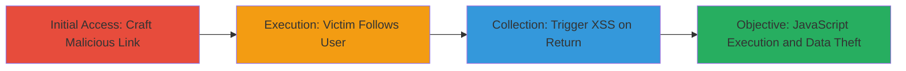

---
tags:
  - xss
  - reflected-xss
  - twitter
  - javascript
  - session-hijacking
type: attack_chain
tools: []
tactics:
  - '[[Initial Access]]'
  - '[[Execution]]'
  - '[[Collection]]'
commands: []
platforms:
  - Web
complexity: medium
procedures:
  - '[[procedures/Craft-Malicious-Twitter-Intent-URL-for-XSS]]'
  - '[[procedures/Induce-Victim-to-Follow-User-via-Malicious-Link]]'
  - '[[procedures/Trigger-XSS-via-Return-to-Previous-Site]]'
step_count: 3
techniques:
  - '[[Exploit Public-Facing Application]]'
  - '[[JavaScript]]'
description: >-
  A multi-stage reflected XSS attack exploiting the unsanitized
  'original_referer' parameter in Twitter's intent favorite complete endpoint,
  leading to arbitrary JavaScript execution in the victim's browser.
skill_level: intermediate
impact_level: high
id: f85749eb-e455-473a-aaa5-99b5b882992a
created_at: '2025-12-14T03:15:53.076Z'
updated_at: '2025-12-14T03:15:53.076Z'
verified: false
validated: true
submitted: true
mitre_tactics:
  - '[[Initial Access]]'
  - '[[Execution]]'
  - '[[Collection]]'
mitre_techniques:
  - '[[Exploit Public-Facing Application]]'
  - '[[JavaScript]]'
---
# Reflected XSS in Twitter Intent Favorite via Original Referer Parameter

Multi-stage attack chain demonstrating a complete reflected XSS workflow targeting Twitter's intent functionality.

## Chain Metrics Dashboard

| Metric | Value |
|--------|-------|
| Chain Status | Unverified |
| Total Steps | 3 |
| Execution Time | ~2 minutes |
| Skill Level | Intermediate |
| Complexity | Medium |
| Impact Level | High |

## Attack Flow Visualization



## Prerequisites & Requirements

### Required Tools

- None (social engineering via link sharing)

### Target Environment

- Twitter web platform
- Victim must not follow the targeted user
- Browser supporting JavaScript

### Initial Access Requirements

- Ability to share links (e.g., via email, social media)
- No prior credentials needed
- Victim interaction required

## Detailed Attack Procedures

### Step 1: Initial Access
procedure: [[procedures/Craft-Malicious-Twitter-Intent-URL-for-XSS]]

**Objective**: Create a malicious URL that embeds a JavaScript payload in the original_referer parameter to set up the XSS reflection.

**Instructions**: Construct the URL using a valid tweet_id for a user the victim does not follow. Embed the payload as a javascript: URI in the original_referer parameter, URL-encoded. Wrap the link in an HTML anchor with rel='noreferrer' to nullify the referrer header.

Example malicious link construction:

```html
<a href="https://twitter.com/intent/favorite/complete?tweet_id=572435913768366080&already_favorited=false&original_referer=javascript:alert%281%29" rel="noreferrer">Click to favorite this tweet</a>
```

Share this link with the victim via phishing or social engineering.

**Expected Output**: Victim receives and clicks the link, navigating to Twitter's intent page without sending a referrer.

**Success Indicators**:
- Link shared successfully
- Victim accesses the intent/favorite/complete page

### Step 2: Execution
procedure: [[procedures/Induce-Victim-to-Follow-User-via-Malicious-Link]]

**Objective**: Guide the victim to interact with the page by following the user, which is required to expose the vulnerable endpoint.

**Instructions**: The malicious link directs the victim to the favorite complete page for a tweet from a user they do not follow. The page prompts the victim to follow the user first. Instruct or socially engineer the victim to click the 'follow' button.

No direct command; relies on victim action. Monitor via indirect means like observing follow activity if possible.

**Expected Output**: Victim follows the user, updating the page state to allow the return link.

**Success Indicators**:
- Victim clicks 'follow'
- Page transitions to post-follow state with 'return to previous site' option

### Step 3: Collection
procedure: [[procedures/Trigger-XSS-via-Return-to-Previous-Site]]

**Objective**: Execute the reflected XSS payload by having the victim click the return link, leading to arbitrary JavaScript execution.

**Instructions**: After following, the page displays a 'return to previous site' link that reflects the original_referer parameter without sanitization. Socially engineer the victim to click this link, triggering the javascript: URI.

The payload executes in the victim's browser context on Twitter's domain.

**Expected Output**: Alert or custom JavaScript runs, such as stealing cookies via `document.cookie` or session hijacking.

**Success Indicators**:
- JavaScript payload executes (e.g., alert pops)
- Attacker receives exfiltrated data if payload includes beaconing

## Attack Chain Summary

### Key Achievements

1. Bypassed referrer checks using rel='noreferrer'
2. Exploited unsanitized parameter reflection in intent endpoint
3. Achieved arbitrary JS execution for potential session theft or data exfiltration

## Technique & Tactic Coverage

### MITRE ATT&CK Techniques

- [[Exploit Public-Facing Application]]
- [[JavaScript]]

### MITRE ATT&CK Tactics

- [[Initial Access]]
- [[Execution]]
- [[Collection]]

---
*Last updated: 2023-10-01T00:00:00Z*
