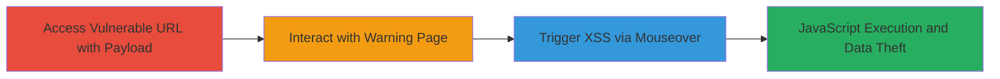

# Reflected XSS in Twitter Unsafe Link Warning via Nested URL Payload

Multi-stage attack chain demonstrating a complete attack workflow exploiting a reflected Cross-Site Scripting (XSS) vulnerability in Twitter's unsafe link warning page. The attack uses a nested URL payload in the 'unsafe_link' parameter to inject malicious JavaScript attributes like onmouseover, evading basic sanitization checks. This triggers arbitrary JavaScript execution in the victim's browser upon interaction, primarily in Internet Explorer, as Content Security Policy (CSP) blocks it in modern browsers like Firefox and Chrome. Potential impacts include session hijacking, cookie theft, or page manipulation.

## Chain Metrics Dashboard

| Metric | Value |
|--------|-------|
| Chain Status | Unverified |
| Total Steps | 3 |
| Execution Time | ~1 minute |
| Skill Level | Intermediate |
| Complexity | Medium |
| Impact Level | High |

## Attack Flow Visualization

## Prerequisites & Requirements

### Required Tools

- Internet Explorer browser (vulnerable to this payload; modern browsers blocked by CSP)

### Target Environment

- Web platform
- Twitter.com domain accessible
- No specific services/ports required beyond standard HTTPS (443)

### Initial Access Requirements

- Direct network access to twitter.com
- Victim must be tricked into visiting the malicious URL (e.g., via phishing)
- No prior credentials needed

## Detailed Attack Procedures

### Step 1: Access Vulnerable URL with Payload
procedure: [[procedures/Access-Twitter-Unsafe-Link-with-Nested-Payload]]

**Objective**: Deliver the nested URL payload to the Twitter unsafe link warning page, injecting malicious attributes into the reflected 'unsafe_link' parameter.

**Instructions**: Open Internet Explorer and navigate to the crafted URL that nests a malicious payload within the 'unsafe_link' parameter. The payload uses URL encoding to include onmouseover and style attributes, evading basic checks.

**Expected Output**: The warning page loads, reflecting the unsanitized 'unsafe_link' parameter, displaying the injected link with hidden malicious attributes.

**Success Indicators**:
- Warning page appears without errors
- Inspect page source to confirm reflection of the payload (e.g., onmouseover=alert(1))

### Step 2: Interact with Warning Page
procedure: [[procedures/Interact-with-Unsafe-Link-Warning-Page]]

**Objective**: Proceed past the warning to render the reflected content, preparing for the XSS trigger.

**Instructions**: On the loaded warning page, locate and click the 'continue' button to interact with the page elements containing the reflected payload.

**Expected Output**: The page processes the interaction, fully rendering the malicious attributes in the DOM without immediate execution.

**Success Indicators**:
- 'Continue' button clickable and responsive
- No CSP errors in browser console (confirm in Internet Explorer)

### Step 3: Trigger XSS via Mouseover Event
procedure: [[procedures/Trigger-XSS-via-Mouseover-Event]]

**Objective**: Execute the injected JavaScript by triggering the onmouseover event on the vulnerable element.

**Instructions**: Hover the mouse over the 'continue' element or the reflected link to fire the onmouseover event, executing the alert(1) payload.

**Expected Output**: A JavaScript alert box pops up displaying '1', confirming arbitrary code execution.

**Success Indicators**:
- Alert dialog appears
- Browser console shows no blocking errors; payload executes successfully

## Attack Chain Summary

### Key Achievements

1. Successful injection of JavaScript attributes via nested URL in 'unsafe_link' parameter
2. Evasion of basic sanitization on Twitter's warning page
3. Arbitrary JavaScript execution in Internet Explorer, enabling potential session theft

## Technique & Tactic Coverage

### MITRE ATT&CK Techniques

- [[JavaScript]]
- [[Drive-by Compromise]]

### MITRE ATT&CK Tactics

- [[Initial Access]]
- [[Execution]]

---
*Last updated: 2023-10-01T12:00:00Z*
