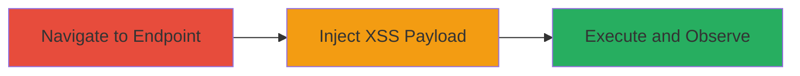

---
tags:
  - xss
  - reflected-xss
  - web
  - dod
  - javascript-injection
type: attack_chain
tools: []
tactics:
  - '[[Initial Access]]'
  - '[[Execution]]'
  - '[[Collection]]'
verified: false
platforms:
  - Web
submitted: true
complexity: low
created_at: '2023-10-01T00:00:00Z'
procedures:
  - '[[procedures/Exploit-Reflected-XSS-in-URL-Parameter]]'
step_count: 3
techniques:
  - '[[JavaScript]]'
updated_at: '2025-12-14T03:16:36.897Z'
description: >-
  A multi-step attack exploiting a reflected XSS vulnerability in the 'url'
  parameter of leaving.html on a U.S. Department of Defense web application,
  allowing arbitrary JavaScript execution leading to potential account takeover.
skill_level: beginner
impact_level: high
id: 1b6ef8c5-941d-4760-94ef-ca1b5a526a94
validated: true
mitre_tactics:
  - '[[Initial Access]]'
  - '[[Execution]]'
  - '[[Collection]]'
mitre_techniques:
  - '[[JavaScript]]'
---
# Reflected XSS in URL Parameter for JavaScript Execution on DoD System

Multi-stage attack chain demonstrating exploitation of a reflected Cross-Site Scripting (XSS) vulnerability in a U.S. Department of Defense web system, enabling arbitrary JavaScript execution in the victim's browser for potential cookie theft and account takeover.

## Chain Metrics Dashboard

| Metric | Value |
|--------|-------|
| Chain Status | Unverified |
| Total Steps | 3 |
| Execution Time | ~1 minutes |
| Skill Level | Beginner |
| Complexity | Low |
| Impact Level | High |

## Attack Flow Visualization

## Prerequisites & Requirements

### Required Tools

- Web browser (e.g., Chrome, Firefox)
- Optional: Proxy tool like Burp Suite for payload crafting

### Target Environment

- Web application on U.S. Department of Defense system
- Accessible via HTTP/HTTPS
- No specific ports required beyond standard web (80/443)

### Initial Access Requirements

- Network access to the target domain
- No credentials needed for initial navigation
- Victim must visit the crafted malicious URL

## Detailed Attack Procedures

### Step 1: Navigate to the Vulnerable Endpoint
procedure: [[procedures/Exploit-Reflected-XSS-in-URL-Parameter]]

**Objective**: Access the leaving.html page to identify the vulnerable 'url' parameter for payload injection.

**Instructions**: Open a web browser and navigate to the target endpoint, such as `https://target-domain.gov/leaving.html?url=`, where the domain is the censored DoD system URL. Inspect the page source to confirm how the 'url' parameter is reflected in the HTML.

**Expected Output**: The page loads, displaying a redirect or leaving notice, with the 'url' value echoed back in the HTML without sanitization.

**Success Indicators**:
- Page accessible without errors
- 'url' parameter visible in page source

### Step 2: Inject a Crafted XSS Payload into the URL Parameter
procedure: [[procedures/Exploit-Reflected-XSS-in-URL-Parameter]]

**Objective**: Deliver a malicious JavaScript payload via the 'url' parameter to break out of the HTML context and execute code.

**Instructions**: Modify the URL by appending a payload to the 'url' parameter, such as `https://target-domain.gov/leaving.html?url=">`. For URL-encoded version, use `%22%3E%3Cscript%3Ealert(%22xss%20by%20nagli%22)%3C/script%3E`. Trick a victim into visiting this URL, or test in your browser.

**Expected Output**: The page renders with the injected script executing, bypassing any output encoding.

**Success Indicators**:
- Payload reflected without escaping
- No sanitization errors

### Step 3: Observe the Execution of the Payload
procedure: [[procedures/Exploit-Reflected-XSS-in-URL-Parameter]]

**Objective**: Confirm successful JavaScript execution and assess potential for further exploitation like cookie theft.

**Instructions**: Upon loading the malicious URL, monitor for the alert box or any console errors. To escalate, replace the alert with code to exfiltrate cookies, e.g., `https://target-domain.gov/leaving.html?url=">`.

**Expected Output**: JavaScript alert pops up, or network request sent to attacker server with stolen data.

**Success Indicators**:
- Alert box displays 'xss by nagli'
- Cookies or session data potentially compromised

## Attack Chain Summary

### Key Achievements

1. Identified and confirmed reflected XSS in 'url' parameter of leaving.html
2. Executed arbitrary JavaScript in victim's browser context
3. Enabled potential for session hijacking and account takeover on DoD system

## Technique & Tactic Coverage

### MITRE ATT&CK Techniques

- [[JavaScript]]

### MITRE ATT&CK Tactics

- [[Initial Access]]
- [[Execution]]
- [[Collection]]

---
*Last updated: 2023-10-01T00:00:00Z*
