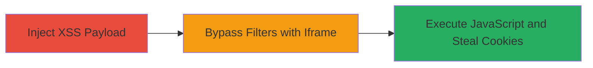

---
tags:
  - xss
  - reflected-xss
  - cookie-theft
  - utm-parameters
  - instacart
type: attack_chain
tools: []
tactics:
  - '[[Execution]]'
  - '[[Collection]]'
verified: false
platforms:
  - Web
submitted: true
complexity: medium
created_at: '2023-10-01T00:00:00Z'
procedures:
  - '[[procedures/Inject-XSS-Payload-in-UTM-Parameters]]'
  - '[[procedures/Bypass-XSS-Filters-with-Iframe-for-Cookie-Theft]]'
step_count: 2
techniques:
  - '[[JavaScript]]'
  - '[[Drive-by Compromise]]'
updated_at: '2025-12-14T00:11:09.428Z'
description: >-
  A multi-step attack exploiting insufficient input validation in Instacart's
  UTM tracking parameters to achieve reflected XSS, enabling arbitrary
  JavaScript execution and cookie theft through an iframe bypass technique.
skill_level: intermediate
impact_level: high
id: 43516384-3d11-40de-9ea3-2af1f13750b5
validated: true
mitre_tactics:
  - '[[Execution]]'
  - '[[Collection]]'
mitre_techniques:
  - '[[JavaScript]]'
  - '[[Drive-by Compromise]]'
---
# Reflected XSS in UTM Parameters Leading to Cookie Theft via Iframe Bypass

Multi-stage attack chain demonstrating a reflected XSS vulnerability in Instacart's UTM tracking parameters, allowing arbitrary JavaScript execution and potential session hijacking through cookie access.

## Chain Metrics Dashboard

| Metric | Value |
|--------|-------|
| Chain Status | Unverified |
| Total Steps | 2 |
| Execution Time | ~5 minutes |
| Skill Level | Intermediate |
| Complexity | Medium |
| Impact Level | High |

## Attack Flow Visualization



## Prerequisites & Requirements

### Required Tools

- Web browser (e.g., Firefox or Internet Explorer for testing)

### Target Environment

- Web platform
- Publicly accessible URL on the target domain (e.g., https://www.instacart.com)
- No specific services or ports required beyond standard HTTP/HTTPS

### Initial Access Requirements

- No credentials needed
- Direct network access to the target website
- No prior access required; attack relies on tricking a victim into visiting a malicious URL

## Detailed Attack Procedures

### Step 1: Inject XSS Payload in UTM Parameters
procedure: [[procedures/Inject-XSS-Payload-in-UTM-Parameters]]

**Objective**: Test and confirm reflected XSS by injecting payloads into UTM parameters, leading to JavaScript execution such as alert popups.

**Instructions**: Construct a malicious URL by appending URL-encoded XSS payloads to the UTM parameters (utm_source, utm_medium, utm_campaign) on a target page like https://www.instacart.com/green-zebra-grocery. For example, use the following URL structure:

```url
https://www.instacart.com/green-zebra-grocery?utm_source=%3E%22%27%3E<script>alert(/Hussain/)</script>&utm_medium=%22%27%3E<script>alert(/XSS/)</script>&utm_campaign=%22%27%3E<script>alert(/injection/)</script>
```

Open the URL in a web browser. The payloads should reflect unsanitized in the page source, triggering JavaScript alerts.

**Expected Output**: JavaScript alerts (e.g., "Hussain", "XSS", "injection") pop up in the browser, confirming execution.

**Success Indicators**:
- Alerts display without errors
- Page source shows reflected payload without escaping

### Step 2: Bypass XSS Filters with Iframe for Cookie Theft
procedure: [[procedures/Bypass-XSS-Filters-with-Iframe-for-Cookie-Theft]]

**Objective**: Circumvent any basic filters by injecting an iframe that loads content from the same domain, enabling access to sensitive data like document.cookie for potential session hijacking.

**Instructions**: Build on the initial injection by crafting a more advanced payload that embeds an iframe. Use this URL example:

```url
https://www.instacart.com/green-zebra-grocery?utm_source=%3E'%3d'%3E%22%3E%3Ciframe src=%22https://www.instacart.com%22 onmouseover=alert(document.cookie)%3E%3C/iframe%3E/927&utm_campaign=%22%27%3E<script>alert(/XSS/)</script>
```

Navigate to the URL in the browser. Hover over the injected iframe to trigger the onmouseover event, which alerts the document.cookie value.

**Expected Output**: An iframe loads from the same domain, and hovering reveals the cookie contents in an alert, demonstrating access to session data.

**Success Indicators**:
- Iframe renders without blocking
- Cookie alert displays session tokens or user data
- No CSP or filter errors in console

## Attack Chain Summary

### Key Achievements

1. Confirmed reflected XSS in UTM parameters via simple script injection
2. Bypassed potential protections using same-domain iframe to access document.cookie
3. Demonstrated potential for session hijacking or phishing attacks

## Technique & Tactic Coverage

### MITRE ATT&CK Techniques

- [[JavaScript]]
- [[Drive-by Compromise]]

### MITRE ATT&CK Tactics

- [[Execution]]
- [[Collection]]

---
*Last updated: 2023-10-01T00:00:00Z*
