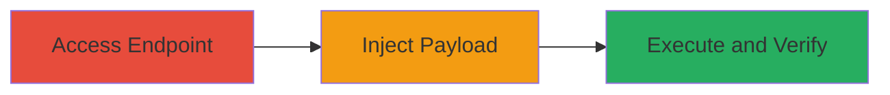

# Reflected XSS in Uber Business Endpoint via UTM Parameters

Multi-stage attack chain demonstrating a reflected Cross-Site Scripting (XSS) vulnerability in the Uber getrush.uber.com/business endpoint. The attack leverages unescaped user input from UTM parameters (like utm_campaign) inserted into a JavaScript object within a script tag, allowing attackers to break out and execute arbitrary JavaScript. This can lead to session hijacking, cookie theft, or phishing when victims click a malicious link.

## Chain Metrics Dashboard

| Metric | Value |
|--------|-------|
| Chain Status | Unverified |
| Total Steps | 3 |
| Execution Time | ~2 minutes |
| Skill Level | Intermediate |
| Complexity | Low |
| Impact Level | High |

## Attack Flow Visualization

## Prerequisites & Requirements

### Required Tools

- [[tools/Web-Browser]]

### Target Environment

- Web platform
- Access to public-facing Uber business endpoint (https://getrush.uber.com/business)
- No authentication required

### Initial Access Requirements

- Internet access
- Ability to craft and load URLs in a browser
- No prior credentials needed

## Detailed Attack Procedures

### Step 1: Access the Business Endpoint with Tracking Parameters
procedure: [[procedures/Access-Uber-Business-Endpoint-with-UTM-Parameters]]

**Objective**: Navigate to the target endpoint and observe how UTM parameters are rendered in the page's JavaScript to identify reflection points.

**Instructions**: Open a web browser and load the base URL with standard UTM parameters to inspect the page source and confirm parameter insertion into JavaScript.

**Expected Output**: Page loads with JavaScript object like `window.utm = {campaign: 'somevalue', ...}` visible in the script tag.

**Success Indicators**:
- Endpoint accessible without errors
- UTM parameters reflected in client-side JavaScript

### Step 2: Inject XSS Payload into UTM Campaign Parameter
procedure: [[procedures/Inject-XSS-Payload-into-UTM-Campaign-Parameter]]

**Objective**: Modify the URL to include a malicious payload in the utm_campaign parameter, breaking out of the JavaScript string literal to inject and execute a new script.

**Instructions**: Use a web browser to construct and load the malicious URL. For testing, encode the payload `'</script>'` as `%27%3C/script%3E%3Cscript%3Ealert(0)%3C/script%3E` in the parameter.

**Expected Output**: The page loads, but the injected script executes immediately.

**Success Indicators**:
- Payload breaks out of the script tag
- No encoding or sanitization applied to the parameter

### Step 3: Observe Execution of Payload
procedure: [[procedures/Verify-XSS-Payload-Execution]]

**Objective**: Confirm the vulnerability by verifying arbitrary JavaScript execution, such as displaying an alert dialog, and note that it affects all UTM parameters.

**Instructions**: Load the crafted URL in a modern browser like Firefox and monitor for the alert popup. Test variations with other UTM parameters (e.g., utm_medium) to confirm broader impact.

**Expected Output**: Alert dialog (e.g., alert(0)) appears, indicating successful JS execution.

**Success Indicators**:
- JavaScript alert or other payload executes
- Vulnerability confirmed across multiple UTM parameters

## Attack Chain Summary

### Key Achievements

1. Identified reflection of UTM parameters in unsanitized JavaScript
2. Successfully injected and executed arbitrary code via URL manipulation
3. Demonstrated potential for session theft or data exfiltration in victim browsers

## Technique & Tactic Coverage

### MITRE ATT&CK Techniques

- [[JavaScript]]

### MITRE ATT&CK Tactics

- [[Execution]]
- [[Collection]]

---
*Last updated: 2023-10-01T00:00:00Z*
