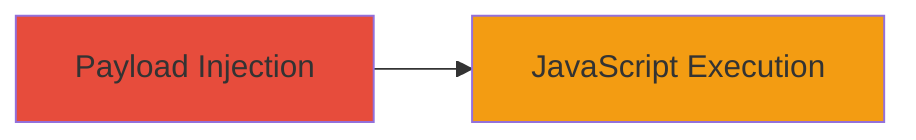

# Reflected XSS in Uber Lert Search Functionality

Multi-stage attack chain demonstrating a complete attack workflow.

## Chain Metrics Dashboard

| Metric | Value |
|--------|-------|
| Chain Status | Unverified |
| Total Steps | 1 |
| Execution Time | ~1 minute |
| Skill Level | Beginner |
| Complexity | Low |
| Impact Level | High |

## Attack Flow Visualization

## Prerequisites & Requirements

### Required Tools

- None (manual URL crafting)

### Target Environment

- Web platform
- Access to lert.uber.com search functionality
- No specific services or ports required beyond standard HTTP/HTTPS

### Initial Access Requirements

- No credentials needed
- Victim must access the malicious URL (e.g., via phishing or direct link)
- No prior access required

## Detailed Attack Procedures

### Step 1: Inject XSS Payload
procedure: [[procedures/Inject-XSS-Payload-into-Uber-Lert-Search-URL]]

**Objective**: Inject a malicious payload into the search URL to reflect and execute arbitrary JavaScript in the victim's browser.

**Instructions**: Construct a malicious URL by appending the XSS payload to the search path. For example, use a payload that breaks out of the URL context and injects a script tag:

Example URL: `https://lert.uber.com/s/search/All/Home">`

Send this URL to the victim via email, social engineering, or any method that tricks them into clicking it. Upon access, the payload reflects in the search field without validation, executing the JavaScript.

**Expected Output**: The victim's browser executes the injected JavaScript, such as displaying an alert or performing other actions like stealing cookies.

**Success Indicators**:
- JavaScript alert or other payload effects visible in the browser
- No server-side errors; payload reflects directly in the page

## Attack Chain Summary

### Key Achievements

1. Successful reflection of arbitrary JavaScript via URL parameter
2. Achievement of code execution in victim browser context
3. Potential for session hijacking or data exfiltration

## Technique & Tactic Coverage

### MITRE ATT&CK Techniques

- [[JavaScript]]
- [[Exploit Public-Facing Application]]

### MITRE ATT&CK Tactics

- [[Execution]]

---
*Last updated: 2023-10-01T00:00:00Z*
